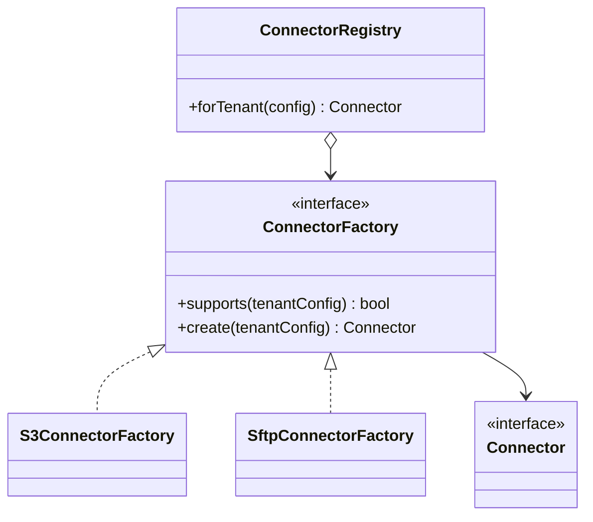

# Module 28 — Production: Factory Method

## Vì sao bài này tồn tại?

**Tạo connector theo tenant** là tình huống độc lập được xây dựng riêng cho Factory Method. Bài không lấy từ một source ẩn: bạn tự tạo phiên bản `before` tối thiểu dựa trên mô tả dưới đây, sau đó dùng test để chứng minh refactor không đổi behavior. Bài Production giả định hệ thống đã chạy thật. Ngoài cấu trúc code, lời giải phải xử lý migration, failure, idempotency hoặc observability phù hợp với use case.

## Câu chuyện nghiệp vụ

Hệ thống cần xử lý **Tạo connector theo tenant**. `TenantConnectorProvider` đang dựng S3/SFTP connector bằng config rải rác, làm secret resolution, validation và lifecycle không nhất quán.

Invariant trung tâm của bài **Factory Method** là:

> **mỗi tenant nhận đúng connector và credential scope.**

Ở cấp Production, **Factory Method** phải bảo vệ invariant dưới retry/concurrency hoặc partial failure, đồng thời có migration seam, telemetry, rollback trigger và cleanup condition sau rollout.

Failure bắt buộc phải được mô hình hóa:

> **factory map sai tenant hoặc credential.**

## Trạng thái code ban đầu

```php
final class TenantConnectorProvider
{
    public function handle(array $input): mixed
    {
        // validation chung, lựa chọn biến thể và side effect
        // đang bị trộn trong một method.
        throw new RuntimeException('Hãy dựng phiên bản before phù hợp đề bài.');
    }
}
```

Đây là skeleton định hướng, không phải lời giải. Hãy thêm dữ liệu và behavior nhỏ nhất đủ tái hiện pain point của **Tạo connector theo tenant**.

## Mô hình thiết kế cần hướng tới



Mỗi factory sở hữu validation và construction của một connector. Registry chỉ lựa chọn factory theo capability/config; secret resolution và connection test phải ở boundary, không hard-code trong client.

## Nhiệm vụ

1. Khóa behavior hiện tại của **Tạo connector theo tenant** bằng characterization test và log một trace hoàn chỉnh.
2. Xác định source of truth, transaction boundary và side effect bên ngoài quanh `ConnectorJob`.
3. Tạo một migration seam để chạy song song implementation cũ/mới; so sánh kết quả trước khi chuyển traffic.
4. Mô phỏng failure **factory map sai tenant hoặc credential** và chứng minh retry/replay không phá invariant.
5. Bổ sung registry có version, fallback có kiểm soát; định nghĩa metric, alert và rollback trigger.
6. Viết ADR ghi rõ evidence, phương án baseline, cleanup condition và người sở hữu runbook.

## Dữ liệu thử tối thiểu

- Hai scenario hợp lệ đại diện cho hai biến thể khác nhau.
- Một boundary value liên quan trực tiếp tới **mỗi tenant nhận đúng connector và credential scope**.
- Một scenario tạo ra **factory map sai tenant hoặc credential**.
- Một operation lặp lại và một scenario concurrent/replay.

## Gợi ý triển khai

- Bắt đầu bằng behavior và invariant; chỉ tạo abstraction sau khi xác định đúng trục thay đổi.
- Đặt tên method theo domain của **Tạo connector theo tenant**, tránh `execute(mixed $data)` hoặc `handleAnything()`.
- Tách selection/wiring khỏi business calculation; composition root có thể biết concrete class nhưng use case không nên biết.
- Đừng nuốt exception. Map lỗi kỹ thuật thành error có ý nghĩa và giữ nguyên cause để điều tra.
- Nếu **khởi tạo trực tiếp khi chỉ có một product** vẫn rõ ràng hơn và thay đổi chưa có thật, hãy ghi kết luận “chưa cần pattern” trong ADR.

## Test bắt buộc

- Replay cùng operation không tạo kết quả thứ hai và vẫn giữ **mỗi tenant nhận đúng connector và credential scope**.
- Concurrency test tại boundary nơi **factory map sai tenant hoặc credential** có thể xảy ra.
- Migration test so sánh old/new implementation trên cùng fixture hoặc shadow traffic.
- Telemetry test/assertion cho correlation ID, error class và decision version.

## Deliverable

```text
solution/
├── before.php
├── after.php
├── tests/
│   ├── CharacterizationTest.php
│   ├── ContractOrBehaviorTest.php
│   └── FailurePathTest.php
└── ADR.md
```

Bài Production cần thêm migration.md, dashboard.md và runbook.md.

## Tiêu chí tự chấm

- [ ] Tên class/method phản ánh đúng **Tạo connector theo tenant**.
- [ ] Invariant **mỗi tenant nhận đúng connector và credential scope** có test tự động.
- [ ] Failure **factory map sai tenant hoặc credential** có outcome xác định.
- [ ] Client biết ít concrete detail hơn sau refactor.
- [ ] Diagram, code và test mô tả cùng một boundary.
- [ ] Có giải thích khi nào **khởi tạo trực tiếp khi chỉ có một product** tốt hơn.
- [ ] Có migration, rollback, metric và runbook.

## Câu hỏi design review

1. Trục thay đổi thật sự của **Tạo connector theo tenant** là gì, và `ConnectorJob` cô lập nó ở đâu?
2. Invariant **mỗi tenant nhận đúng connector và credential scope** được enforce ở layer nào? Có đường đi nào bypass không?
3. Khi **factory map sai tenant hoặc credential** xảy ra, client nhận error gì và operator nhìn thấy evidence nào?
4. Pattern này làm dependency graph tốt hơn ở điểm nào, và tạo thêm chi phí gì?
5. Dấu hiệu nào cho biết nên quay lại phương án **khởi tạo trực tiếp khi chỉ có một product**?

## Lời giải tham khảo

Với **Tạo connector theo tenant**, hãy hoàn thành test và tự vẽ dependency trước/sau rồi mới mở [`SOLUTION.md`](SOLUTION.md). Khi đối chiếu, ưu tiên invariant, failure semantics và khả năng mở rộng của Factory Method thay vì đếm class.
