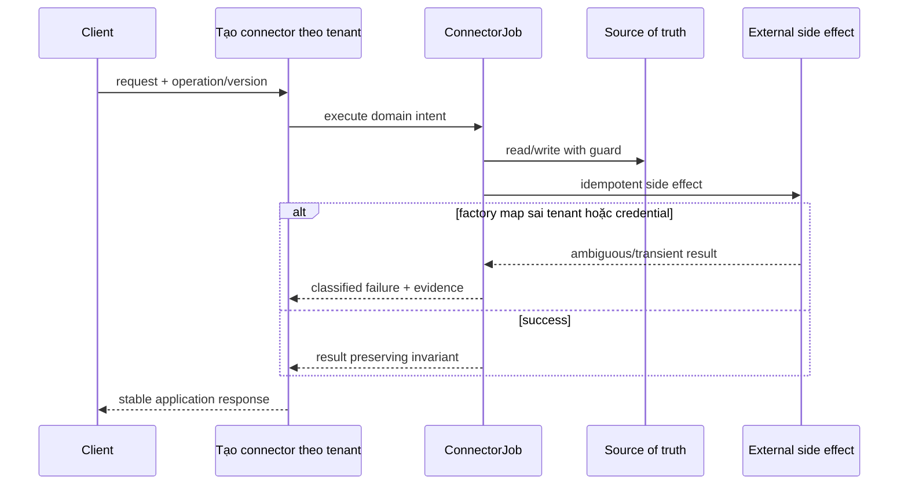

# Lời giải tham khảo — Factory Method (Production)

## Kết luận thiết kế

Lời giải chọn `ConnectorJob` làm boundary vì nó bao quanh phần thay đổi của **Tạo connector theo tenant** nhưng không kéo validation, transaction hoặc orchestration ổn định vào abstraction. Mục tiêu là bảo vệ **mỗi tenant nhận đúng connector và credential scope**, không phải chứng minh rằng mọi bài toán đều cần Factory Method.

## Sơ đồ lời giải



## Các bước refactor

1. Định nghĩa `ConnectorJob` bằng ngôn ngữ của **Tạo connector theo tenant**, không dùng interface chung chung.
2. Bọc implementation cũ sau cùng contract để tạo seam mà chưa thay behavior.
3. Thêm implementation mới và chạy dual-read/shadow compare; lưu mismatch có dữ liệu điều tra.
4. Đưa guard cho invariant **mỗi tenant nhận đúng connector và credential scope** gần source of truth nhất.
5. Classify **factory map sai tenant hoặc credential** thành domain/transient/permanent và gắn retry hoặc compensation tương ứng.
6. Triển khai registry có version, fallback có kiểm soát; chỉ chuyển traffic khi metric đạt ngưỡng và rollback đã được diễn tập.

## Phác thảo contract

```php
interface ConnectorJob
{
    /** Trả về kết quả domain hoặc ném lỗi application có nghĩa. */
    public function apply(array $input): mixed;
}
```

Trong implementation hoàn chỉnh của **Tạo connector theo tenant**, thay `array`/`mixed` bằng input và result có tên theo domain. Contract của Factory Method phải làm rõ precondition, postcondition và lỗi có thể quan sát; đoạn trên chỉ minh họa hướng dependency.

## Test suite tối thiểu

- `TaoConnectorTheoTenantBehaviorTest`: dựng fixture nhỏ nhất và assert trực tiếp invariant **mỗi tenant nhận đúng connector và credential scope.** trên output/state, không assert tên concrete class.
- `TaoConnectorTheoTenantFailureTest`: tạo **factory map sai tenant hoặc credential.**, kiểm tra error taxonomy và xác nhận state/side effect không ở trạng thái nửa vời.
- `FactoryMethodContractTest`: chạy cùng bộ contract cho mọi implementation hoặc variant được bài yêu cầu.
- `TaoConnectorTheoTenantReplayAndConcurrencyTest`: gửi lại operation hoặc tạo race tại source of truth; assert idempotency/version guard thay vì chỉ mock call count.
- `TaoConnectorTheoTenantMigrationTest`: chạy old/new trên cùng fixture hoặc shadow input, lưu mismatch có correlation ID và kiểm tra rollback trigger.
- Telemetry assertion: log/metric phải chứa operation, decision/version và failure class đủ để điều tra **Tạo connector theo tenant**.
## Failure walkthrough

Khi **factory map sai tenant hoặc credential**, implementation không được trả `null`/`false` mơ hồ. Nó phải tạo error có taxonomy rõ, giữ correlation/operation data cần thiết và không phá invariant **mỗi tenant nhận đúng connector và credential scope**. Nếu side effect có thể đã thành công, lần retry phải dựa vào operation record/idempotency evidence thay vì đoán.

## Trade-off và phương án thay thế

Trong **Tạo connector theo tenant**, Factory Method chỉ đáng giữ khi nó giảm rủi ro của **factory map sai tenant hoặc credential.** hoặc cho phép migration/rollback có evidence. Chi phí thật gồm wiring, version compatibility, telemetry, runbook và ownership khi on-call — không chỉ số class.

Baseline cần so sánh là **khởi tạo trực tiếp khi chỉ có một product**. Nếu shadow comparison không cho thấy blast radius, correctness hoặc recovery tốt hơn, hãy giữ baseline và ghi lại trigger xem xét lại. Trước khi rollout cần xác định source of truth, cleanup condition cho implementation cũ và metric chứng minh invariant **mỗi tenant nhận đúng connector và credential scope.** tiếp tục được giữ.
## Dấu hiệu lời giải chưa đạt

- Boundary của Factory Method không dùng ngôn ngữ **Tạo connector theo tenant**, khiến người đọc vẫn phải biết concrete detail.
- Test không chứng minh invariant **mỗi tenant nhận đúng connector và credential scope** hoặc chỉ xác nhận method được gọi.
- Selection, transaction hay error mapping vẫn nằm rải rác ở client nên blast radius không giảm.
- Diagram không khớp dependency thực trong code hoặc bỏ qua failure path quan trọng.
- Migration không có shadow evidence/rollback, hoặc retry vẫn có thể tạo side effect kép.

## Câu hỏi mở rộng

- Với **Tạo connector theo tenant**, metric nào chứng minh Factory Method giảm rủi ro thay đổi thay vì chỉ tăng số type?
- Khi số biến thể tăng, ai sở hữu selection, versioning và compatibility của boundary?
- Failure nào buộc thiết kế phải đổi, và failure nào nên được xử lý bên ngoài pattern?
- Điều kiện cleanup nào cho phép hợp nhất implementation hoặc xóa abstraction này?

## Ghi chú triển khai chuyên biệt cho Factory Method

Với **Lời giải tham khảo — Factory Method (Production)** cấp Production, creator giữ workflow ổn định và gọi factory method tại extension point; nếu mọi creation vẫn dồn vào một `match`, bài chưa chứng minh Factory Method.

### Test focus

Ở cấp **Production**, với **Lời giải tham khảo — Factory Method (Production)** cấp Production, test workflow chung ở creator base, contract của product và selection/construction của từng concrete creator; Production cần thêm config rollout và unknown-key behavior. Thêm failure/concurrency hoặc retry case, telemetry assertion và recovery verification.

### Bằng chứng nên lưu

Với **Tạo connector theo tenant**, lưu sơ đồ dependency trước/sau, fixture tái hiện lỗi, test chứng minh invariant, commit chuyển đổi và ADR của Factory Method. Reviewer cần nhìn được bằng chứng rằng boundary mới giảm blast radius hoặc làm failure dễ kiểm soát hơn, không chỉ thấy nhiều class hơn.
