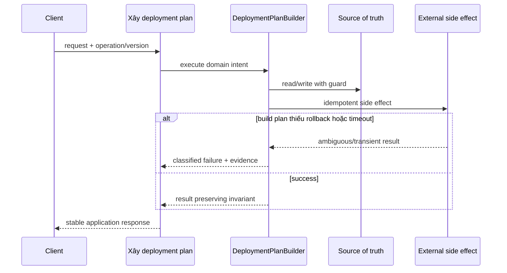

# Lời giải tham khảo — Builder (Production)

## Kết luận thiết kế

Lời giải chọn `DeploymentPlanBuilder` làm boundary vì nó bao quanh phần thay đổi của **Xây deployment plan** nhưng không kéo validation, transaction hoặc orchestration ổn định vào abstraction. Mục tiêu là bảo vệ **plan phải có rollback, health check và owner**, không phải chứng minh rằng mọi bài toán đều cần Builder.

## Sơ đồ lời giải



## Các bước refactor

1. Định nghĩa `DeploymentPlanBuilder` bằng ngôn ngữ của **Xây deployment plan**, không dùng interface chung chung.
2. Bọc implementation cũ sau cùng contract để tạo seam mà chưa thay behavior.
3. Thêm implementation mới và chạy dual-read/shadow compare; lưu mismatch có dữ liệu điều tra.
4. Đưa guard cho invariant **plan phải có rollback, health check và owner** gần source of truth nhất.
5. Classify **build plan thiếu rollback hoặc timeout** thành domain/transient/permanent và gắn retry hoặc compensation tương ứng.
6. Triển khai validation theo stage và immutable plan; chỉ chuyển traffic khi metric đạt ngưỡng và rollback đã được diễn tập.

## Phác thảo contract

```php
interface DeploymentPlanBuilder
{
    /** Trả về kết quả domain hoặc ném lỗi application có nghĩa. */
    public function apply(array $input): mixed;
}
```

Trong implementation hoàn chỉnh của **Xây deployment plan**, thay `array`/`mixed` bằng input và result có tên theo domain. Contract của Builder phải làm rõ precondition, postcondition và lỗi có thể quan sát; đoạn trên chỉ minh họa hướng dependency.

## Test suite tối thiểu

- `XayDeploymentPlanBehaviorTest`: dựng fixture nhỏ nhất và assert trực tiếp invariant **plan phải có rollback, health check và owner.** trên output/state, không assert tên concrete class.
- `XayDeploymentPlanFailureTest`: tạo **build plan thiếu rollback hoặc timeout.**, kiểm tra error taxonomy và xác nhận state/side effect không ở trạng thái nửa vời.
- `BuilderContractTest`: chạy cùng bộ contract cho mọi implementation hoặc variant được bài yêu cầu.
- `XayDeploymentPlanReplayAndConcurrencyTest`: gửi lại operation hoặc tạo race tại source of truth; assert idempotency/version guard thay vì chỉ mock call count.
- `XayDeploymentPlanMigrationTest`: chạy old/new trên cùng fixture hoặc shadow input, lưu mismatch có correlation ID và kiểm tra rollback trigger.
- Telemetry assertion: log/metric phải chứa operation, decision/version và failure class đủ để điều tra **Xây deployment plan**.
## Failure walkthrough

Khi **build plan thiếu rollback hoặc timeout**, implementation không được trả `null`/`false` mơ hồ. Nó phải tạo error có taxonomy rõ, giữ correlation/operation data cần thiết và không phá invariant **plan phải có rollback, health check và owner**. Nếu side effect có thể đã thành công, lần retry phải dựa vào operation record/idempotency evidence thay vì đoán.

## Trade-off và phương án thay thế

Trong **Xây deployment plan**, Builder chỉ đáng giữ khi nó giảm rủi ro của **build plan thiếu rollback hoặc timeout.** hoặc cho phép migration/rollback có evidence. Chi phí thật gồm wiring, version compatibility, telemetry, runbook và ownership khi on-call — không chỉ số class.

Baseline cần so sánh là **constructor named arguments khi object đơn giản**. Nếu shadow comparison không cho thấy blast radius, correctness hoặc recovery tốt hơn, hãy giữ baseline và ghi lại trigger xem xét lại. Trước khi rollout cần xác định source of truth, cleanup condition cho implementation cũ và metric chứng minh invariant **plan phải có rollback, health check và owner.** tiếp tục được giữ.
## Dấu hiệu lời giải chưa đạt

- Boundary của Builder không dùng ngôn ngữ **Xây deployment plan**, khiến người đọc vẫn phải biết concrete detail.
- Test không chứng minh invariant **plan phải có rollback, health check và owner** hoặc chỉ xác nhận method được gọi.
- Selection, transaction hay error mapping vẫn nằm rải rác ở client nên blast radius không giảm.
- Diagram không khớp dependency thực trong code hoặc bỏ qua failure path quan trọng.
- Migration không có shadow evidence/rollback, hoặc retry vẫn có thể tạo side effect kép.

## Câu hỏi mở rộng

- Với **Xây deployment plan**, metric nào chứng minh Builder giảm rủi ro thay đổi thay vì chỉ tăng số type?
- Khi số biến thể tăng, ai sở hữu selection, versioning và compatibility của boundary?
- Failure nào buộc thiết kế phải đổi, và failure nào nên được xử lý bên ngoài pattern?
- Điều kiện cleanup nào cho phép hợp nhất implementation hoặc xóa abstraction này?

## Ghi chú triển khai chuyên biệt cho Builder

Trong **Lời giải tham khảo — Builder (Production)** cấp Production, Builder phải làm rõ thứ tự bước, preset và validation liên bước; object hoàn tất nên immutable và không thể tồn tại ở trạng thái build dở.

### Test focus

Ở cấp **Production**, test incomplete build, preset và hai builder instance không rò state. Thêm failure/concurrency hoặc retry case, telemetry assertion và recovery verification.

### Bằng chứng nên lưu

Với **Xây deployment plan**, lưu sơ đồ dependency trước/sau, fixture tái hiện lỗi, test chứng minh invariant, commit chuyển đổi và ADR của Builder. Reviewer cần nhìn được bằng chứng rằng boundary mới giảm blast radius hoặc làm failure dễ kiểm soát hơn, không chỉ thấy nhiều class hơn.
