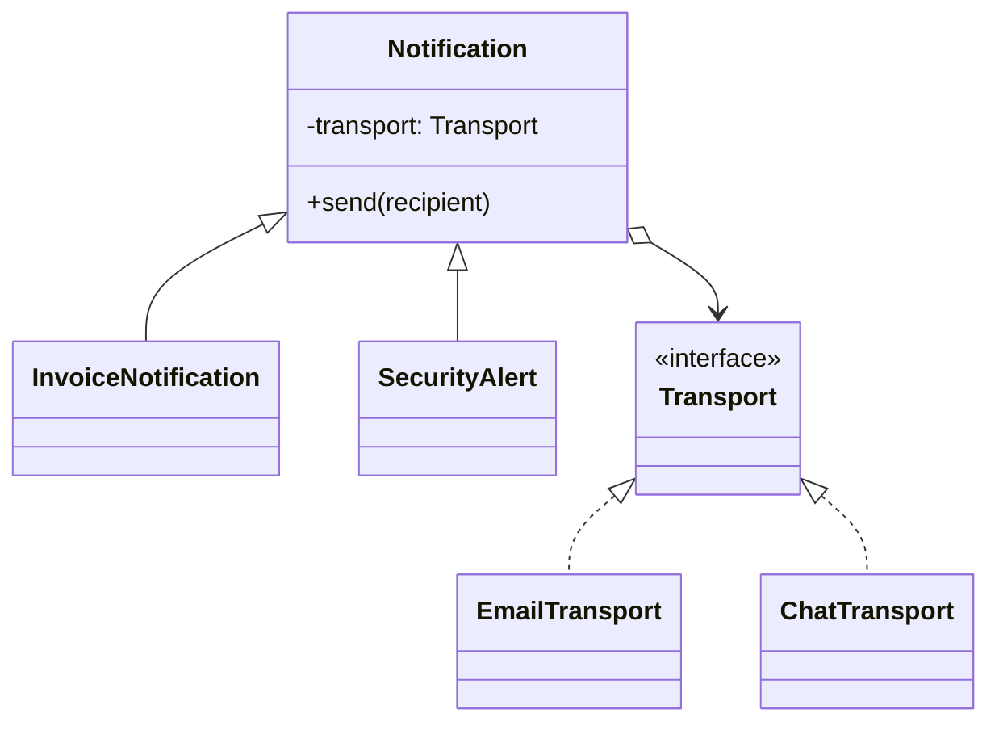

# Module 32 — Production: Bridge

## Vì sao bài này tồn tại?

**Thông báo đa template/transport** là tình huống độc lập được xây dựng riêng cho Bridge. Bài không lấy từ một source ẩn: bạn tự tạo phiên bản `before` tối thiểu dựa trên mô tả dưới đây, sau đó dùng test để chứng minh refactor không đổi behavior. Bài Production giả định hệ thống đã chạy thật. Ngoài cấu trúc code, lời giải phải xử lý migration, failure, idempotency hoặc observability phù hợp với use case.

## Câu chuyện nghiệp vụ

Hệ thống cần xử lý **Thông báo đa template/transport**. `Notification` đang nhân class theo mọi tổ hợp notification type, locale và transport.

Invariant trung tâm của bài **Bridge** là:

> **template và transport tiến hóa độc lập.**

Ở cấp Production, **Bridge** phải bảo vệ invariant dưới retry/concurrency hoặc partial failure, đồng thời có migration seam, telemetry, rollback trigger và cleanup condition sau rollout.

Failure bắt buộc phải được mô hình hóa:

> **capability mismatch giữa notification và transport.**

## Trạng thái code ban đầu

```php
final class Notification
{
    public function handle(array $input): mixed
    {
        // validation chung, lựa chọn biến thể và side effect
        // đang bị trộn trong một method.
        throw new RuntimeException('Hãy dựng phiên bản before phù hợp đề bài.');
    }
}
```

Đây là skeleton định hướng, không phải lời giải. Hãy thêm dữ liệu và behavior nhỏ nhất đủ tái hiện pain point của **Thông báo đa template/transport**.

## Mô hình thiết kế cần hướng tới



Loại nội dung và transport tiến hóa độc lập. Template version, locale và delivery capability phải được kiểm tra trước khi gửi; Bridge không thay thế routing/retry policy.

## Nhiệm vụ

1. Khóa behavior hiện tại của **Thông báo đa template/transport** bằng characterization test và log một trace hoàn chỉnh.
2. Xác định source of truth, transaction boundary và side effect bên ngoài quanh `Transport`.
3. Tạo một migration seam để chạy song song implementation cũ/mới; so sánh kết quả trước khi chuyển traffic.
4. Mô phỏng failure **capability mismatch giữa notification và transport** và chứng minh retry/replay không phá invariant.
5. Bổ sung capability negotiation và compatibility matrix; định nghĩa metric, alert và rollback trigger.
6. Viết ADR ghi rõ evidence, phương án baseline, cleanup condition và người sở hữu runbook.

## Dữ liệu thử tối thiểu

- Hai scenario hợp lệ đại diện cho hai biến thể khác nhau.
- Một boundary value liên quan trực tiếp tới **template và transport tiến hóa độc lập**.
- Một scenario tạo ra **capability mismatch giữa notification và transport**.
- Một operation lặp lại và một scenario concurrent/replay.

## Gợi ý triển khai

- Bắt đầu bằng behavior và invariant; chỉ tạo abstraction sau khi xác định đúng trục thay đổi.
- Đặt tên method theo domain của **Thông báo đa template/transport**, tránh `execute(mixed $data)` hoặc `handleAnything()`.
- Tách selection/wiring khỏi business calculation; composition root có thể biết concrete class nhưng use case không nên biết.
- Đừng nuốt exception. Map lỗi kỹ thuật thành error có ý nghĩa và giữ nguyên cause để điều tra.
- Nếu **kế thừa khi chỉ có một trục thay đổi** vẫn rõ ràng hơn và thay đổi chưa có thật, hãy ghi kết luận “chưa cần pattern” trong ADR.

## Test bắt buộc

- Replay cùng operation không tạo kết quả thứ hai và vẫn giữ **template và transport tiến hóa độc lập**.
- Concurrency test tại boundary nơi **capability mismatch giữa notification và transport** có thể xảy ra.
- Migration test so sánh old/new implementation trên cùng fixture hoặc shadow traffic.
- Telemetry test/assertion cho correlation ID, error class và decision version.

## Deliverable

```text
solution/
├── before.php
├── after.php
├── tests/
│   ├── CharacterizationTest.php
│   ├── ContractOrBehaviorTest.php
│   └── FailurePathTest.php
└── ADR.md
```

Bài Production cần thêm migration.md, dashboard.md và runbook.md.

## Tiêu chí tự chấm

- [ ] Tên class/method phản ánh đúng **Thông báo đa template/transport**.
- [ ] Invariant **template và transport tiến hóa độc lập** có test tự động.
- [ ] Failure **capability mismatch giữa notification và transport** có outcome xác định.
- [ ] Client biết ít concrete detail hơn sau refactor.
- [ ] Diagram, code và test mô tả cùng một boundary.
- [ ] Có giải thích khi nào **kế thừa khi chỉ có một trục thay đổi** tốt hơn.
- [ ] Có migration, rollback, metric và runbook.

## Câu hỏi design review

1. Trục thay đổi thật sự của **Thông báo đa template/transport** là gì, và `Transport` cô lập nó ở đâu?
2. Invariant **template và transport tiến hóa độc lập** được enforce ở layer nào? Có đường đi nào bypass không?
3. Khi **capability mismatch giữa notification và transport** xảy ra, client nhận error gì và operator nhìn thấy evidence nào?
4. Pattern này làm dependency graph tốt hơn ở điểm nào, và tạo thêm chi phí gì?
5. Dấu hiệu nào cho biết nên quay lại phương án **kế thừa khi chỉ có một trục thay đổi**?

## Lời giải tham khảo

Với **Thông báo đa template/transport**, hãy hoàn thành test và tự vẽ dependency trước/sau rồi mới mở [`SOLUTION.md`](SOLUTION.md). Khi đối chiếu, ưu tiên invariant, failure semantics và khả năng mở rộng của Bridge thay vì đếm class.
