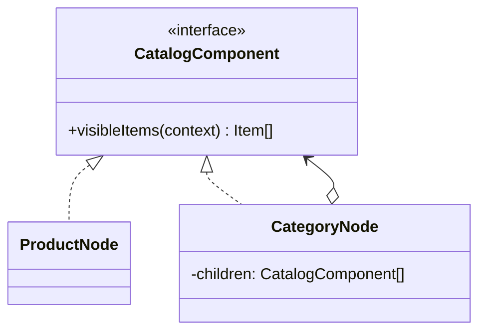

# Module 33 — Production: Composite

## Vì sao bài này tồn tại?

**Danh mục sản phẩm phân cấp** là tình huống độc lập được xây dựng riêng cho Composite. Bài không lấy từ một source ẩn: bạn tự tạo phiên bản `before` tối thiểu dựa trên mô tả dưới đây, sau đó dùng test để chứng minh refactor không đổi behavior. Bài Production giả định hệ thống đã chạy thật. Ngoài cấu trúc code, lời giải phải xử lý migration, failure, idempotency hoặc observability phù hợp với use case.

## Câu chuyện nghiệp vụ

Hệ thống cần xử lý **Danh mục sản phẩm phân cấp**. `CatalogTreeService` đang xử lý category và product bằng code riêng, đồng thời có nguy cơ cycle/N+1 khi duyệt cây.

Invariant trung tâm của bài **Composite** là:

> **aggregate không double-count và traversal có giới hạn.**

Ở cấp Production, **Composite** phải bảo vệ invariant dưới retry/concurrency hoặc partial failure, đồng thời có migration seam, telemetry, rollback trigger và cleanup condition sau rollout.

Failure bắt buộc phải được mô hình hóa:

> **cycle, depth quá lớn hoặc stale child.**

## Trạng thái code ban đầu

```php
final class CatalogTreeService
{
    public function handle(array $input): mixed
    {
        // validation chung, lựa chọn biến thể và side effect
        // đang bị trộn trong một method.
        throw new RuntimeException('Hãy dựng phiên bản before phù hợp đề bài.');
    }
}
```

Đây là skeleton định hướng, không phải lời giải. Hãy thêm dữ liệu và behavior nhỏ nhất đủ tái hiện pain point của **Danh mục sản phẩm phân cấp**.

## Mô hình thiết kế cần hướng tới



Composite cho phép áp dụng visibility/pricing traversal trên cây catalog. Cần bảo vệ cycle, depth limit và N+1 query; không load toàn cây khi chỉ cần một projection.

## Nhiệm vụ

1. Khóa behavior hiện tại của **Danh mục sản phẩm phân cấp** bằng characterization test và log một trace hoàn chỉnh.
2. Xác định source of truth, transaction boundary và side effect bên ngoài quanh `CatalogNode`.
3. Tạo một migration seam để chạy song song implementation cũ/mới; so sánh kết quả trước khi chuyển traffic.
4. Mô phỏng failure **cycle, depth quá lớn hoặc stale child** và chứng minh retry/replay không phá invariant.
5. Bổ sung cycle detection, batch loading, projection cache; định nghĩa metric, alert và rollback trigger.
6. Viết ADR ghi rõ evidence, phương án baseline, cleanup condition và người sở hữu runbook.

## Dữ liệu thử tối thiểu

- Hai scenario hợp lệ đại diện cho hai biến thể khác nhau.
- Một boundary value liên quan trực tiếp tới **aggregate không double-count và traversal có giới hạn**.
- Một scenario tạo ra **cycle, depth quá lớn hoặc stale child**.
- Một operation lặp lại và một scenario concurrent/replay.

## Gợi ý triển khai

- Bắt đầu bằng behavior và invariant; chỉ tạo abstraction sau khi xác định đúng trục thay đổi.
- Đặt tên method theo domain của **Danh mục sản phẩm phân cấp**, tránh `execute(mixed $data)` hoặc `handleAnything()`.
- Tách selection/wiring khỏi business calculation; composition root có thể biết concrete class nhưng use case không nên biết.
- Đừng nuốt exception. Map lỗi kỹ thuật thành error có ý nghĩa và giữ nguyên cause để điều tra.
- Nếu **mảng phẳng khi không có tree behavior** vẫn rõ ràng hơn và thay đổi chưa có thật, hãy ghi kết luận “chưa cần pattern” trong ADR.

## Test bắt buộc

- Replay cùng operation không tạo kết quả thứ hai và vẫn giữ **aggregate không double-count và traversal có giới hạn**.
- Concurrency test tại boundary nơi **cycle, depth quá lớn hoặc stale child** có thể xảy ra.
- Migration test so sánh old/new implementation trên cùng fixture hoặc shadow traffic.
- Telemetry test/assertion cho correlation ID, error class và decision version.

## Deliverable

```text
solution/
├── before.php
├── after.php
├── tests/
│   ├── CharacterizationTest.php
│   ├── ContractOrBehaviorTest.php
│   └── FailurePathTest.php
└── ADR.md
```

Bài Production cần thêm migration.md, dashboard.md và runbook.md.

## Tiêu chí tự chấm

- [ ] Tên class/method phản ánh đúng **Danh mục sản phẩm phân cấp**.
- [ ] Invariant **aggregate không double-count và traversal có giới hạn** có test tự động.
- [ ] Failure **cycle, depth quá lớn hoặc stale child** có outcome xác định.
- [ ] Client biết ít concrete detail hơn sau refactor.
- [ ] Diagram, code và test mô tả cùng một boundary.
- [ ] Có giải thích khi nào **mảng phẳng khi không có tree behavior** tốt hơn.
- [ ] Có migration, rollback, metric và runbook.

## Câu hỏi design review

1. Trục thay đổi thật sự của **Danh mục sản phẩm phân cấp** là gì, và `CatalogNode` cô lập nó ở đâu?
2. Invariant **aggregate không double-count và traversal có giới hạn** được enforce ở layer nào? Có đường đi nào bypass không?
3. Khi **cycle, depth quá lớn hoặc stale child** xảy ra, client nhận error gì và operator nhìn thấy evidence nào?
4. Pattern này làm dependency graph tốt hơn ở điểm nào, và tạo thêm chi phí gì?
5. Dấu hiệu nào cho biết nên quay lại phương án **mảng phẳng khi không có tree behavior**?

## Lời giải tham khảo

Với **Danh mục sản phẩm phân cấp**, hãy hoàn thành test và tự vẽ dependency trước/sau rồi mới mở [`SOLUTION.md`](SOLUTION.md). Khi đối chiếu, ưu tiên invariant, failure semantics và khả năng mở rộng của Composite thay vì đếm class.
