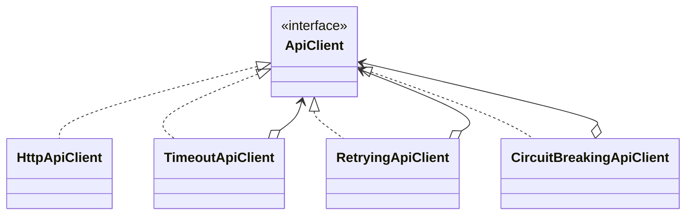

# Module 34 — Production: Decorator

## Vì sao bài này tồn tại?

**HTTP client resilient** là tình huống độc lập được xây dựng riêng cho Decorator. Bài không lấy từ một source ẩn: bạn tự tạo phiên bản `before` tối thiểu dựa trên mô tả dưới đây, sau đó dùng test để chứng minh refactor không đổi behavior. Bài Production giả định hệ thống đã chạy thật. Ngoài cấu trúc code, lời giải phải xử lý migration, failure, idempotency hoặc observability phù hợp với use case.

## Câu chuyện nghiệp vụ

Hệ thống cần xử lý **HTTP client resilient**. `ResilientApiClient` đang đóng gói timeout, retry, circuit breaker và metrics trong một class khó thay thứ tự và kiểm chứng.

Invariant trung tâm của bài **Decorator** là:

> **timeout/retry/logging không thay contract nghiệp vụ.**

Ở cấp Production, **Decorator** phải bảo vệ invariant dưới retry/concurrency hoặc partial failure, đồng thời có migration seam, telemetry, rollback trigger và cleanup condition sau rollout.

Failure bắt buộc phải được mô hình hóa:

> **retry request không idempotent hoặc wrapper order sai.**

## Trạng thái code ban đầu

```php
final class ResilientApiClient
{
    public function handle(array $input): mixed
    {
        // validation chung, lựa chọn biến thể và side effect
        // đang bị trộn trong một method.
        throw new RuntimeException('Hãy dựng phiên bản before phù hợp đề bài.');
    }
}
```

Đây là skeleton định hướng, không phải lời giải. Hãy thêm dữ liệu và behavior nhỏ nhất đủ tái hiện pain point của **HTTP client resilient**.

## Mô hình thiết kế cần hướng tới



Mỗi decorator thêm timeout/retry/circuit breaker có metric riêng. Retry chỉ áp dụng operation idempotent và thứ tự wrapper phải được kiểm chứng bằng failure-injection test.

## Nhiệm vụ

1. Khóa behavior hiện tại của **HTTP client resilient** bằng characterization test và log một trace hoàn chỉnh.
2. Xác định source of truth, transaction boundary và side effect bên ngoài quanh `ApiClient`.
3. Tạo một migration seam để chạy song song implementation cũ/mới; so sánh kết quả trước khi chuyển traffic.
4. Mô phỏng failure **retry request không idempotent hoặc wrapper order sai** và chứng minh retry/replay không phá invariant.
5. Bổ sung policy retry theo method, tracing và circuit breaker; định nghĩa metric, alert và rollback trigger.
6. Viết ADR ghi rõ evidence, phương án baseline, cleanup condition và người sở hữu runbook.

## Dữ liệu thử tối thiểu

- Hai scenario hợp lệ đại diện cho hai biến thể khác nhau.
- Một boundary value liên quan trực tiếp tới **timeout/retry/logging không thay contract nghiệp vụ**.
- Một scenario tạo ra **retry request không idempotent hoặc wrapper order sai**.
- Một operation lặp lại và một scenario concurrent/replay.

## Gợi ý triển khai

- Bắt đầu bằng behavior và invariant; chỉ tạo abstraction sau khi xác định đúng trục thay đổi.
- Đặt tên method theo domain của **HTTP client resilient**, tránh `execute(mixed $data)` hoặc `handleAnything()`.
- Tách selection/wiring khỏi business calculation; composition root có thể biết concrete class nhưng use case không nên biết.
- Đừng nuốt exception. Map lỗi kỹ thuật thành error có ý nghĩa và giữ nguyên cause để điều tra.
- Nếu **một service duy nhất khi behavior không composable** vẫn rõ ràng hơn và thay đổi chưa có thật, hãy ghi kết luận “chưa cần pattern” trong ADR.

## Test bắt buộc

- Replay cùng operation không tạo kết quả thứ hai và vẫn giữ **timeout/retry/logging không thay contract nghiệp vụ**.
- Concurrency test tại boundary nơi **retry request không idempotent hoặc wrapper order sai** có thể xảy ra.
- Migration test so sánh old/new implementation trên cùng fixture hoặc shadow traffic.
- Telemetry test/assertion cho correlation ID, error class và decision version.

## Deliverable

```text
solution/
├── before.php
├── after.php
├── tests/
│   ├── CharacterizationTest.php
│   ├── ContractOrBehaviorTest.php
│   └── FailurePathTest.php
└── ADR.md
```

Bài Production cần thêm migration.md, dashboard.md và runbook.md.

## Tiêu chí tự chấm

- [ ] Tên class/method phản ánh đúng **HTTP client resilient**.
- [ ] Invariant **timeout/retry/logging không thay contract nghiệp vụ** có test tự động.
- [ ] Failure **retry request không idempotent hoặc wrapper order sai** có outcome xác định.
- [ ] Client biết ít concrete detail hơn sau refactor.
- [ ] Diagram, code và test mô tả cùng một boundary.
- [ ] Có giải thích khi nào **một service duy nhất khi behavior không composable** tốt hơn.
- [ ] Có migration, rollback, metric và runbook.

## Câu hỏi design review

1. Trục thay đổi thật sự của **HTTP client resilient** là gì, và `ApiClient` cô lập nó ở đâu?
2. Invariant **timeout/retry/logging không thay contract nghiệp vụ** được enforce ở layer nào? Có đường đi nào bypass không?
3. Khi **retry request không idempotent hoặc wrapper order sai** xảy ra, client nhận error gì và operator nhìn thấy evidence nào?
4. Pattern này làm dependency graph tốt hơn ở điểm nào, và tạo thêm chi phí gì?
5. Dấu hiệu nào cho biết nên quay lại phương án **một service duy nhất khi behavior không composable**?

## Lời giải tham khảo

Với **HTTP client resilient**, hãy hoàn thành test và tự vẽ dependency trước/sau rồi mới mở [`SOLUTION.md`](SOLUTION.md). Khi đối chiếu, ưu tiên invariant, failure semantics và khả năng mở rộng của Decorator thay vì đếm class.
