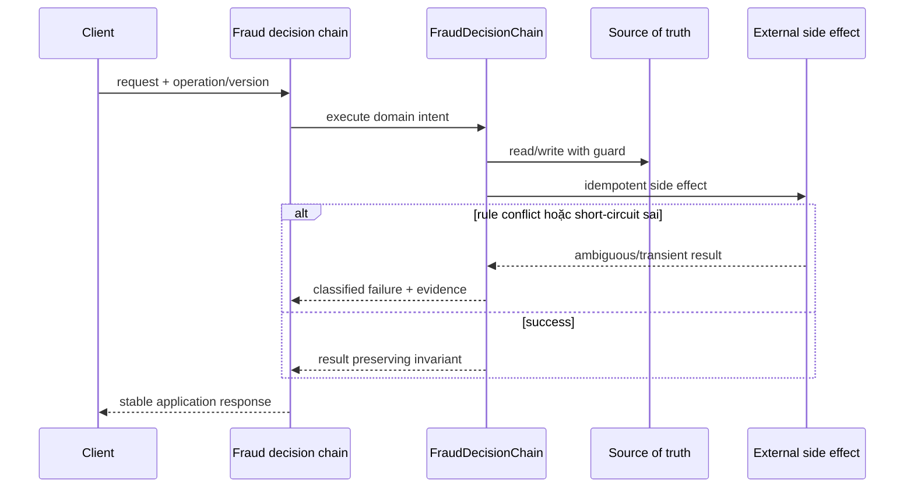

# Lời giải tham khảo — Chain of Responsibility (Production)

## Kết luận thiết kế

Lời giải chọn `FraudDecisionChain` làm boundary vì nó bao quanh phần thay đổi của **Fraud decision chain** nhưng không kéo validation, transaction hoặc orchestration ổn định vào abstraction. Mục tiêu là bảo vệ **quyết định có reason trail và deterministic order**, không phải chứng minh rằng mọi bài toán đều cần Chain of Responsibility.

## Sơ đồ lời giải



## Các bước refactor

1. Định nghĩa `FraudDecisionChain` bằng ngôn ngữ của **Fraud decision chain**, không dùng interface chung chung.
2. Bọc implementation cũ sau cùng contract để tạo seam mà chưa thay behavior.
3. Thêm implementation mới và chạy dual-read/shadow compare; lưu mismatch có dữ liệu điều tra.
4. Đưa guard cho invariant **quyết định có reason trail và deterministic order** gần source of truth nhất.
5. Classify **rule conflict hoặc short-circuit sai** thành domain/transient/permanent và gắn retry hoặc compensation tương ứng.
6. Triển khai rule versioning, explainability và shadow evaluation; chỉ chuyển traffic khi metric đạt ngưỡng và rollback đã được diễn tập.

## Phác thảo contract

```php
interface FraudDecisionChain
{
    /** Trả về kết quả domain hoặc ném lỗi application có nghĩa. */
    public function apply(array $input): mixed;
}
```

Trong implementation hoàn chỉnh của **Fraud decision chain**, thay `array`/`mixed` bằng input và result có tên theo domain. Contract của Chain of Responsibility phải làm rõ precondition, postcondition và lỗi có thể quan sát; đoạn trên chỉ minh họa hướng dependency.

## Test suite tối thiểu

- `FraudDecisionChainBehaviorTest`: dựng fixture nhỏ nhất và assert trực tiếp invariant **quyết định có reason trail và deterministic order.** trên output/state, không assert tên concrete class.
- `FraudDecisionChainFailureTest`: tạo **rule conflict hoặc short-circuit sai.**, kiểm tra error taxonomy và xác nhận state/side effect không ở trạng thái nửa vời.
- `ChainofResponsibilityContractTest`: chạy cùng bộ contract cho mọi implementation hoặc variant được bài yêu cầu.
- `FraudDecisionChainReplayAndConcurrencyTest`: gửi lại operation hoặc tạo race tại source of truth; assert idempotency/version guard thay vì chỉ mock call count.
- `FraudDecisionChainMigrationTest`: chạy old/new trên cùng fixture hoặc shadow input, lưu mismatch có correlation ID và kiểm tra rollback trigger.
- Telemetry assertion: log/metric phải chứa operation, decision/version và failure class đủ để điều tra **Fraud decision chain**.
## Failure walkthrough

Khi **rule conflict hoặc short-circuit sai**, implementation không được trả `null`/`false` mơ hồ. Nó phải tạo error có taxonomy rõ, giữ correlation/operation data cần thiết và không phá invariant **quyết định có reason trail và deterministic order**. Nếu side effect có thể đã thành công, lần retry phải dựa vào operation record/idempotency evidence thay vì đoán.

## Trade-off và phương án thay thế

Trong **Fraud decision chain**, Chain of Responsibility chỉ đáng giữ khi nó giảm rủi ro của **rule conflict hoặc short-circuit sai.** hoặc cho phép migration/rollback có evidence. Chi phí thật gồm wiring, version compatibility, telemetry, runbook và ownership khi on-call — không chỉ số class.

Baseline cần so sánh là **if/elseif rõ ràng khi chuỗi ngắn cố định**. Nếu shadow comparison không cho thấy blast radius, correctness hoặc recovery tốt hơn, hãy giữ baseline và ghi lại trigger xem xét lại. Trước khi rollout cần xác định source of truth, cleanup condition cho implementation cũ và metric chứng minh invariant **quyết định có reason trail và deterministic order.** tiếp tục được giữ.
## Dấu hiệu lời giải chưa đạt

- Boundary của Chain of Responsibility không dùng ngôn ngữ **Fraud decision chain**, khiến người đọc vẫn phải biết concrete detail.
- Test không chứng minh invariant **quyết định có reason trail và deterministic order** hoặc chỉ xác nhận method được gọi.
- Selection, transaction hay error mapping vẫn nằm rải rác ở client nên blast radius không giảm.
- Diagram không khớp dependency thực trong code hoặc bỏ qua failure path quan trọng.
- Migration không có shadow evidence/rollback, hoặc retry vẫn có thể tạo side effect kép.

## Câu hỏi mở rộng

- Với **Fraud decision chain**, metric nào chứng minh Chain of Responsibility giảm rủi ro thay đổi thay vì chỉ tăng số type?
- Khi số biến thể tăng, ai sở hữu selection, versioning và compatibility của boundary?
- Failure nào buộc thiết kế phải đổi, và failure nào nên được xử lý bên ngoài pattern?
- Điều kiện cleanup nào cho phép hợp nhất implementation hoặc xóa abstraction này?

## Ghi chú triển khai chuyên biệt cho Chain of Responsibility

Ở **Lời giải tham khảo — Chain of Responsibility (Production)** cấp Production, mỗi handler phải công khai điều kiện xử lý, kết quả handled/continue và thứ tự; audit/explanation là bắt buộc khi chain ảnh hưởng quyết định nghiệp vụ.

### Test focus

Ở cấp **Production**, test no-handler, first-match, conflict, order và reason trail. Thêm failure/concurrency hoặc retry case, telemetry assertion và recovery verification.

### Bằng chứng nên lưu

Với **Fraud decision chain**, lưu sơ đồ dependency trước/sau, fixture tái hiện lỗi, test chứng minh invariant, commit chuyển đổi và ADR của Chain of Responsibility. Reviewer cần nhìn được bằng chứng rằng boundary mới giảm blast radius hoặc làm failure dễ kiểm soát hơn, không chỉ thấy nhiều class hơn.
