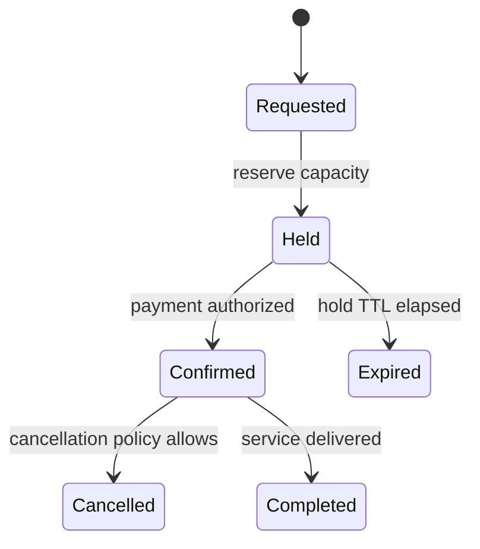

# Module 40 — Production: State

## Vì sao bài này tồn tại?

**Booking lifecycle** là tình huống độc lập được xây dựng riêng cho State. Bài không lấy từ một source ẩn: bạn tự tạo phiên bản `before` tối thiểu dựa trên mô tả dưới đây, sau đó dùng test để chứng minh refactor không đổi behavior. Bài Production giả định hệ thống đã chạy thật. Ngoài cấu trúc code, lời giải phải xử lý migration, failure, idempotency hoặc observability phù hợp với use case.

## Câu chuyện nghiệp vụ

Hệ thống cần xử lý **Booking lifecycle**. `Booking` đang xử lý hold/confirm/expire bằng nhiều worker cạnh tranh nhưng không có transition/version guard.

Invariant trung tâm của bài **State** là:

> **hold/confirm/cancel tuân TTL và ownership.**

Ở cấp Production, **State** phải bảo vệ invariant dưới retry/concurrency hoặc partial failure, đồng thời có migration seam, telemetry, rollback trigger và cleanup condition sau rollout.

Failure bắt buộc phải được mô hình hóa:

> **race confirm-expire hoặc event đến muộn.**

## Trạng thái code ban đầu

```php
final class Booking
{
    public function handle(array $input): mixed
    {
        // validation chung, lựa chọn biến thể và side effect
        // đang bị trộn trong một method.
        throw new RuntimeException('Hãy dựng phiên bản before phù hợp đề bài.');
    }
}
```

Đây là skeleton định hướng, không phải lời giải. Hãy thêm dữ liệu và behavior nhỏ nhất đủ tái hiện pain point của **Booking lifecycle**.

## Mô hình thiết kế cần hướng tới



Lifecycle phải gắn transition với guard, side effect và version check. Expiration/cancellation cạnh tranh cần optimistic locking để không vừa confirm vừa expire.

## Nhiệm vụ

1. Khóa behavior hiện tại của **Booking lifecycle** bằng characterization test và log một trace hoàn chỉnh.
2. Xác định source of truth, transaction boundary và side effect bên ngoài quanh `BookingState`.
3. Tạo một migration seam để chạy song song implementation cũ/mới; so sánh kết quả trước khi chuyển traffic.
4. Mô phỏng failure **race confirm-expire hoặc event đến muộn** và chứng minh retry/replay không phá invariant.
5. Bổ sung optimistic locking, transition audit và repair command; định nghĩa metric, alert và rollback trigger.
6. Viết ADR ghi rõ evidence, phương án baseline, cleanup condition và người sở hữu runbook.

## Dữ liệu thử tối thiểu

- Hai scenario hợp lệ đại diện cho hai biến thể khác nhau.
- Một boundary value liên quan trực tiếp tới **hold/confirm/cancel tuân TTL và ownership**.
- Một scenario tạo ra **race confirm-expire hoặc event đến muộn**.
- Một operation lặp lại và một scenario concurrent/replay.

## Gợi ý triển khai

- Bắt đầu bằng behavior và invariant; chỉ tạo abstraction sau khi xác định đúng trục thay đổi.
- Đặt tên method theo domain của **Booking lifecycle**, tránh `execute(mixed $data)` hoặc `handleAnything()`.
- Tách selection/wiring khỏi business calculation; composition root có thể biết concrete class nhưng use case không nên biết.
- Đừng nuốt exception. Map lỗi kỹ thuật thành error có ý nghĩa và giữ nguyên cause để điều tra.
- Nếu **enum + switch khi transition ít và ổn định** vẫn rõ ràng hơn và thay đổi chưa có thật, hãy ghi kết luận “chưa cần pattern” trong ADR.

## Test bắt buộc

- Replay cùng operation không tạo kết quả thứ hai và vẫn giữ **hold/confirm/cancel tuân TTL và ownership**.
- Concurrency test tại boundary nơi **race confirm-expire hoặc event đến muộn** có thể xảy ra.
- Migration test so sánh old/new implementation trên cùng fixture hoặc shadow traffic.
- Telemetry test/assertion cho correlation ID, error class và decision version.

## Deliverable

```text
solution/
├── before.php
├── after.php
├── tests/
│   ├── CharacterizationTest.php
│   ├── ContractOrBehaviorTest.php
│   └── FailurePathTest.php
└── ADR.md
```

Bài Production cần thêm migration.md, dashboard.md và runbook.md.

## Tiêu chí tự chấm

- [ ] Tên class/method phản ánh đúng **Booking lifecycle**.
- [ ] Invariant **hold/confirm/cancel tuân TTL và ownership** có test tự động.
- [ ] Failure **race confirm-expire hoặc event đến muộn** có outcome xác định.
- [ ] Client biết ít concrete detail hơn sau refactor.
- [ ] Diagram, code và test mô tả cùng một boundary.
- [ ] Có giải thích khi nào **enum + switch khi transition ít và ổn định** tốt hơn.
- [ ] Có migration, rollback, metric và runbook.

## Câu hỏi design review

1. Trục thay đổi thật sự của **Booking lifecycle** là gì, và `BookingState` cô lập nó ở đâu?
2. Invariant **hold/confirm/cancel tuân TTL và ownership** được enforce ở layer nào? Có đường đi nào bypass không?
3. Khi **race confirm-expire hoặc event đến muộn** xảy ra, client nhận error gì và operator nhìn thấy evidence nào?
4. Pattern này làm dependency graph tốt hơn ở điểm nào, và tạo thêm chi phí gì?
5. Dấu hiệu nào cho biết nên quay lại phương án **enum + switch khi transition ít và ổn định**?

## Lời giải tham khảo

Với **Booking lifecycle**, hãy hoàn thành test và tự vẽ dependency trước/sau rồi mới mở [`SOLUTION.md`](SOLUTION.md). Khi đối chiếu, ưu tiên invariant, failure semantics và khả năng mở rộng của State thay vì đếm class.
