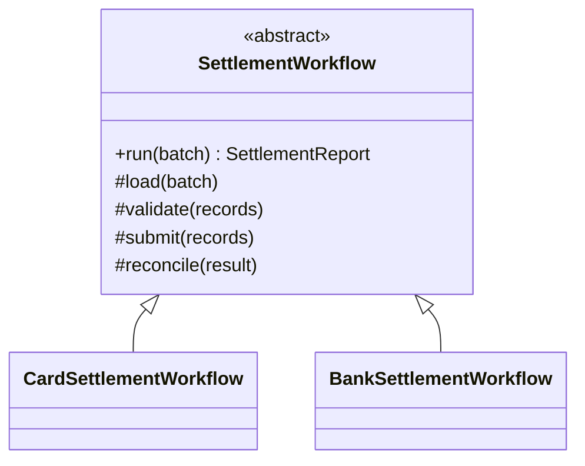

# Module 41 — Production: Template Method

## Vì sao bài này tồn tại?

**Batch settlement workflow** là tình huống độc lập được xây dựng riêng cho Template Method. Bài không lấy từ một source ẩn: bạn tự tạo phiên bản `before` tối thiểu dựa trên mô tả dưới đây, sau đó dùng test để chứng minh refactor không đổi behavior. Bài Production giả định hệ thống đã chạy thật. Ngoài cấu trúc code, lời giải phải xử lý migration, failure, idempotency hoặc observability phù hợp với use case.

## Câu chuyện nghiệp vụ

Hệ thống cần xử lý **Batch settlement workflow**. `SettlementWorkflow` đang copy checkpoint, submit và reconcile giữa từng provider, dễ commit checkpoint sai thời điểm.

Invariant trung tâm của bài **Template Method** là:

> **skeleton giữ audit/transaction; hook chỉ tùy biến bước an toàn.**

Ở cấp Production, **Template Method** phải bảo vệ invariant dưới retry/concurrency hoặc partial failure, đồng thời có migration seam, telemetry, rollback trigger và cleanup condition sau rollout.

Failure bắt buộc phải được mô hình hóa:

> **subclass override phá transaction boundary.**

## Trạng thái code ban đầu

```php
final class SettlementWorkflow
{
    public function handle(array $input): mixed
    {
        // validation chung, lựa chọn biến thể và side effect
        // đang bị trộn trong một method.
        throw new RuntimeException('Hãy dựng phiên bản before phù hợp đề bài.');
    }
}
```

Đây là skeleton định hướng, không phải lời giải. Hãy thêm dữ liệu và behavior nhỏ nhất đủ tái hiện pain point của **Batch settlement workflow**.

## Mô hình thiết kế cần hướng tới



Skeleton giữ checkpoint, audit và reconciliation chung; subclass chỉ thay provider-specific steps. Hook không được cho phép bỏ qua invariant hoặc commit checkpoint trước external confirmation.

## Nhiệm vụ

1. Khóa behavior hiện tại của **Batch settlement workflow** bằng characterization test và log một trace hoàn chỉnh.
2. Xác định source of truth, transaction boundary và side effect bên ngoài quanh `SettlementJob`.
3. Tạo một migration seam để chạy song song implementation cũ/mới; so sánh kết quả trước khi chuyển traffic.
4. Mô phỏng failure **subclass override phá transaction boundary** và chứng minh retry/replay không phá invariant.
5. Bổ sung final steps, protected hooks nhỏ và template contract test; định nghĩa metric, alert và rollback trigger.
6. Viết ADR ghi rõ evidence, phương án baseline, cleanup condition và người sở hữu runbook.

## Dữ liệu thử tối thiểu

- Hai scenario hợp lệ đại diện cho hai biến thể khác nhau.
- Một boundary value liên quan trực tiếp tới **skeleton giữ audit/transaction; hook chỉ tùy biến bước an toàn**.
- Một scenario tạo ra **subclass override phá transaction boundary**.
- Một operation lặp lại và một scenario concurrent/replay.

## Gợi ý triển khai

- Bắt đầu bằng behavior và invariant; chỉ tạo abstraction sau khi xác định đúng trục thay đổi.
- Đặt tên method theo domain của **Batch settlement workflow**, tránh `execute(mixed $data)` hoặc `handleAnything()`.
- Tách selection/wiring khỏi business calculation; composition root có thể biết concrete class nhưng use case không nên biết.
- Đừng nuốt exception. Map lỗi kỹ thuật thành error có ý nghĩa và giữ nguyên cause để điều tra.
- Nếu **composition khi các bước cần hoán đổi tự do** vẫn rõ ràng hơn và thay đổi chưa có thật, hãy ghi kết luận “chưa cần pattern” trong ADR.

## Test bắt buộc

- Replay cùng operation không tạo kết quả thứ hai và vẫn giữ **skeleton giữ audit/transaction; hook chỉ tùy biến bước an toàn**.
- Concurrency test tại boundary nơi **subclass override phá transaction boundary** có thể xảy ra.
- Migration test so sánh old/new implementation trên cùng fixture hoặc shadow traffic.
- Telemetry test/assertion cho correlation ID, error class và decision version.

## Deliverable

```text
solution/
├── before.php
├── after.php
├── tests/
│   ├── CharacterizationTest.php
│   ├── ContractOrBehaviorTest.php
│   └── FailurePathTest.php
└── ADR.md
```

Bài Production cần thêm migration.md, dashboard.md và runbook.md.

## Tiêu chí tự chấm

- [ ] Tên class/method phản ánh đúng **Batch settlement workflow**.
- [ ] Invariant **skeleton giữ audit/transaction; hook chỉ tùy biến bước an toàn** có test tự động.
- [ ] Failure **subclass override phá transaction boundary** có outcome xác định.
- [ ] Client biết ít concrete detail hơn sau refactor.
- [ ] Diagram, code và test mô tả cùng một boundary.
- [ ] Có giải thích khi nào **composition khi các bước cần hoán đổi tự do** tốt hơn.
- [ ] Có migration, rollback, metric và runbook.

## Câu hỏi design review

1. Trục thay đổi thật sự của **Batch settlement workflow** là gì, và `SettlementJob` cô lập nó ở đâu?
2. Invariant **skeleton giữ audit/transaction; hook chỉ tùy biến bước an toàn** được enforce ở layer nào? Có đường đi nào bypass không?
3. Khi **subclass override phá transaction boundary** xảy ra, client nhận error gì và operator nhìn thấy evidence nào?
4. Pattern này làm dependency graph tốt hơn ở điểm nào, và tạo thêm chi phí gì?
5. Dấu hiệu nào cho biết nên quay lại phương án **composition khi các bước cần hoán đổi tự do**?

## Lời giải tham khảo

Với **Batch settlement workflow**, hãy hoàn thành test và tự vẽ dependency trước/sau rồi mới mở [`SOLUTION.md`](SOLUTION.md). Khi đối chiếu, ưu tiên invariant, failure semantics và khả năng mở rộng của Template Method thay vì đếm class.
