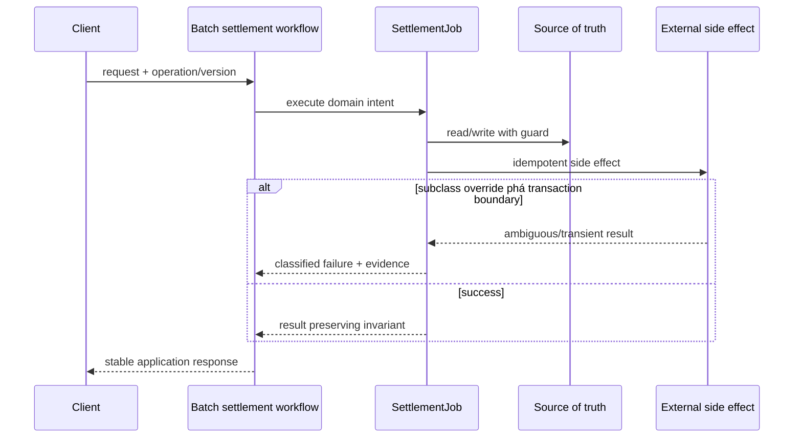

# Lời giải tham khảo — Template Method (Production)

## Kết luận thiết kế

Lời giải chọn `SettlementJob` làm boundary vì nó bao quanh phần thay đổi của **Batch settlement workflow** nhưng không kéo validation, transaction hoặc orchestration ổn định vào abstraction. Mục tiêu là bảo vệ **skeleton giữ audit/transaction; hook chỉ tùy biến bước an toàn**, không phải chứng minh rằng mọi bài toán đều cần Template Method.

## Sơ đồ lời giải



## Các bước refactor

1. Định nghĩa `SettlementJob` bằng ngôn ngữ của **Batch settlement workflow**, không dùng interface chung chung.
2. Bọc implementation cũ sau cùng contract để tạo seam mà chưa thay behavior.
3. Thêm implementation mới và chạy dual-read/shadow compare; lưu mismatch có dữ liệu điều tra.
4. Đưa guard cho invariant **skeleton giữ audit/transaction; hook chỉ tùy biến bước an toàn** gần source of truth nhất.
5. Classify **subclass override phá transaction boundary** thành domain/transient/permanent và gắn retry hoặc compensation tương ứng.
6. Triển khai final steps, protected hooks nhỏ và template contract test; chỉ chuyển traffic khi metric đạt ngưỡng và rollback đã được diễn tập.

## Phác thảo contract

```php
interface SettlementJob
{
    /** Trả về kết quả domain hoặc ném lỗi application có nghĩa. */
    public function apply(array $input): mixed;
}
```

Trong implementation hoàn chỉnh của **Batch settlement workflow**, thay `array`/`mixed` bằng input và result có tên theo domain. Contract của Template Method phải làm rõ precondition, postcondition và lỗi có thể quan sát; đoạn trên chỉ minh họa hướng dependency.

## Test suite tối thiểu

- `BatchSettlementWorkflowBehaviorTest`: dựng fixture nhỏ nhất và assert trực tiếp invariant **skeleton giữ audit/transaction; hook chỉ tùy biến bước an toàn.** trên output/state, không assert tên concrete class.
- `BatchSettlementWorkflowFailureTest`: tạo **subclass override phá transaction boundary.**, kiểm tra error taxonomy và xác nhận state/side effect không ở trạng thái nửa vời.
- `TemplateMethodContractTest`: chạy cùng bộ contract cho mọi implementation hoặc variant được bài yêu cầu.
- `BatchSettlementWorkflowReplayAndConcurrencyTest`: gửi lại operation hoặc tạo race tại source of truth; assert idempotency/version guard thay vì chỉ mock call count.
- `BatchSettlementWorkflowMigrationTest`: chạy old/new trên cùng fixture hoặc shadow input, lưu mismatch có correlation ID và kiểm tra rollback trigger.
- Telemetry assertion: log/metric phải chứa operation, decision/version và failure class đủ để điều tra **Batch settlement workflow**.
## Failure walkthrough

Khi **subclass override phá transaction boundary**, implementation không được trả `null`/`false` mơ hồ. Nó phải tạo error có taxonomy rõ, giữ correlation/operation data cần thiết và không phá invariant **skeleton giữ audit/transaction; hook chỉ tùy biến bước an toàn**. Nếu side effect có thể đã thành công, lần retry phải dựa vào operation record/idempotency evidence thay vì đoán.

## Trade-off và phương án thay thế

Trong **Batch settlement workflow**, Template Method chỉ đáng giữ khi nó giảm rủi ro của **subclass override phá transaction boundary.** hoặc cho phép migration/rollback có evidence. Chi phí thật gồm wiring, version compatibility, telemetry, runbook và ownership khi on-call — không chỉ số class.

Baseline cần so sánh là **composition khi các bước cần hoán đổi tự do**. Nếu shadow comparison không cho thấy blast radius, correctness hoặc recovery tốt hơn, hãy giữ baseline và ghi lại trigger xem xét lại. Trước khi rollout cần xác định source of truth, cleanup condition cho implementation cũ và metric chứng minh invariant **skeleton giữ audit/transaction; hook chỉ tùy biến bước an toàn.** tiếp tục được giữ.
## Dấu hiệu lời giải chưa đạt

- Boundary của Template Method không dùng ngôn ngữ **Batch settlement workflow**, khiến người đọc vẫn phải biết concrete detail.
- Test không chứng minh invariant **skeleton giữ audit/transaction; hook chỉ tùy biến bước an toàn** hoặc chỉ xác nhận method được gọi.
- Selection, transaction hay error mapping vẫn nằm rải rác ở client nên blast radius không giảm.
- Diagram không khớp dependency thực trong code hoặc bỏ qua failure path quan trọng.
- Migration không có shadow evidence/rollback, hoặc retry vẫn có thể tạo side effect kép.

## Câu hỏi mở rộng

- Với **Batch settlement workflow**, metric nào chứng minh Template Method giảm rủi ro thay đổi thay vì chỉ tăng số type?
- Khi số biến thể tăng, ai sở hữu selection, versioning và compatibility của boundary?
- Failure nào buộc thiết kế phải đổi, và failure nào nên được xử lý bên ngoài pattern?
- Điều kiện cleanup nào cho phép hợp nhất implementation hoặc xóa abstraction này?

## Ghi chú triển khai chuyên biệt cho Template Method

Ở **Lời giải tham khảo — Template Method (Production)** cấp Production, Template Method chỉ bảo vệ thứ tự bất biến; hook phải nhỏ, có contract và nếu bước cần thay runtime thì composition/Strategy phù hợp hơn inheritance.

### Test focus

Ở cấp **Production**, test invariant của skeleton và từng hook mà không subclass phá transaction. Thêm failure/concurrency hoặc retry case, telemetry assertion và recovery verification.

### Bằng chứng nên lưu

Với **Batch settlement workflow**, lưu sơ đồ dependency trước/sau, fixture tái hiện lỗi, test chứng minh invariant, commit chuyển đổi và ADR của Template Method. Reviewer cần nhìn được bằng chứng rằng boundary mới giảm blast radius hoặc làm failure dễ kiểm soát hơn, không chỉ thấy nhiều class hơn.
