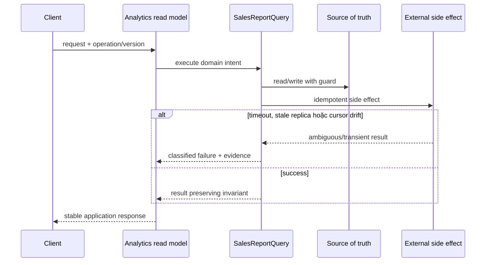

# Lời giải tham khảo — Query Object (Production)

## Kết luận thiết kế

Lời giải chọn `SalesReportQuery` làm boundary vì nó bao quanh phần thay đổi của **Analytics read model** nhưng không kéo validation, transaction hoặc orchestration ổn định vào abstraction. Mục tiêu là bảo vệ **projection versioned và result reproducible**, không phải chứng minh rằng mọi bài toán đều cần Query Object.

## Sơ đồ lời giải



## Các bước refactor

1. Định nghĩa `SalesReportQuery` bằng ngôn ngữ của **Analytics read model**, không dùng interface chung chung.
2. Bọc implementation cũ sau cùng contract để tạo seam mà chưa thay behavior.
3. Thêm implementation mới và chạy dual-read/shadow compare; lưu mismatch có dữ liệu điều tra.
4. Đưa guard cho invariant **projection versioned và result reproducible** gần source of truth nhất.
5. Classify **timeout, stale replica hoặc cursor drift** thành domain/transient/permanent và gắn retry hoặc compensation tương ứng.
6. Triển khai read replica policy, cursor pagination và query budget; chỉ chuyển traffic khi metric đạt ngưỡng và rollback đã được diễn tập.

## Phác thảo contract

```php
interface SalesReportQuery
{
    /** Trả về kết quả domain hoặc ném lỗi application có nghĩa. */
    public function apply(array $input): mixed;
}
```

Trong implementation hoàn chỉnh của **Analytics read model**, thay `array`/`mixed` bằng input và result có tên theo domain. Contract của Query Object phải làm rõ precondition, postcondition và lỗi có thể quan sát; đoạn trên chỉ minh họa hướng dependency.

## Test suite tối thiểu

- `AnalyticsReadModelBehaviorTest`: dựng fixture nhỏ nhất và assert trực tiếp invariant **projection versioned và result reproducible.** trên output/state, không assert tên concrete class.
- `AnalyticsReadModelFailureTest`: tạo **timeout, stale replica hoặc cursor drift.**, kiểm tra error taxonomy và xác nhận state/side effect không ở trạng thái nửa vời.
- `QueryObjectContractTest`: chạy cùng bộ contract cho mọi implementation hoặc variant được bài yêu cầu.
- `AnalyticsReadModelReplayAndConcurrencyTest`: gửi lại operation hoặc tạo race tại source of truth; assert idempotency/version guard thay vì chỉ mock call count.
- `AnalyticsReadModelMigrationTest`: chạy old/new trên cùng fixture hoặc shadow input, lưu mismatch có correlation ID và kiểm tra rollback trigger.
- Telemetry assertion: log/metric phải chứa operation, decision/version và failure class đủ để điều tra **Analytics read model**.
## Failure walkthrough

Khi **timeout, stale replica hoặc cursor drift**, implementation không được trả `null`/`false` mơ hồ. Nó phải tạo error có taxonomy rõ, giữ correlation/operation data cần thiết và không phá invariant **projection versioned và result reproducible**. Nếu side effect có thể đã thành công, lần retry phải dựa vào operation record/idempotency evidence thay vì đoán.

## Trade-off và phương án thay thế

Trong **Analytics read model**, Query Object chỉ đáng giữ khi nó giảm rủi ro của **timeout, stale replica hoặc cursor drift.** hoặc cho phép migration/rollback có evidence. Chi phí thật gồm wiring, version compatibility, telemetry, runbook và ownership khi on-call — không chỉ số class.

Baseline cần so sánh là **query inline ngắn, chỉ dùng một nơi**. Nếu shadow comparison không cho thấy blast radius, correctness hoặc recovery tốt hơn, hãy giữ baseline và ghi lại trigger xem xét lại. Trước khi rollout cần xác định source of truth, cleanup condition cho implementation cũ và metric chứng minh invariant **projection versioned và result reproducible.** tiếp tục được giữ.
## Dấu hiệu lời giải chưa đạt

- Boundary của Query Object không dùng ngôn ngữ **Analytics read model**, khiến người đọc vẫn phải biết concrete detail.
- Test không chứng minh invariant **projection versioned và result reproducible** hoặc chỉ xác nhận method được gọi.
- Selection, transaction hay error mapping vẫn nằm rải rác ở client nên blast radius không giảm.
- Diagram không khớp dependency thực trong code hoặc bỏ qua failure path quan trọng.
- Migration không có shadow evidence/rollback, hoặc retry vẫn có thể tạo side effect kép.

## Câu hỏi mở rộng

- Với **Analytics read model**, metric nào chứng minh Query Object giảm rủi ro thay đổi thay vì chỉ tăng số type?
- Khi số biến thể tăng, ai sở hữu selection, versioning và compatibility của boundary?
- Failure nào buộc thiết kế phải đổi, và failure nào nên được xử lý bên ngoài pattern?
- Điều kiện cleanup nào cho phép hợp nhất implementation hoặc xóa abstraction này?

## Ghi chú triển khai chuyên biệt cho Query Object

Trong **Lời giải tham khảo — Query Object (Production)** (Production), Query Object diễn đạt read concern bằng filter, sort, cursor/page và projection; nó không trả aggregate write model hoặc giả làm Repository domain.

### Test focus

Ở cấp **Production**, test filter combinations, stable ordering, cursor/page boundary và query budget. Thêm failure/concurrency hoặc retry case, telemetry assertion và recovery verification.

### Bằng chứng nên lưu

Với **Analytics read model**, lưu sơ đồ dependency trước/sau, fixture tái hiện lỗi, test chứng minh invariant, commit chuyển đổi và ADR của Query Object. Reviewer cần nhìn được bằng chứng rằng boundary mới giảm blast radius hoặc làm failure dễ kiểm soát hơn, không chỉ thấy nhiều class hơn.
