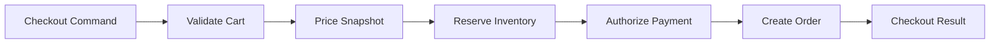

# Module 48 — Production: Pipeline

## Vì sao bài này tồn tại?

**Checkout processing pipeline** là tình huống độc lập được xây dựng riêng cho Pipeline. Bài không lấy từ một source ẩn: bạn tự tạo phiên bản `before` tối thiểu dựa trên mô tả dưới đây, sau đó dùng test để chứng minh refactor không đổi behavior. Bài Production giả định hệ thống đã chạy thật. Ngoài cấu trúc code, lời giải phải xử lý migration, failure, idempotency hoặc observability phù hợp với use case.

## Câu chuyện nghiệp vụ

Hệ thống cần xử lý **Checkout processing pipeline**. `CheckoutPipeline` đang chạy validation, pricing, reservation, payment và order creation trong một method không checkpoint/compensation.

Invariant trung tâm của bài **Pipeline** là:

> **stage idempotent hoặc có compensation rõ.**

Ở cấp Production, **Pipeline** phải bảo vệ invariant dưới retry/concurrency hoặc partial failure, đồng thời có migration seam, telemetry, rollback trigger và cleanup condition sau rollout.

Failure bắt buộc phải được mô hình hóa:

> **retry từ giữa pipeline tạo side effect kép.**

## Trạng thái code ban đầu

```php
final class CheckoutPipeline
{
    public function handle(array $input): mixed
    {
        // validation chung, lựa chọn biến thể và side effect
        // đang bị trộn trong một method.
        throw new RuntimeException('Hãy dựng phiên bản before phù hợp đề bài.');
    }
}
```

Đây là skeleton định hướng, không phải lời giải. Hãy thêm dữ liệu và behavior nhỏ nhất đủ tái hiện pain point của **Checkout processing pipeline**.

## Mô hình thiết kế cần hướng tới



Mỗi stage có typed context và outcome. Side-effect stage cần idempotency/compensation; pipeline phải ghi stage checkpoint để điều tra và resume an toàn.

## Nhiệm vụ

1. Khóa behavior hiện tại của **Checkout processing pipeline** bằng characterization test và log một trace hoàn chỉnh.
2. Xác định source of truth, transaction boundary và side effect bên ngoài quanh `CheckoutPipeline`.
3. Tạo một migration seam để chạy song song implementation cũ/mới; so sánh kết quả trước khi chuyển traffic.
4. Mô phỏng failure **retry từ giữa pipeline tạo side effect kép** và chứng minh retry/replay không phá invariant.
5. Bổ sung checkpoint, stage telemetry và resume policy; định nghĩa metric, alert và rollback trigger.
6. Viết ADR ghi rõ evidence, phương án baseline, cleanup condition và người sở hữu runbook.

## Dữ liệu thử tối thiểu

- Hai scenario hợp lệ đại diện cho hai biến thể khác nhau.
- Một boundary value liên quan trực tiếp tới **stage idempotent hoặc có compensation rõ**.
- Một scenario tạo ra **retry từ giữa pipeline tạo side effect kép**.
- Một operation lặp lại và một scenario concurrent/replay.

## Gợi ý triển khai

- Bắt đầu bằng behavior và invariant; chỉ tạo abstraction sau khi xác định đúng trục thay đổi.
- Đặt tên method theo domain của **Checkout processing pipeline**, tránh `execute(mixed $data)` hoặc `handleAnything()`.
- Tách selection/wiring khỏi business calculation; composition root có thể biết concrete class nhưng use case không nên biết.
- Đừng nuốt exception. Map lỗi kỹ thuật thành error có ý nghĩa và giữ nguyên cause để điều tra.
- Nếu **loop trực tiếp khi pipeline không tái cấu hình** vẫn rõ ràng hơn và thay đổi chưa có thật, hãy ghi kết luận “chưa cần pattern” trong ADR.

## Test bắt buộc

- Replay cùng operation không tạo kết quả thứ hai và vẫn giữ **stage idempotent hoặc có compensation rõ**.
- Concurrency test tại boundary nơi **retry từ giữa pipeline tạo side effect kép** có thể xảy ra.
- Migration test so sánh old/new implementation trên cùng fixture hoặc shadow traffic.
- Telemetry test/assertion cho correlation ID, error class và decision version.

## Deliverable

```text
solution/
├── before.php
├── after.php
├── tests/
│   ├── CharacterizationTest.php
│   ├── ContractOrBehaviorTest.php
│   └── FailurePathTest.php
└── ADR.md
```

Bài Production cần thêm migration.md, dashboard.md và runbook.md.

## Tiêu chí tự chấm

- [ ] Tên class/method phản ánh đúng **Checkout processing pipeline**.
- [ ] Invariant **stage idempotent hoặc có compensation rõ** có test tự động.
- [ ] Failure **retry từ giữa pipeline tạo side effect kép** có outcome xác định.
- [ ] Client biết ít concrete detail hơn sau refactor.
- [ ] Diagram, code và test mô tả cùng một boundary.
- [ ] Có giải thích khi nào **loop trực tiếp khi pipeline không tái cấu hình** tốt hơn.
- [ ] Có migration, rollback, metric và runbook.

## Câu hỏi design review

1. Trục thay đổi thật sự của **Checkout processing pipeline** là gì, và `CheckoutPipeline` cô lập nó ở đâu?
2. Invariant **stage idempotent hoặc có compensation rõ** được enforce ở layer nào? Có đường đi nào bypass không?
3. Khi **retry từ giữa pipeline tạo side effect kép** xảy ra, client nhận error gì và operator nhìn thấy evidence nào?
4. Pattern này làm dependency graph tốt hơn ở điểm nào, và tạo thêm chi phí gì?
5. Dấu hiệu nào cho biết nên quay lại phương án **loop trực tiếp khi pipeline không tái cấu hình**?

## Lời giải tham khảo

Với **Checkout processing pipeline**, hãy hoàn thành test và tự vẽ dependency trước/sau rồi mới mở [`SOLUTION.md`](SOLUTION.md). Khi đối chiếu, ưu tiên invariant, failure semantics và khả năng mở rộng của Pipeline thay vì đếm class.
