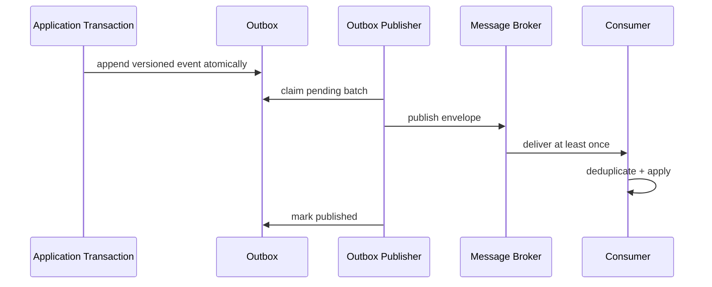

# Module 49 — Production: Domain Event

## Vì sao bài này tồn tại?

**Integration event publishing** là tình huống độc lập được xây dựng riêng cho Domain Event. Bài không lấy từ một source ẩn: bạn tự tạo phiên bản `before` tối thiểu dựa trên mô tả dưới đây, sau đó dùng test để chứng minh refactor không đổi behavior. Bài Production giả định hệ thống đã chạy thật. Ngoài cấu trúc code, lời giải phải xử lý migration, failure, idempotency hoặc observability phù hợp với use case.

## Câu chuyện nghiệp vụ

Hệ thống cần xử lý **Integration event publishing**. `IntegrationEventPublisher` đang publish broker trước/ngoài transaction, thiếu outbox, event id và schema version.

Invariant trung tâm của bài **Domain Event** là:

> **publish sau commit và schema compatible.**

Ở cấp Production, **Domain Event** phải bảo vệ invariant dưới retry/concurrency hoặc partial failure, đồng thời có migration seam, telemetry, rollback trigger và cleanup condition sau rollout.

Failure bắt buộc phải được mô hình hóa:

> **database commit thành công nhưng publish thất bại.**

## Trạng thái code ban đầu

```php
final class IntegrationEventPublisher
{
    public function handle(array $input): mixed
    {
        // validation chung, lựa chọn biến thể và side effect
        // đang bị trộn trong một method.
        throw new RuntimeException('Hãy dựng phiên bản before phù hợp đề bài.');
    }
}
```

Đây là skeleton định hướng, không phải lời giải. Hãy thêm dữ liệu và behavior nhỏ nhất đủ tái hiện pain point của **Integration event publishing**.

## Mô hình thiết kế cần hướng tới



Integration event cần schema version, event id, aggregate id, correlation và occurred-at. Outbox bảo đảm atomicity; consumer vẫn phải idempotent vì delivery ít nhất một lần.

## Nhiệm vụ

1. Khóa behavior hiện tại của **Integration event publishing** bằng characterization test và log một trace hoàn chỉnh.
2. Xác định source of truth, transaction boundary và side effect bên ngoài quanh `EventPublisher`.
3. Tạo một migration seam để chạy song song implementation cũ/mới; so sánh kết quả trước khi chuyển traffic.
4. Mô phỏng failure **database commit thành công nhưng publish thất bại** và chứng minh retry/replay không phá invariant.
5. Bổ sung transactional outbox, schema registry và consumer contract; định nghĩa metric, alert và rollback trigger.
6. Viết ADR ghi rõ evidence, phương án baseline, cleanup condition và người sở hữu runbook.

## Dữ liệu thử tối thiểu

- Hai scenario hợp lệ đại diện cho hai biến thể khác nhau.
- Một boundary value liên quan trực tiếp tới **publish sau commit và schema compatible**.
- Một scenario tạo ra **database commit thành công nhưng publish thất bại**.
- Một operation lặp lại và một scenario concurrent/replay.

## Gợi ý triển khai

- Bắt đầu bằng behavior và invariant; chỉ tạo abstraction sau khi xác định đúng trục thay đổi.
- Đặt tên method theo domain của **Integration event publishing**, tránh `execute(mixed $data)` hoặc `handleAnything()`.
- Tách selection/wiring khỏi business calculation; composition root có thể biết concrete class nhưng use case không nên biết.
- Đừng nuốt exception. Map lỗi kỹ thuật thành error có ý nghĩa và giữ nguyên cause để điều tra.
- Nếu **gọi method trực tiếp cho collaboration nội bộ đồng bộ** vẫn rõ ràng hơn và thay đổi chưa có thật, hãy ghi kết luận “chưa cần pattern” trong ADR.

## Test bắt buộc

- Replay cùng operation không tạo kết quả thứ hai và vẫn giữ **publish sau commit và schema compatible**.
- Concurrency test tại boundary nơi **database commit thành công nhưng publish thất bại** có thể xảy ra.
- Migration test so sánh old/new implementation trên cùng fixture hoặc shadow traffic.
- Telemetry test/assertion cho correlation ID, error class và decision version.

## Deliverable

```text
solution/
├── before.php
├── after.php
├── tests/
│   ├── CharacterizationTest.php
│   ├── ContractOrBehaviorTest.php
│   └── FailurePathTest.php
└── ADR.md
```

Bài Production cần thêm migration.md, dashboard.md và runbook.md.

## Tiêu chí tự chấm

- [ ] Tên class/method phản ánh đúng **Integration event publishing**.
- [ ] Invariant **publish sau commit và schema compatible** có test tự động.
- [ ] Failure **database commit thành công nhưng publish thất bại** có outcome xác định.
- [ ] Client biết ít concrete detail hơn sau refactor.
- [ ] Diagram, code và test mô tả cùng một boundary.
- [ ] Có giải thích khi nào **gọi method trực tiếp cho collaboration nội bộ đồng bộ** tốt hơn.
- [ ] Có migration, rollback, metric và runbook.

## Câu hỏi design review

1. Trục thay đổi thật sự của **Integration event publishing** là gì, và `EventPublisher` cô lập nó ở đâu?
2. Invariant **publish sau commit và schema compatible** được enforce ở layer nào? Có đường đi nào bypass không?
3. Khi **database commit thành công nhưng publish thất bại** xảy ra, client nhận error gì và operator nhìn thấy evidence nào?
4. Pattern này làm dependency graph tốt hơn ở điểm nào, và tạo thêm chi phí gì?
5. Dấu hiệu nào cho biết nên quay lại phương án **gọi method trực tiếp cho collaboration nội bộ đồng bộ**?

## Lời giải tham khảo

Với **Integration event publishing**, hãy hoàn thành test và tự vẽ dependency trước/sau rồi mới mở [`SOLUTION.md`](SOLUTION.md). Khi đối chiếu, ưu tiên invariant, failure semantics và khả năng mở rộng của Domain Event thay vì đếm class.
