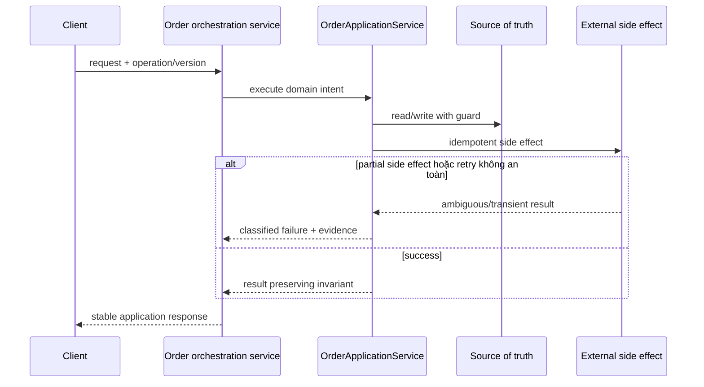

# Lời giải tham khảo — Service Layer (Production)

## Kết luận thiết kế

Lời giải chọn `OrderApplicationService` làm boundary vì nó bao quanh phần thay đổi của **Order orchestration service** nhưng không kéo validation, transaction hoặc orchestration ổn định vào abstraction. Mục tiêu là bảo vệ **orchestration idempotent và observable**, không phải chứng minh rằng mọi bài toán đều cần Service Layer.

## Sơ đồ lời giải



## Các bước refactor

1. Định nghĩa `OrderApplicationService` bằng ngôn ngữ của **Order orchestration service**, không dùng interface chung chung.
2. Bọc implementation cũ sau cùng contract để tạo seam mà chưa thay behavior.
3. Thêm implementation mới và chạy dual-read/shadow compare; lưu mismatch có dữ liệu điều tra.
4. Đưa guard cho invariant **orchestration idempotent và observable** gần source of truth nhất.
5. Classify **partial side effect hoặc retry không an toàn** thành domain/transient/permanent và gắn retry hoặc compensation tương ứng.
6. Triển khai outbox, operation record và compensating workflow; chỉ chuyển traffic khi metric đạt ngưỡng và rollback đã được diễn tập.

## Phác thảo contract

```php
interface OrderApplicationService
{
    /** Trả về kết quả domain hoặc ném lỗi application có nghĩa. */
    public function apply(array $input): mixed;
}
```

Trong implementation hoàn chỉnh của **Order orchestration service**, thay `array`/`mixed` bằng input và result có tên theo domain. Contract của Service Layer phải làm rõ precondition, postcondition và lỗi có thể quan sát; đoạn trên chỉ minh họa hướng dependency.

## Test suite tối thiểu

- `OrderOrchestrationServiceBehaviorTest`: dựng fixture nhỏ nhất và assert trực tiếp invariant **orchestration idempotent và observable.** trên output/state, không assert tên concrete class.
- `OrderOrchestrationServiceFailureTest`: tạo **partial side effect hoặc retry không an toàn.**, kiểm tra error taxonomy và xác nhận state/side effect không ở trạng thái nửa vời.
- `ServiceLayerContractTest`: chạy cùng bộ contract cho mọi implementation hoặc variant được bài yêu cầu.
- `OrderOrchestrationServiceReplayAndConcurrencyTest`: gửi lại operation hoặc tạo race tại source of truth; assert idempotency/version guard thay vì chỉ mock call count.
- `OrderOrchestrationServiceMigrationTest`: chạy old/new trên cùng fixture hoặc shadow input, lưu mismatch có correlation ID và kiểm tra rollback trigger.
- Telemetry assertion: log/metric phải chứa operation, decision/version và failure class đủ để điều tra **Order orchestration service**.
## Failure walkthrough

Khi **partial side effect hoặc retry không an toàn**, implementation không được trả `null`/`false` mơ hồ. Nó phải tạo error có taxonomy rõ, giữ correlation/operation data cần thiết và không phá invariant **orchestration idempotent và observable**. Nếu side effect có thể đã thành công, lần retry phải dựa vào operation record/idempotency evidence thay vì đoán.

## Trade-off và phương án thay thế

Trong **Order orchestration service**, Service Layer chỉ đáng giữ khi nó giảm rủi ro của **partial side effect hoặc retry không an toàn.** hoặc cho phép migration/rollback có evidence. Chi phí thật gồm wiring, version compatibility, telemetry, runbook và ownership khi on-call — không chỉ số class.

Baseline cần so sánh là **controller trực tiếp cho thao tác CRUD đơn giản**. Nếu shadow comparison không cho thấy blast radius, correctness hoặc recovery tốt hơn, hãy giữ baseline và ghi lại trigger xem xét lại. Trước khi rollout cần xác định source of truth, cleanup condition cho implementation cũ và metric chứng minh invariant **orchestration idempotent và observable.** tiếp tục được giữ.
## Dấu hiệu lời giải chưa đạt

- Boundary của Service Layer không dùng ngôn ngữ **Order orchestration service**, khiến người đọc vẫn phải biết concrete detail.
- Test không chứng minh invariant **orchestration idempotent và observable** hoặc chỉ xác nhận method được gọi.
- Selection, transaction hay error mapping vẫn nằm rải rác ở client nên blast radius không giảm.
- Diagram không khớp dependency thực trong code hoặc bỏ qua failure path quan trọng.
- Migration không có shadow evidence/rollback, hoặc retry vẫn có thể tạo side effect kép.

## Câu hỏi mở rộng

- Với **Order orchestration service**, metric nào chứng minh Service Layer giảm rủi ro thay đổi thay vì chỉ tăng số type?
- Khi số biến thể tăng, ai sở hữu selection, versioning và compatibility của boundary?
- Failure nào buộc thiết kế phải đổi, và failure nào nên được xử lý bên ngoài pattern?
- Điều kiện cleanup nào cho phép hợp nhất implementation hoặc xóa abstraction này?

## Ghi chú triển khai chuyên biệt cho Service Layer

Bài **Lời giải tham khảo — Service Layer (Production)** cấp Production đặt orchestration và transaction boundary trong Service Layer; domain policy phải ở entity, domain service hoặc specification để service không thành procedural God Object.

### Test focus

Ở cấp **Production**, test orchestration outcome, transaction rollback, external port interaction và retry safety. Thêm failure/concurrency hoặc retry case, telemetry assertion và recovery verification.

### Bằng chứng nên lưu

Với **Order orchestration service**, lưu sơ đồ dependency trước/sau, fixture tái hiện lỗi, test chứng minh invariant, commit chuyển đổi và ADR của Service Layer. Reviewer cần nhìn được bằng chứng rằng boundary mới giảm blast radius hoặc làm failure dễ kiểm soát hơn, không chỉ thấy nhiều class hơn.
