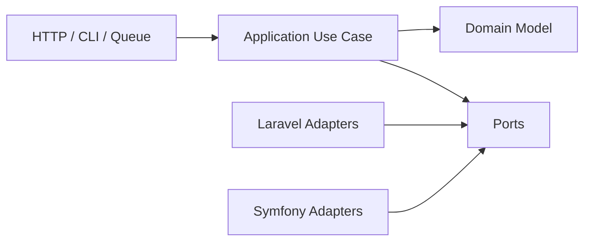
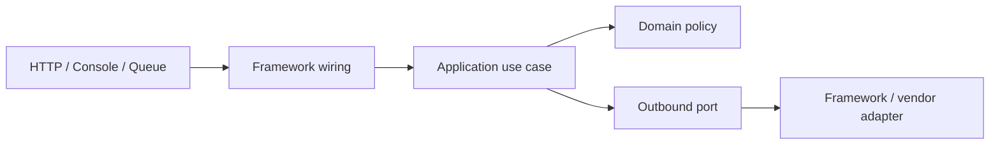

# Framework Integration

Khu vực này chỉ ra cách giữ intent của pattern khi đi qua container, ORM, queue, event dispatcher và HTTP lifecycle. Mục tiêu không phải “bọc framework”, mà là xác định boundary nào thuộc application/domain và boundary nào là adapter.

## Mental model

## Tuyến đọc

### Laravel

1. [Container Bindings](laravel/01-container-bindings.md)
2. [Application Services](laravel/02-application-services.md)
3. [Events và Jobs](laravel/03-events-vs-jobs.md)
4. [Pipeline](laravel/04-pipeline.md)
5. [Repository và Query Object](laravel/05-repository-query-object.md)
6. [Transactional Outbox](laravel/06-transaction-outbox.md)
7. [Testing Boundaries](laravel/07-testing-boundaries.md)
8. [Multi-channel Notification](laravel/08-multi-channel-notification.md)

### Symfony

1. [Dependency Injection](symfony/01-service-container.md)
2. [Messenger](symfony/02-messenger.md)
3. [Event Dispatcher](symfony/03-event-dispatcher.md)
4. [Doctrine Boundary](symfony/04-doctrine-boundaries.md)
5. [HTTP Client Adapter](symfony/05-http-client-adapter.md)
6. [Testing](symfony/06-testing-services.md)

## Câu hỏi review chung

- Domain có chạy unit test mà không boot framework không?
- Wiring có tập trung ở composition root/service provider không?
- Queue/event có idempotency, retry và schema semantics rõ không?
- ORM model có rò vào message hoặc public API dài hạn không?
- Integration test có kiểm tra container configuration và adapter mapping thật không?

Mỗi bài con có checklist production và sai lầm riêng; không dùng danh sách này thay cho review theo capability.

## Ma trận tích hợp enterprise

| Concern | Laravel | Symfony | Evidence cần có |
|---|---|---|---|
| Dependency wiring | Container binding, provider, contextual binding | compiled container, alias, tag | lifecycle test và composition root rõ |
| Async work | Job/queue | Messenger/transport | idempotency, retry, dead-letter |
| Domain events | Event/listener | EventDispatcher | after-commit và duplicate handling |
| Persistence | Eloquent/Query Builder | Doctrine/DBAL | transaction boundary và query budget |
| External API | HTTP client adapter | HttpClient adapter | timeout, mapping, redaction, contract test |

## Quy tắc tích hợp

Framework chịu trách nhiệm wiring và lifecycle; domain sở hữu invariant. Nếu business rule chỉ chạy được khi boot framework, boundary đang rò rỉ. Mỗi integration article phải chỉ ra composition root, failure semantics, cách test không boot toàn hệ thống và dấu hiệu cần revisit.

## Bản đồ boundary giữa framework và application

Framework được phép sở hữu routing, serialization, lifecycle và infrastructure configuration. Business invariant không nên phụ thuộc facade, ORM model hoặc container lookup. Khi thay framework, application use case và domain test phải giữ nguyên phần lớn.

## Checklist enterprise

- Composition root là nơi duy nhất chọn implementation.
- Queue/job payload có version và không serialize object graph ORM.
- Transaction boundary nằm trong application use case, không rải ở controller/listener.
- Adapter map lỗi vendor thành error contract ổn định.
- Integration test xác minh wiring; domain test không boot framework.
