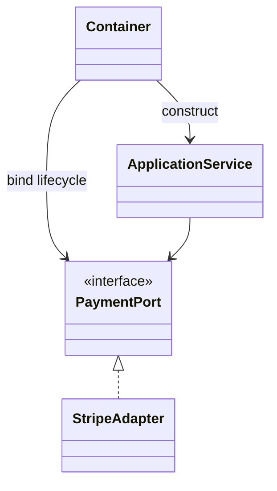

# Laravel Container Bindings

## Vấn đề cần giải quyết

Cấu hình dependency graph bằng binding tường minh, contextual binding và lifecycle phù hợp. Container chỉ xuất hiện ở composition root.

## Khái niệm trọng tâm

- Binding interface sang implementation tại Service Provider.
- Phân biệt `bind`, `singleton`, `scoped`; tránh singleton cho object giữ request state.
- Dùng contextual binding khi hai consumer thực sự cần implementation khác nhau.

## Mẫu triển khai

```php
<?php

declare(strict_types=1);

interface ApplicationPort
{
    public function execute(string $id): void;
}

final readonly class UseCase
{
    public function __construct(private ApplicationPort $port) {}

    public function handle(string $id): void
    {
        if ($id === '') {
            throw new InvalidArgumentException('ID must not be empty.');
        }

        $this->port->execute($id);
    }
}
```

Đoạn code trong bài **Laravel Container Bindings** chỉ minh họa điểm tích hợp cốt lõi. Khi đưa vào production, hãy kiểm tra lifecycle, transaction, serialization và error semantics đặc thù của capability này; không sao chép wiring sang use case khác nếu boundary không giống nhau.

## Checklist production

- [ ] Test provider resolution và lifecycle.
- [ ] Fail fast khi config/credential bắt buộc thiếu.
- [ ] Ghi document ownership của từng binding.

## Sai lầm thường gặp

- Resolve service trong domain bằng `app()` hoặc facade.
- Đăng ký closure làm I/O nặng lúc boot.
- Dùng singleton cho client chứa token mutable theo user.

## Câu hỏi review

1. Chi tiết framework nào đang rò vào core và gây khó test/thay đổi?
2. Failure nào cần translation, retry hoặc observability riêng trong chủ đề này?
3. Lifecycle/transaction/delivery semantics đã được ghi rõ chưa?
4. Có thể đơn giản hóa bằng convention framework mà vẫn giữ boundary không?  
> **Ngữ cảnh áp dụng:** Trong **Laravel Container Bindings**, diễn giải checklist theo boundary và vocabulary của chính chủ đề này thay vì áp dụng máy móc.

## Phân tích production sâu hơn

Trọng tâm của bài là **Laravel request lifecycle, scoped binding và contextual binding**. Hãy xác định ownership, vòng đời object và failure boundary trước khi cấu hình container; cơ chế DI chỉ lắp object graph, không được che khuất quyết định domain hay biến service locator thành dependency ẩn.



### Dấu hiệu thiết kế đang lệch

- Binding singleton cho service có request state
- Contextual binding bị phân tán ngoài composition root
- Resolve service trực tiếp từ container trong domain

### Câu hỏi production

- Binding nào cần transient, scoped hoặc singleton?
- Có circular dependency hoặc hidden dependency nào không?
- Container test nào xác minh đúng implementation theo environment?


## Lifetime và worker dài hạn

`singleton` chỉ dùng cho object stateless hoặc state thực sự process-wide; dữ liệu tenant/request phải dùng scoped binding. Contextual binding hữu ích khi hai use case cần implementation khác, nhưng quá nhiều contextual rule làm composition khó quan sát. Container test nên resolve composition root quan trọng trong environment production.
