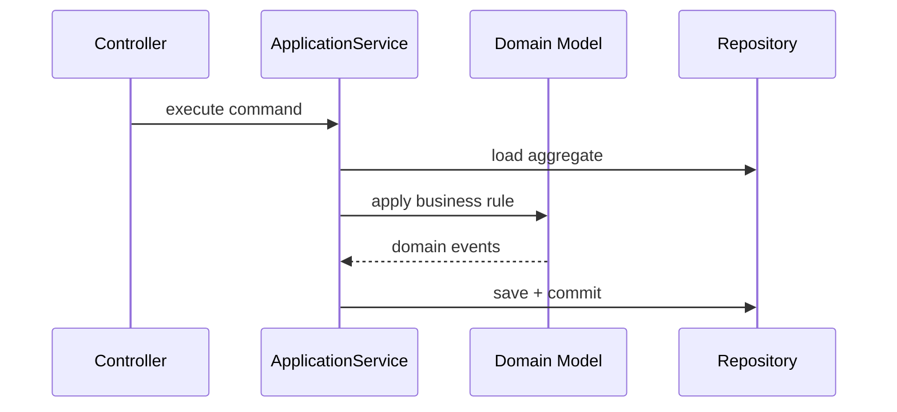

# Laravel Application Services

## Vấn đề cần giải quyết

Giữ controller mỏng nhưng không biến service thành “God Service”. Application service điều phối transaction, domain và ports.

## Khái niệm trọng tâm

- Input DTO/command rõ kiểu.
- Transaction bao quanh thay đổi database cần atomic; remote side effect đi qua outbox khi cần.
- Domain rule nằm ở entity/value object/specification.

## Mẫu triển khai

```php
<?php

declare(strict_types=1);

interface ApplicationPort
{
    public function execute(string $id): void;
}

final readonly class UseCase
{
    public function __construct(private ApplicationPort $port) {}

    public function handle(string $id): void
    {
        if ($id === '') {
            throw new InvalidArgumentException('ID must not be empty.');
        }

        $this->port->execute($id);
    }
}
```

Đoạn code trong bài **Laravel Application Services** chỉ minh họa điểm tích hợp cốt lõi. Khi đưa vào production, hãy kiểm tra lifecycle, transaction, serialization và error semantics đặc thù của capability này; không sao chép wiring sang use case khác nếu boundary không giống nhau.

## Checklist production

- [ ] Unit test orchestration bằng fake ports.
- [ ] Integration test transaction và unique constraint.
- [ ] Đặt timeout/error mapping tại adapter.

## Sai lầm thường gặp

- Service chỉ chuyển tiếp một lệnh Eloquent không thêm giá trị.
- Trả HTTP Response hoặc Request vào domain.
- Bắt mọi Throwable rồi trả false.

## Câu hỏi review

1. Chi tiết framework nào đang rò vào core và gây khó test/thay đổi?
2. Failure nào cần translation, retry hoặc observability riêng trong chủ đề này?
3. Lifecycle/transaction/delivery semantics đã được ghi rõ chưa?
4. Có thể đơn giản hóa bằng convention framework mà vẫn giữ boundary không?  
> **Ngữ cảnh áp dụng:** Trong **Laravel Application Services**, diễn giải checklist theo boundary và vocabulary của chính chủ đề này thay vì áp dụng máy móc.

## Phân tích production sâu hơn

Trọng tâm của bài này là **orchestration, transaction boundary và domain isolation**. Hãy xác định ownership, lifecycle và failure boundary trước khi cấu hình framework; container, queue hoặc ORM chỉ là cơ chế wiring/thực thi, không thay thế quyết định domain.



### Dấu hiệu thiết kế đang lệch

- Application service chứa business rule thay vì orchestration
- Transaction bao trùm cả network call dài
- Controller gọi repository và event dispatcher trực tiếp

### Câu hỏi production

- Use case bắt đầu/kết thúc transaction ở đâu?
- Domain rule nào phải chuyển vào entity/value object?
- External side effect nào cần outbox hoặc compensation?


## Transaction và side effect

Application service mở transaction quanh state change cục bộ, không giữ database transaction trong lúc gọi provider chậm. Side effect bất đồng bộ được ghi Outbox trong cùng commit. Service trả result có nghĩa, không trả Eloquent model tùy tiện cho mọi caller; error mapping sang HTTP thuộc controller/boundary.
