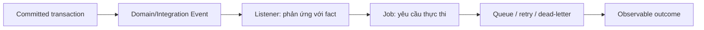

# Laravel Events và Jobs

## Vấn đề cần giải quyết

Chọn event cho fact đã xảy ra, job cho công việc cần thực hiện; hiểu rõ sync/async và delivery semantics.

## Khái niệm trọng tâm

- Domain event không chứa model lazy-loaded.
- Job có idempotency key, timeout, retry/backoff và `failed()` policy.
- Event sau commit khi listener phụ thuộc dữ liệu đã persist.

## Mẫu triển khai

```php
<?php

declare(strict_types=1);

interface ApplicationPort
{
    public function execute(string $id): void;
}

final readonly class UseCase
{
    public function __construct(private ApplicationPort $port) {}

    public function handle(string $id): void
    {
        if ($id === '') {
            throw new InvalidArgumentException('ID must not be empty.');
        }

        $this->port->execute($id);
    }
}
```

Đoạn code trong bài **Laravel Events và Jobs** chỉ minh họa điểm tích hợp cốt lõi. Khi đưa vào production, hãy kiểm tra lifecycle, transaction, serialization và error semantics đặc thù của capability này; không sao chép wiring sang use case khác nếu boundary không giống nhau.

## Checklist production

- [ ] Theo dõi queue lag, attempts, failure reason.
- [ ] Contract/version payload nếu qua process boundary.
- [ ] Dead-letter hoặc manual replay có runbook.

## Sai lầm thường gặp

- Dùng event để che giấu command bắt buộc.
- Retry mọi exception kể cả validation/permanent error.
- Dispatch trước commit gây consumer đọc dữ liệu chưa tồn tại.

## Câu hỏi review

1. Chi tiết framework nào đang rò vào core và gây khó test/thay đổi?
2. Failure nào cần translation, retry hoặc observability riêng trong chủ đề này?
3. Lifecycle/transaction/delivery semantics đã được ghi rõ chưa?
4. Có thể đơn giản hóa bằng convention framework mà vẫn giữ boundary không?  
> **Ngữ cảnh áp dụng:** Trong **Laravel Events và Jobs**, diễn giải checklist theo boundary và vocabulary của chính chủ đề này thay vì áp dụng máy móc.

## Phân tích production sâu hơn

Trọng tâm của bài này là **fact vs command, after-commit và delivery semantics**. Hãy xác định ownership, lifecycle và failure boundary trước khi cấu hình framework; container, queue hoặc ORM chỉ là cơ chế wiring/thực thi, không thay thế quyết định domain.



### Dấu hiệu thiết kế đang lệch

- Event payload chứa ORM object/lazy relation làm serialization không ổn định.
- Listener chạy trước commit hoặc Job retry tạo side effect trùng.
- Domain dùng queue API trực tiếp thay vì port/application boundary.

### Câu hỏi production

- Với **Laravel Events và Jobs**, contract nào phải ổn định giữa framework wiring và application/domain code?
- Failure nào được phép retry mà không nhân đôi side effect, và failure nào phải fail-fast hoặc đưa sang recovery flow?
- Metric nào phản ánh đúng outcome của capability này thay vì chỉ đo số request hoặc số job?

