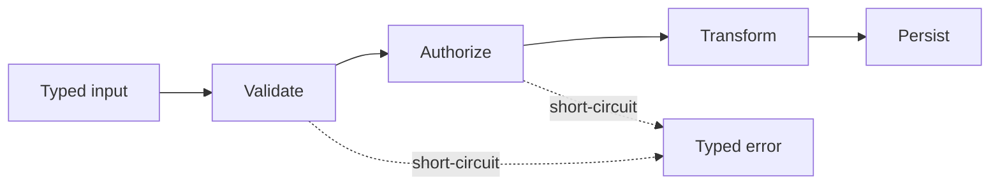

# Laravel Pipeline

## Vấn đề cần giải quyết

Tổ chức chuỗi xử lý có thể cấu hình mà không biến mọi workflow tuyến tính thành pipeline.

## Khái niệm trọng tâm

- Mỗi pipe có input/output nhất quán.
- Thứ tự pipe được khai báo và test.
- Phân biệt short-circuit hợp lệ với exception.

## Mẫu triển khai

```php
<?php

declare(strict_types=1);

interface ApplicationPort
{
    public function execute(string $id): void;
}

final readonly class UseCase
{
    public function __construct(private ApplicationPort $port) {}

    public function handle(string $id): void
    {
        if ($id === '') {
            throw new InvalidArgumentException('ID must not be empty.');
        }

        $this->port->execute($id);
    }
}
```

Đoạn code trong bài **Laravel Pipeline** chỉ minh họa điểm tích hợp cốt lõi. Khi đưa vào production, hãy kiểm tra lifecycle, transaction, serialization và error semantics đặc thù của capability này; không sao chép wiring sang use case khác nếu boundary không giống nhau.

## Checklist production

- [ ] Test từng pipe và integration test ordering.
- [ ] Log tên pipe và duration cho pipeline dài.
- [ ] Không retry toàn pipeline nếu một bước không idempotent.

## Sai lầm thường gặp

- Pipe truy cập global request/container ngầm.
- Trộn domain transition với middleware kỹ thuật.
- Payload array không schema khiến bước sau đoán key.

## Câu hỏi review

1. Chi tiết framework nào đang rò vào core và gây khó test/thay đổi?
2. Failure nào cần translation, retry hoặc observability riêng trong chủ đề này?
3. Lifecycle/transaction/delivery semantics đã được ghi rõ chưa?
4. Có thể đơn giản hóa bằng convention framework mà vẫn giữ boundary không?  
> **Ngữ cảnh áp dụng:** Trong **Laravel Pipeline**, diễn giải checklist theo boundary và vocabulary của chính chủ đề này thay vì áp dụng máy móc.

## Phân tích production sâu hơn

Trọng tâm của bài này là **ordering, short-circuit và typed payload**. Hãy xác định ownership, lifecycle và failure boundary trước khi cấu hình framework; container, queue hoặc ORM chỉ là cơ chế wiring/thực thi, không thay thế quyết định domain.



### Dấu hiệu thiết kế đang lệch

- Pipe phụ thuộc thứ tự ngầm nhưng không có test ordering.
- Payload đổi kiểu qua từng stage mà không có contract.
- Pipeline chứa transaction/business workflow dài khó quan sát.

### Câu hỏi production

- Với **Laravel Pipeline**, contract nào phải ổn định giữa framework wiring và application/domain code?
- Failure nào được phép retry mà không nhân đôi side effect, và failure nào phải fail-fast hoặc đưa sang recovery flow?
- Metric nào phản ánh đúng outcome của capability này thay vì chỉ đo số request hoặc số job?


## Failure propagation

Mỗi pipe cần contract input/output và không âm thầm biến exception thành `null`. Pipe có side effect phải xác định idempotency và thứ tự; nếu pipeline retry toàn bộ, các stage trước đó không được nhân đôi tác động. Test thứ tự, short-circuit, typed payload và cleanup khi stage giữa thất bại.
