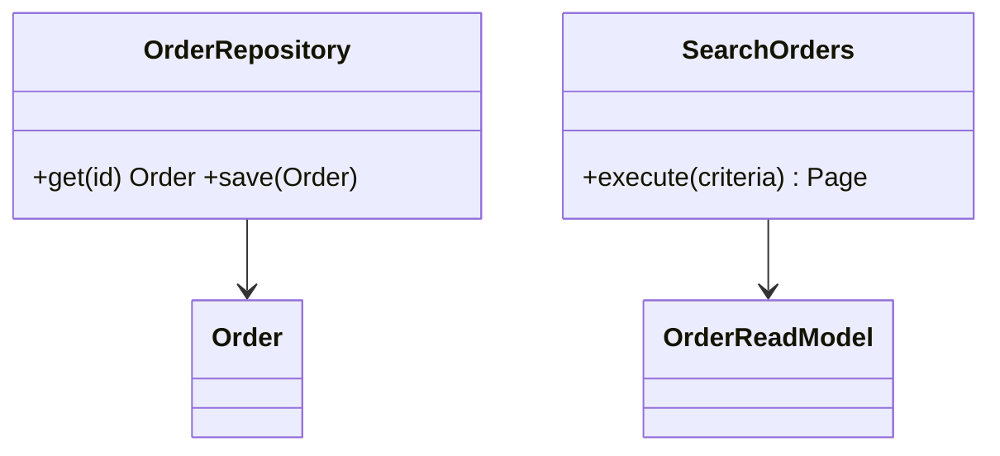

# Laravel Repository và Query Object

## Vấn đề cần giải quyết

Tách write-side aggregate access khỏi read-side reporting thay vì ép mọi query qua generic repository.

## Khái niệm trọng tâm

- Repository trả aggregate/domain type.
- Query Object trả projection/paginator chuyên biệt.
- Eloquent scopes dùng nội bộ implementation, không rò ra contract.

## Mẫu triển khai

```php
<?php

declare(strict_types=1);

interface ApplicationPort
{
    public function execute(string $id): void;
}

final readonly class UseCase
{
    public function __construct(private ApplicationPort $port) {}

    public function handle(string $id): void
    {
        if ($id === '') {
            throw new InvalidArgumentException('ID must not be empty.');
        }

        $this->port->execute($id);
    }
}
```

Đoạn code trong bài **Laravel Repository và Query Object** chỉ minh họa điểm tích hợp cốt lõi. Khi đưa vào production, hãy kiểm tra lifecycle, transaction, serialization và error semantics đặc thù của capability này; không sao chép wiring sang use case khác nếu boundary không giống nhau.

## Checklist production

- [ ] Contract test repository implementation.
- [ ] Integration test query SQL, timezone, pagination.
- [ ] Theo dõi slow query và index bằng execution plan.

## Sai lầm thường gặp

- Interface CRUD cho mọi model.
- Repository có hàng chục method tìm kiếm màn hình.
- Mock Eloquent chain trong unit test.

## Câu hỏi review

1. Chi tiết framework nào đang rò vào core và gây khó test/thay đổi?
2. Failure nào cần translation, retry hoặc observability riêng trong chủ đề này?
3. Lifecycle/transaction/delivery semantics đã được ghi rõ chưa?
4. Có thể đơn giản hóa bằng convention framework mà vẫn giữ boundary không?  
> **Ngữ cảnh áp dụng:** Trong **Laravel Repository và Query Object**, diễn giải checklist theo boundary và vocabulary của chính chủ đề này thay vì áp dụng máy móc.

## Phân tích production sâu hơn

Trọng tâm của bài này là **aggregate repository vs read query**. Hãy xác định ownership, lifecycle và failure boundary trước khi cấu hình framework; container, queue hoặc ORM chỉ là cơ chế wiring/thực thi, không thay thế quyết định domain.



### Dấu hiệu thiết kế đang lệch

- Repository trả Query Builder hoặc pagination shape hạ tầng.
- Read report bị ép qua aggregate repository gây N+1/over-fetch.
- Contract không nói rõ not-found, ordering hoặc consistency.

### Câu hỏi production

- Với **Laravel Repository và Query Object**, contract nào phải ổn định giữa framework wiring và application/domain code?
- Failure nào được phép retry mà không nhân đôi side effect, và failure nào phải fail-fast hoặc đưa sang recovery flow?
- Metric nào phản ánh đúng outcome của capability này thay vì chỉ đo số request hoặc số job?


## Eloquent boundary thực tế

Eloquent có thể nằm trong Query Object đọc vì projection ưu tiên hiệu suất và shape cụ thể. Write-side Repository chỉ đáng có khi aggregate semantics hoặc persistence substitution đem lại giá trị rõ. Tránh interface chỉ bọc `Model::find()`; hãy đo blast radius và testability trước khi thêm layer.
