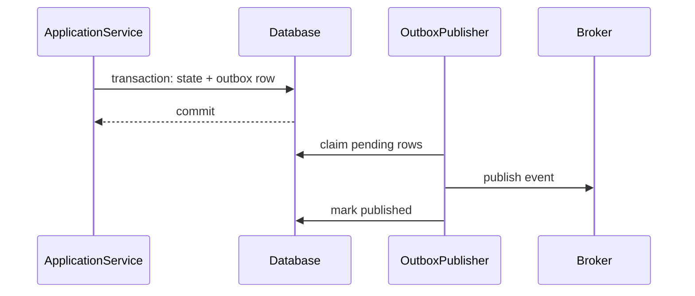

# Laravel Transactional Outbox

## Vấn đề cần giải quyết

Đảm bảo thay đổi database và ý định publish message được ghi atomic mà không dùng distributed transaction.

## Khái niệm trọng tâm

- Ghi aggregate change và outbox row trong cùng DB transaction.
- Publisher claim row an toàn, retry và đánh dấu published.
- Consumer idempotent vì delivery ít nhất một lần.

## Mẫu triển khai

```php
<?php

declare(strict_types=1);

interface ApplicationPort
{
    public function execute(string $id): void;
}

final readonly class UseCase
{
    public function __construct(private ApplicationPort $port) {}

    public function handle(string $id): void
    {
        if ($id === '') {
            throw new InvalidArgumentException('ID must not be empty.');
        }

        $this->port->execute($id);
    }
}
```

Đoạn code trong bài **Laravel Transactional Outbox** chỉ minh họa điểm tích hợp cốt lõi. Khi đưa vào production, hãy kiểm tra lifecycle, transaction, serialization và error semantics đặc thù của capability này; không sao chép wiring sang use case khác nếu boundary không giống nhau.

## Checklist production

- [ ] Unique event ID và index trạng thái.
- [ ] Metric oldest-unpublished age, backlog, failure.
- [ ] Runbook replay theo event range.

## Sai lầm thường gặp

- Dispatch queue trực tiếp bên trong transaction rồi giả định chắc chắn.
- Xóa outbox trước khi broker acknowledge.
- Không có retention/replay strategy.

## Câu hỏi review

1. Chi tiết framework nào đang rò vào core và gây khó test/thay đổi?
2. Failure nào cần translation, retry hoặc observability riêng trong chủ đề này?
3. Lifecycle/transaction/delivery semantics đã được ghi rõ chưa?
4. Có thể đơn giản hóa bằng convention framework mà vẫn giữ boundary không?  
> **Ngữ cảnh áp dụng:** Trong **Laravel Transactional Outbox**, diễn giải checklist theo boundary và vocabulary của chính chủ đề này thay vì áp dụng máy móc.

## Phân tích production sâu hơn

Trọng tâm của bài này là **atomic write, retry và duplicate publication**. Hãy xác định ownership, lifecycle và failure boundary trước khi cấu hình framework; container, queue hoặc ORM chỉ là cơ chế wiring/thực thi, không thay thế quyết định domain.



### Dấu hiệu thiết kế đang lệch

- Ghi state và publish event ở hai transaction
- Publisher không claim row an toàn
- Không có chiến lược replay/retention

### Câu hỏi production

- Outbox row được ghi atomically với state nào?
- Duplicate publish được consumer xử lý ra sao?
- Metric nào phát hiện backlog và poison message?

## Tình huống vận hành cần diễn tập

Giả lập worker publish thành công nhưng chết trước khi đánh dấu `published_at`. Lần chạy kế tiếp sẽ publish lại, vì vậy consumer phải deduplicate theo event id. Dashboard cần tách backlog do publisher dừng, record lỗi vĩnh viễn và record đang chờ retry. Khi deploy schema event mới, publisher phải ghi version rõ ràng để consumer cũ không diễn giải sai payload.
