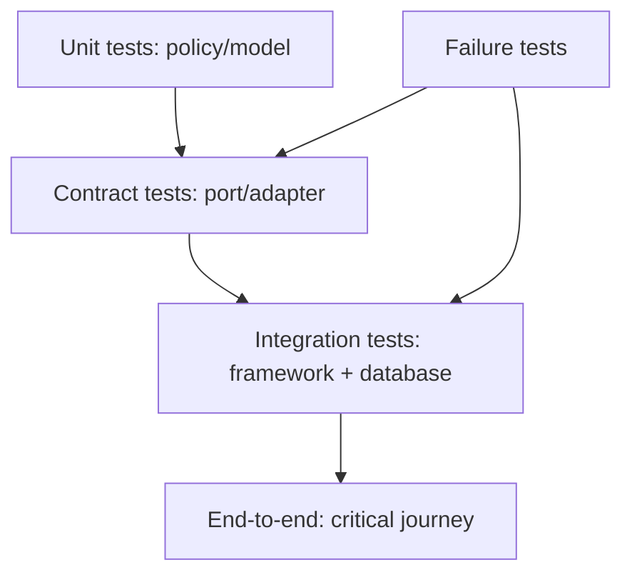

# Laravel Testing Boundaries

## Vấn đề cần giải quyết

Chọn đúng tầng test: domain unit, application orchestration, adapter integration và HTTP feature.

## Khái niệm trọng tâm

- Fake ở port của application, không mock mọi framework class.
- Database test cho mapping, transaction, lock và query.
- Contract test dùng chung cho nhiều adapter.

## Mẫu triển khai

```php
<?php

declare(strict_types=1);

interface ApplicationPort
{
    public function execute(string $id): void;
}

final readonly class UseCase
{
    public function __construct(private ApplicationPort $port) {}

    public function handle(string $id): void
    {
        if ($id === '') {
            throw new InvalidArgumentException('ID must not be empty.');
        }

        $this->port->execute($id);
    }
}
```

Đoạn code trong bài **Laravel Testing Boundaries** chỉ minh họa điểm tích hợp cốt lõi. Khi đưa vào production, hãy kiểm tra lifecycle, transaction, serialization và error semantics đặc thù của capability này; không sao chép wiring sang use case khác nếu boundary không giống nhau.

## Checklist production

- [ ] Test deterministic clock/UUID.
- [ ] Failure injection cho timeout/duplicate.
- [ ] CI tách fast suite và integration suite.

## Sai lầm thường gặp

- Feature test cho mọi tổ hợp nhỏ gây suite chậm.
- Mock method chain của Eloquent.
- Assert implementation detail thay vì behavior.

## Câu hỏi review

1. Chi tiết framework nào đang rò vào core và gây khó test/thay đổi?
2. Failure nào cần translation, retry hoặc observability riêng trong chủ đề này?
3. Lifecycle/transaction/delivery semantics đã được ghi rõ chưa?
4. Có thể đơn giản hóa bằng convention framework mà vẫn giữ boundary không?  
> **Ngữ cảnh áp dụng:** Trong **Laravel Testing Boundaries**, diễn giải checklist theo boundary và vocabulary của chính chủ đề này thay vì áp dụng máy móc.

## Phân tích production sâu hơn

Trọng tâm của bài này là **test pyramid theo boundary thay vì theo class count**. Hãy xác định ownership, lifecycle và failure boundary trước khi cấu hình framework; container, queue hoặc ORM chỉ là cơ chế wiring/thực thi, không thay thế quyết định domain.



### Dấu hiệu thiết kế đang lệch

- Mock framework internals quá mức
- E2E test thay cho contract test
- Failure path chỉ test bằng exception giả

### Câu hỏi production

- Invariant nào cần unit/property test?
- Port nào cần contract suite dùng chung cho mọi adapter?
- Integration test nào cần database/queue thật?

## Chiến lược test theo boundary

Domain test không boot Laravel và chỉ kiểm tra invariant. Application test dùng fake port để xác nhận orchestration, transaction intent và error mapping. Integration test boot container nhằm kiểm tra binding, lifecycle và middleware order. E2E chỉ giữ một số hành trình quan trọng; không dùng E2E để bao phủ mọi rule vì feedback chậm và khó chẩn đoán.
