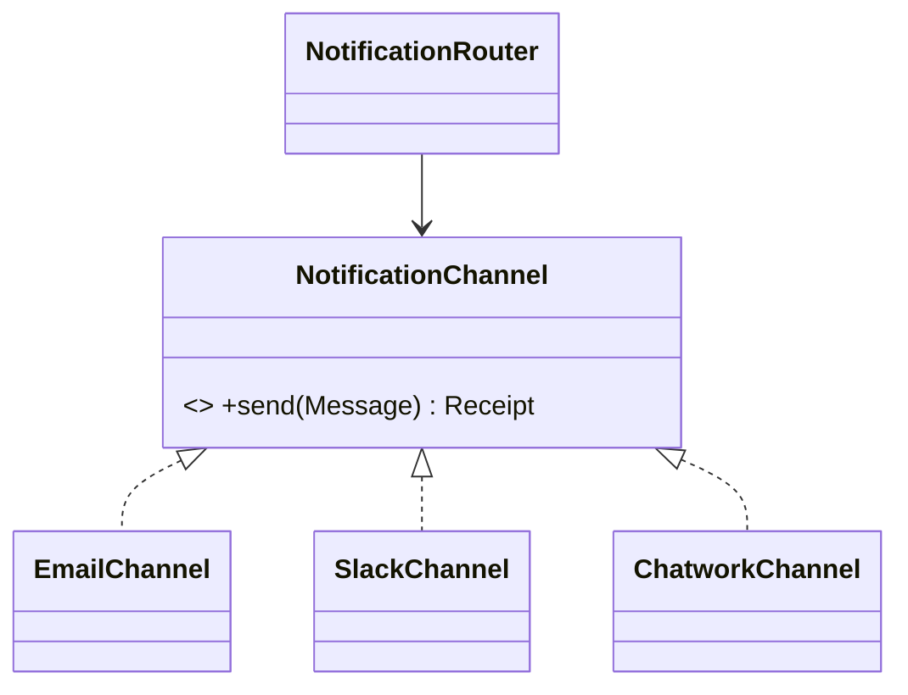

# Laravel Notification đa kênh

## Vấn đề cần giải quyết

Thiết kế routing, preference, template và provider adapter cho email/SMS/Chatwork/Slack.

## Khái niệm trọng tâm

- Channel policy tôn trọng consent và quiet hours.
- Adapter map payload và lỗi provider.
- Delivery record + idempotency ngăn gửi trùng.

## Mẫu triển khai

```php
<?php

declare(strict_types=1);

interface ApplicationPort
{
    public function execute(string $id): void;
}

final readonly class UseCase
{
    public function __construct(private ApplicationPort $port) {}

    public function handle(string $id): void
    {
        if ($id === '') {
            throw new InvalidArgumentException('ID must not be empty.');
        }

        $this->port->execute($id);
    }
}
```

Đoạn code trong bài **Laravel Notification đa kênh** chỉ minh họa điểm tích hợp cốt lõi. Khi đưa vào production, hãy kiểm tra lifecycle, transaction, serialization và error semantics đặc thù của capability này; không sao chép wiring sang use case khác nếu boundary không giống nhau.

## Checklist production

- [ ] Contract test từng channel.
- [ ] Metric delivery latency/failure theo provider.
- [ ] Template version và audit dữ liệu render.

## Sai lầm thường gặp

- Nhét mọi channel vào một Notification class lớn.
- Fallback sang SMS dù user opt-out.
- Retry lỗi permanent như số điện thoại sai.

## Câu hỏi review

1. Chi tiết framework nào đang rò vào core và gây khó test/thay đổi?
2. Failure nào cần translation, retry hoặc observability riêng trong chủ đề này?
3. Lifecycle/transaction/delivery semantics đã được ghi rõ chưa?
4. Có thể đơn giản hóa bằng convention framework mà vẫn giữ boundary không?  
> **Ngữ cảnh áp dụng:** Trong **Laravel Notification đa kênh**, diễn giải checklist theo boundary và vocabulary của chính chủ đề này thay vì áp dụng máy móc.

## Phân tích production sâu hơn

Trọng tâm của bài này là **routing, channel contract, idempotency và per-channel failure**. Hãy xác định ownership, lifecycle và failure boundary trước khi cấu hình framework; container, queue hoặc ORM chỉ là cơ chế wiring/thực thi, không thay thế quyết định domain.



### Dấu hiệu thiết kế đang lệch

- Channel tự quyết routing
- Retry toàn message làm gửi trùng channel đã thành công
- Payload dùng chung làm lộ dữ liệu không phù hợp kênh

### Câu hỏi production

- Routing policy dựa vào tenant/event/preference nào?
- Receipt/idempotency per-channel được lưu ở đâu?
- Failure của một channel có chặn các channel khác không?

## Rủi ro khi mở rộng nhiều channel

Channel không chỉ khác API gửi; chúng khác giới hạn payload, rate limit, retry semantics và khả năng xác nhận delivery. Router phải lưu channel decision cùng template version để điều tra. Fallback chỉ được dùng cho lỗi đã phân loại, tránh gửi trùng qua hai kênh khi primary đã thành công nhưng response timeout.
