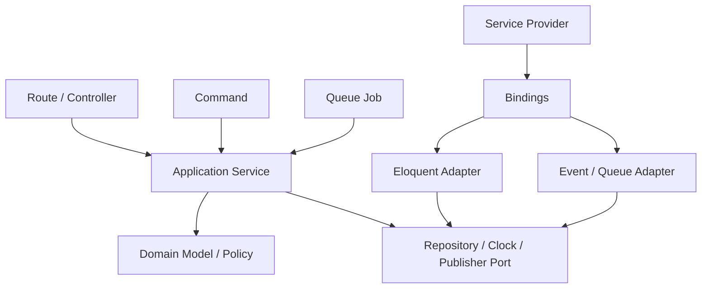
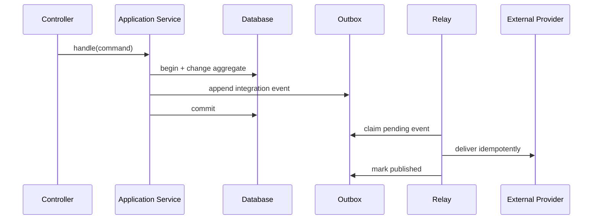

# Tích hợp Design Pattern trong Laravel

Laravel cung cấp Container, Eloquent, Events, Jobs, Pipeline và Middleware. Mục tiêu của phần này không phải “bọc Laravel”, mà là dùng framework như **composition/infrastructure mechanism** trong khi business rule và use case vẫn kiểm thử độc lập.

## Dependency direction

`ServiceProvider` chỉ wiring dependency. Controller/Job chuyển input thành command và gọi use case. Domain không import Facade, Eloquent model hoặc helper framework.

## Ma trận capability

| Capability | Vai trò phù hợp | Rủi ro phổ biến | Test cần có |
|---|---|---|---|
| Service Container | Composition root, lifecycle | Singleton giữ request state, hidden binding | Container boot + use-case unit test |
| Service Provider | Đăng ký adapter/config | Business workflow trong `boot()` | Boot smoke + config validation |
| Eloquent | CRUD/read model/adapter | Lazy loading, N+1, aggregate bị xé nhỏ | Query count + integration test |
| Event | Fact trong process | Dispatch trước commit, subscriber phụ thuộc thứ tự | after-commit + listener contract |
| Job | Async command | Duplicate side effect, stale payload | idempotency + retry/dead-letter |
| Pipeline | Chuỗi transformation | Ordering ẩn, mutable payload | order + short-circuit + exception |
| Middleware | Cross-cutting request concern | Business rule rò vào HTTP layer | ordering + tenant/security test |
| Notification | Channel adapter | Retry không an toàn, template drift | channel contract + delivery state |

## Transaction boundary

Không mở transaction trong Controller rồi gọi network. Application Service nên sở hữu transaction cho thay đổi local; external side effect được thực hiện after-commit hoặc qua Outbox.

## Khi dùng Repository và khi dùng Eloquent trực tiếp

Dùng Eloquent trực tiếp cho CRUD/read model khi query là bản chất của use case và không có aggregate invariant phức tạp. Dùng Repository khi application cần làm việc với aggregate theo collection semantics, optimistic version hoặc persistence cần bị che khỏi domain.

Không tạo interface chỉ để có `find`, `save`, `delete` giống hệt Eloquent.

## Events và Jobs

- Event mô tả fact đã xảy ra; tên ở quá khứ.
- Job/Command yêu cầu thực hiện hành động; có thể thất bại hoặc retry.
- Event qua queue có at-least-once semantics: listener phải idempotent.
- Payload chỉ chứa ID/value immutable; reload state tại thời điểm xử lý.
- Khi provider có thể thành công nhưng worker timeout, cần reconciliation thay vì retry mù.

## Production checklist

1. Binding lifecycle được ghi rõ: transient, singleton hay scoped.
2. Use case test không cần boot Laravel.
3. Adapter có integration/contract test.
4. Database transaction không bao quanh network call.
5. Job có idempotency key, retry budget và dead-letter handling.
6. Event schema có version hoặc compatibility rule.
7. Log có correlation ID và business identifier.
8. Dashboard theo dõi queue lag, stuck state và duplicate/retry rate.
9. Runbook chỉ rõ replay, reconcile và rollback.

## Lộ trình đọc

1. Container và Service Provider.
2. Application Service và transaction.
3. Events, Jobs và after-commit.
4. Pipeline/Middleware.
5. Repository/Query Object/Eloquent.
6. Outbox và notification đa kênh.
7. Boundary testing.

## Definition of Done

Một integration đạt chuẩn khi dependency direction rõ, use case chạy độc lập framework, adapter được test với công nghệ thật, failure semantics được mô tả, retry không tạo duplicate side effect và observability đủ để trả lời “command nào đang kẹt, ở trạng thái nào, ai xử lý”.
