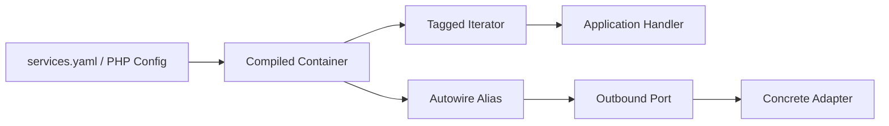

# Symfony Service Container

## Vấn đề cần giải quyết

Dùng autowiring/autoconfiguration có kiểm soát, alias interface và tagged iterator cho plugin.

## Khái niệm trọng tâm

- Constructor injection mặc định.
- Alias interface rõ khi nhiều implementation.
- Tagged services cho registry có thứ tự/priority.

## Mẫu triển khai

```php
<?php

declare(strict_types=1);

interface ApplicationPort
{
    public function execute(string $id): void;
}

final readonly class UseCase
{
    public function __construct(private ApplicationPort $port) {}

    public function handle(string $id): void
    {
        if ($id === '') {
            throw new InvalidArgumentException('ID must not be empty.');
        }

        $this->port->execute($id);
    }
}
```

Đoạn code trong bài **Symfony Service Container** chỉ minh họa điểm tích hợp cốt lõi. Khi đưa vào production, hãy kiểm tra lifecycle, transaction, serialization và error semantics đặc thù của capability này; không sao chép wiring sang use case khác nếu boundary không giống nhau.

## Checklist production

- [ ] Compile container trong CI.
- [ ] Test service wiring quan trọng.
- [ ] Không giữ request-scoped state trong shared service.

## Sai lầm thường gặp

- Service locator trong domain.
- Public service không cần thiết.
- Autowire nhầm implementation vì alias mơ hồ.

## Câu hỏi review

1. Chi tiết framework nào đang rò vào core và gây khó test/thay đổi?
2. Failure nào cần translation, retry hoặc observability riêng trong chủ đề này?
3. Lifecycle/transaction/delivery semantics đã được ghi rõ chưa?
4. Có thể đơn giản hóa bằng convention framework mà vẫn giữ boundary không?  
> **Ngữ cảnh áp dụng:** Trong **Symfony Service Container**, diễn giải checklist theo boundary và vocabulary của chính chủ đề này thay vì áp dụng máy móc.

## Phân tích production sâu hơn

Trọng tâm của bài là **Symfony compiled container, autowiring alias và tagged service collection**. Hãy xác định ownership, vòng đời object và failure boundary trước khi cấu hình container; cơ chế DI chỉ lắp object graph, không được che khuất quyết định domain hay biến service locator thành dependency ẩn.



### Dấu hiệu thiết kế đang lệch

- Domain service gọi container/service locator.
- Shared service giữ request/user state ngoài ý muốn.
- Autowiring che giấu dependency cycle hoặc ambiguous binding.

### Câu hỏi production

- Với **Symfony Service Container**, contract nào phải ổn định giữa framework wiring và application/domain code?
- Failure nào được phép retry mà không nhân đôi side effect, và failure nào phải fail-fast hoặc đưa sang recovery flow?
- Metric nào phản ánh đúng outcome của capability này thay vì chỉ đo số request hoặc số job?


## Kiểm tra compiled container

Trong CI, dump container cho environment production để phát hiện alias thiếu, circular dependency và service không thể autowire trước deploy. Tagged iterator cần contract thứ tự rõ nếu chain phụ thuộc priority. Không lấy service trực tiếp từ container trong domain; composition root mới là nơi biết service id và framework metadata.
