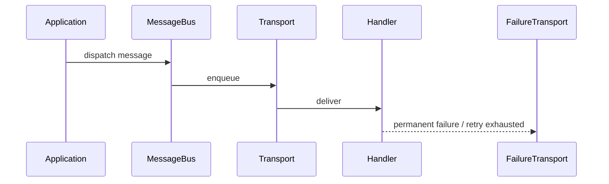

# Symfony Messenger

## Vấn đề cần giải quyết

Thiết kế command/event transport, retry strategy, failure transport và idempotent handler.

## Khái niệm trọng tâm

- Message immutable và serializable.
- Handler giao dịch rõ; middleware ordering được hiểu.
- Routing sync/async theo semantics, không chỉ performance.

## Mẫu triển khai

```php
<?php

declare(strict_types=1);

interface ApplicationPort
{
    public function execute(string $id): void;
}

final readonly class UseCase
{
    public function __construct(private ApplicationPort $port) {}

    public function handle(string $id): void
    {
        if ($id === '') {
            throw new InvalidArgumentException('ID must not be empty.');
        }

        $this->port->execute($id);
    }
}
```

Đoạn code trong bài **Symfony Messenger** chỉ minh họa điểm tích hợp cốt lõi. Khi đưa vào production, hãy kiểm tra lifecycle, transaction, serialization và error semantics đặc thù của capability này; không sao chép wiring sang use case khác nếu boundary không giống nhau.

## Checklist production

- [ ] Monitor rejected/failure queue.
- [ ] Version serializer/schema.
- [ ] Runbook retry chọn lọc và poison message.

## Sai lầm thường gặp

- Một message vừa là command vừa là event.
- Handler phụ thuộc Request/EntityManager state ngầm.
- Replay failure transport mà không kiểm idempotency.

## Câu hỏi review

1. Chi tiết framework nào đang rò vào core và gây khó test/thay đổi?
2. Failure nào cần translation, retry hoặc observability riêng trong chủ đề này?
3. Lifecycle/transaction/delivery semantics đã được ghi rõ chưa?
4. Có thể đơn giản hóa bằng convention framework mà vẫn giữ boundary không?  
> **Ngữ cảnh áp dụng:** Trong **Symfony Messenger**, diễn giải checklist theo boundary và vocabulary của chính chủ đề này thay vì áp dụng máy móc.

## Phân tích production sâu hơn

Trọng tâm của bài này là **transport, retry strategy, stamps và failure transport**. Hãy xác định ownership, lifecycle và failure boundary trước khi cấu hình framework; container, queue hoặc ORM chỉ là cơ chế wiring/thực thi, không thay thế quyết định domain.



### Dấu hiệu thiết kế đang lệch

- Message không version hoặc chứa entity object.
- Handler không idempotent trong khi transport at-least-once.
- Retry mọi exception kể cả validation/permanent failure.

### Câu hỏi production

- Với **Symfony Messenger**, contract nào phải ổn định giữa framework wiring và application/domain code?
- Failure nào được phép retry mà không nhân đôi side effect, và failure nào phải fail-fast hoặc đưa sang recovery flow?
- Metric nào phản ánh đúng outcome của capability này thay vì chỉ đo số request hoặc số job?


## Delivery semantics

Message handler phải giả định at-least-once delivery. Persist inbox/idempotency trước side effect không lặp được; phân biệt retryable exception với unrecoverable exception để failure transport không thành nơi chứa mọi lỗi. Payload message cần version và consumer phải hỗ trợ giai đoạn rollout tương thích.
