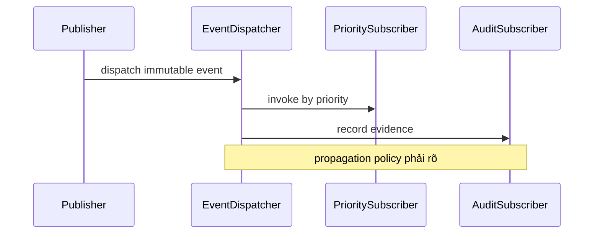

# Symfony Event Dispatcher

## Vấn đề cần giải quyết

Giảm coupling cho extension point trong cùng process nhưng không dùng event để che luồng nghiệp vụ bắt buộc.

## Khái niệm trọng tâm

- Tên event là fact hoặc hook rõ semantics.
- Listener priority chỉ dùng khi ordering thực sự cần.
- Mutable event có quy tắc rõ nếu cho phép listener thay đổi.

## Mẫu triển khai

```php
<?php

declare(strict_types=1);

interface ApplicationPort
{
    public function execute(string $id): void;
}

final readonly class UseCase
{
    public function __construct(private ApplicationPort $port) {}

    public function handle(string $id): void
    {
        if ($id === '') {
            throw new InvalidArgumentException('ID must not be empty.');
        }

        $this->port->execute($id);
    }
}
```

Đoạn code trong bài **Symfony Event Dispatcher** chỉ minh họa điểm tích hợp cốt lõi. Khi đưa vào production, hãy kiểm tra lifecycle, transaction, serialization và error semantics đặc thù của capability này; không sao chép wiring sang use case khác nếu boundary không giống nhau.

## Checklist production

- [ ] Test listener độc lập và integration dispatch.
- [ ] Document sync semantics.
- [ ] Không làm I/O chậm trong listener request path.

## Sai lầm thường gặp

- Business workflow chính bị chia thành listener khó trace.
- Swallow exception khiến state không rõ.
- Dùng event nội bộ như integration event durable.

## Câu hỏi review

1. Chi tiết framework nào đang rò vào core và gây khó test/thay đổi?
2. Failure nào cần translation, retry hoặc observability riêng trong chủ đề này?
3. Lifecycle/transaction/delivery semantics đã được ghi rõ chưa?
4. Có thể đơn giản hóa bằng convention framework mà vẫn giữ boundary không?  
> **Ngữ cảnh áp dụng:** Trong **Symfony Event Dispatcher**, diễn giải checklist theo boundary và vocabulary của chính chủ đề này thay vì áp dụng máy móc.

## Phân tích production sâu hơn

Trọng tâm của bài này là **subscriber priority, propagation và event immutability**. Hãy xác định ownership, lifecycle và failure boundary trước khi cấu hình framework; container, queue hoặc ORM chỉ là cơ chế wiring/thực thi, không thay thế quyết định domain.



### Dấu hiệu thiết kế đang lệch

- Subscriber priority quyết định business correctness nhưng không được test.
- Event mutable khiến listener sau thấy state khó đoán.
- Propagation stop được dùng để thay domain decision.

### Câu hỏi production

- Với **Symfony Event Dispatcher**, contract nào phải ổn định giữa framework wiring và application/domain code?
- Failure nào được phép retry mà không nhân đôi side effect, và failure nào phải fail-fast hoặc đưa sang recovery flow?
- Metric nào phản ánh đúng outcome của capability này thay vì chỉ đo số request hoặc số job?

