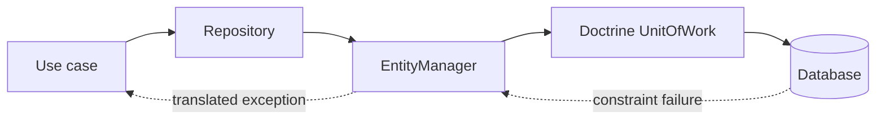

# Symfony Doctrine Boundaries

## Vấn đề cần giải quyết

Giữ aggregate invariant trong domain trong khi mapping, Unit of Work và transaction thuộc infrastructure.

## Khái niệm trọng tâm

- Repository domain-oriented.
- Không serialize entity proxy ra API.
- Transaction boundary ở application service.

## Mẫu triển khai

```php
<?php

declare(strict_types=1);

interface ApplicationPort
{
    public function execute(string $id): void;
}

final readonly class UseCase
{
    public function __construct(private ApplicationPort $port) {}

    public function handle(string $id): void
    {
        if ($id === '') {
            throw new InvalidArgumentException('ID must not be empty.');
        }

        $this->port->execute($id);
    }
}
```

Đoạn code trong bài **Symfony Doctrine Boundaries** chỉ minh họa điểm tích hợp cốt lõi. Khi đưa vào production, hãy kiểm tra lifecycle, transaction, serialization và error semantics đặc thù của capability này; không sao chép wiring sang use case khác nếu boundary không giống nhau.

## Checklist production

- [ ] Integration test mapping/cascade/lock.
- [ ] Theo dõi N+1 và query plan.
- [ ] Optimistic lock cho concurrent edit.

## Sai lầm thường gặp

- Anemic entity chỉ getter/setter.
- Lazy load ngoài transaction.
- Flush rải rác trong domain service.

## Câu hỏi review

1. Chi tiết framework nào đang rò vào core và gây khó test/thay đổi?
2. Failure nào cần translation, retry hoặc observability riêng trong chủ đề này?
3. Lifecycle/transaction/delivery semantics đã được ghi rõ chưa?
4. Có thể đơn giản hóa bằng convention framework mà vẫn giữ boundary không?  
> **Ngữ cảnh áp dụng:** Trong **Symfony Doctrine Boundaries**, diễn giải checklist theo boundary và vocabulary của chính chủ đề này thay vì áp dụng máy móc.

## Phân tích production sâu hơn

Trọng tâm của bài này là **flush boundary, identity map, lazy loading và exception translation**. Hãy xác định ownership, lifecycle và failure boundary trước khi cấu hình framework; container, queue hoặc ORM chỉ là cơ chế wiring/thực thi, không thay thế quyết định domain.



### Dấu hiệu thiết kế đang lệch

- Flush xảy ra ở repository con
- Lazy loading phát sinh trong serialization
- DBAL exception rò ra application

### Câu hỏi production

- Ai sở hữu flush/transaction boundary?
- Aggregate nào được load cùng transaction?
- Constraint violation được map thành domain conflict nào?

## Flush boundary và consistency

`EntityManager::flush()` không nên xuất hiện tùy tiện trong entity hoặc repository method nhỏ. Application service quyết định một use case kết thúc ở đâu, còn repository chỉ tải và lưu aggregate. Với batch lớn, cần clear Unit of Work theo chunk và theo dõi memory. Lazy loading trong serializer hoặc template phải bị xem là lỗi boundary vì tạo query ngoài điểm kiểm soát.

## Flush boundary và lỗi cạnh tranh

Application service quyết định một lần `flush()` cho use case; entity không tự flush. Khi optimistic lock thất bại, caller nhận conflict có nghĩa và re-read trước retry. Lazy collection không được vô tình truy cập sau transaction hoặc trong serializer, vì có thể tạo N+1 và che boundary persistence.
