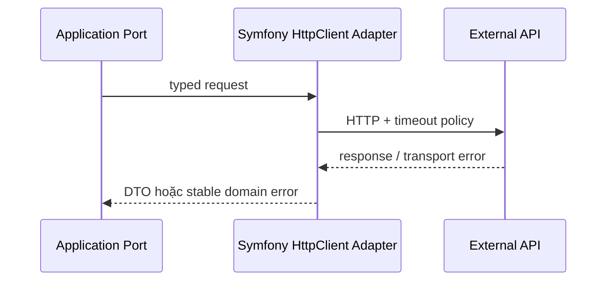

# Symfony HTTP Client Adapter

## Vấn đề cần giải quyết

Bọc API ngoài bằng port application, timeout budget, retry có điều kiện và error translation.

## Khái niệm trọng tâm

- Adapter sở hữu URL/header/auth/schema.
- Map transport/HTTP/business error riêng.
- Retry chỉ operation idempotent hoặc có idempotency key.

## Mẫu triển khai

```php
<?php

declare(strict_types=1);

interface ApplicationPort
{
    public function execute(string $id): void;
}

final readonly class UseCase
{
    public function __construct(private ApplicationPort $port) {}

    public function handle(string $id): void
    {
        if ($id === '') {
            throw new InvalidArgumentException('ID must not be empty.');
        }

        $this->port->execute($id);
    }
}
```

Đoạn code trong bài **Symfony HTTP Client Adapter** chỉ minh họa điểm tích hợp cốt lõi. Khi đưa vào production, hãy kiểm tra lifecycle, transaction, serialization và error semantics đặc thù của capability này; không sao chép wiring sang use case khác nếu boundary không giống nhau.

## Checklist production

- [ ] Contract test với mock HTTP client.
- [ ] Log correlation ID, latency, status class.
- [ ] Redact credential và PII.

## Sai lầm thường gặp

- Trả ResponseInterface ra domain.
- Catch mọi lỗi rồi trả null.
- Không giới hạn timeout/circuit.

## Câu hỏi review

1. Chi tiết framework nào đang rò vào core và gây khó test/thay đổi?
2. Failure nào cần translation, retry hoặc observability riêng trong chủ đề này?
3. Lifecycle/transaction/delivery semantics đã được ghi rõ chưa?
4. Có thể đơn giản hóa bằng convention framework mà vẫn giữ boundary không?  
> **Ngữ cảnh áp dụng:** Trong **Symfony HTTP Client Adapter**, diễn giải checklist theo boundary và vocabulary của chính chủ đề này thay vì áp dụng máy móc.

## Phân tích production sâu hơn

Trọng tâm của bài này là **timeout, retry safety, response mapping và redaction**. Hãy xác định ownership, lifecycle và failure boundary trước khi cấu hình framework; container, queue hoặc ORM chỉ là cơ chế wiring/thực thi, không thay thế quyết định domain.



### Dấu hiệu thiết kế đang lệch

- Technical exception/status rò ra application use case.
- Retry POST không có idempotency semantics.
- Log chứa secret/PII hoặc thiếu correlation/provider request ID.

### Câu hỏi production

- Với **Symfony HTTP Client Adapter**, contract nào phải ổn định giữa framework wiring và application/domain code?
- Failure nào được phép retry mà không nhân đôi side effect, và failure nào phải fail-fast hoặc đưa sang recovery flow?
- Metric nào phản ánh đúng outcome của capability này thay vì chỉ đo số request hoặc số job?


## Timeout và contract ổn định

Adapter đặt connect/total timeout theo deadline của use case, map transport exception thành error taxonomy nội bộ và giữ provider request id để reconcile. Retry middleware chỉ áp dụng operation an toàn hoặc có idempotency key. Contract test dùng fixture thành công, malformed response, 429 và timeout-after-acceptance.
