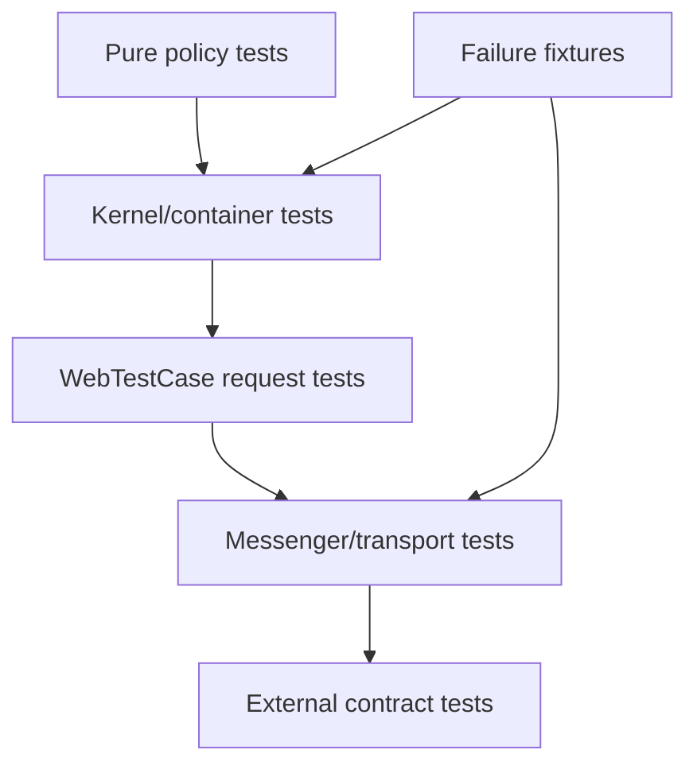

# Symfony Testing Services

## Vấn đề cần giải quyết

Kết hợp unit test service thuần, KernelTestCase cho container và WebTestCase cho boundary HTTP.

## Khái niệm trọng tâm

- Unit test không boot kernel khi không cần.
- Kernel test wiring/compiler pass/tag.
- Functional test auth/validation/serialization.

## Mẫu triển khai

```php
<?php

declare(strict_types=1);

interface ApplicationPort
{
    public function execute(string $id): void;
}

final readonly class UseCase
{
    public function __construct(private ApplicationPort $port) {}

    public function handle(string $id): void
    {
        if ($id === '') {
            throw new InvalidArgumentException('ID must not be empty.');
        }

        $this->port->execute($id);
    }
}
```

Đoạn code trong bài **Symfony Testing Services** chỉ minh họa điểm tích hợp cốt lõi. Khi đưa vào production, hãy kiểm tra lifecycle, transaction, serialization và error semantics đặc thù của capability này; không sao chép wiring sang use case khác nếu boundary không giống nhau.

## Checklist production

- [ ] Reset state giữa test.
- [ ] Fixture nhỏ theo scenario.
- [ ] Test failure transport/transaction cho path quan trọng.

## Sai lầm thường gặp

- Replace service trong test làm khác production wiring quá nhiều.
- Assert container internals.
- Dùng database shared gây test phụ thuộc thứ tự.

## Câu hỏi review

1. Chi tiết framework nào đang rò vào core và gây khó test/thay đổi?
2. Failure nào cần translation, retry hoặc observability riêng trong chủ đề này?
3. Lifecycle/transaction/delivery semantics đã được ghi rõ chưa?
4. Có thể đơn giản hóa bằng convention framework mà vẫn giữ boundary không?  
> **Ngữ cảnh áp dụng:** Trong **Symfony Testing Services**, diễn giải checklist theo boundary và vocabulary của chính chủ đề này thay vì áp dụng máy móc.

## Phân tích production sâu hơn

Trọng tâm của bài này là **kernel boot cost, test isolation, transport determinism và adapter contracts**. Hãy xác định ownership, lifecycle và failure boundary trước khi cấu hình framework; container, queue hoặc ORM chỉ là cơ chế wiring/thực thi, không thay thế quyết định domain.



### Dấu hiệu thiết kế đang lệch

- Mọi test đều boot kernel
- Transport giả khác semantics production
- Fixture dùng chung gây phụ thuộc thứ tự

### Câu hỏi production

- Behavior nào test thuần không cần kernel?
- Messenger test có kiểm tra retry/failure transport không?
- External adapter có contract test độc lập không?

## Test compiled container mà không khóa chặt implementation

Test service nên assert behavior qua public contract, còn một số integration test xác nhận autowiring alias, tagged iterator và compiler pass. Không snapshot toàn bộ container vì thay đổi vô hại sẽ làm test dễ vỡ. Khi service dùng Messenger hoặc Doctrine, thêm failure test cho retry, transaction và serialization chứ không chỉ happy path.
