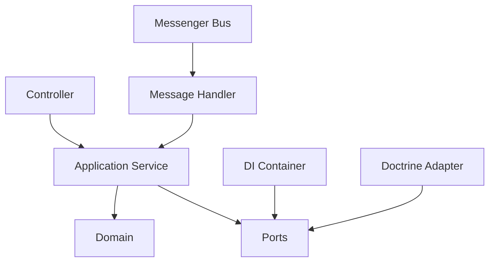
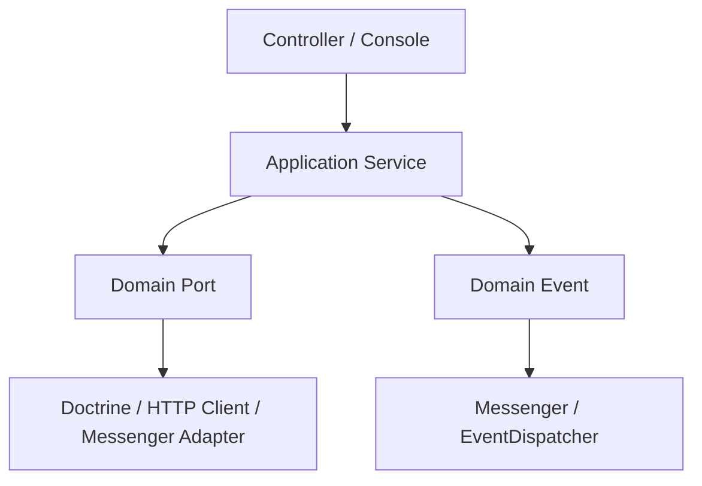
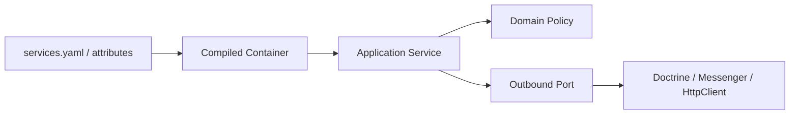

# Symfony Integration

Symfony khuyến khích explicit service configuration, autowiring, Messenger, Event Dispatcher và Doctrine. Các bài trong thư mục này tập trung vào contract, message boundary và mapping thay vì chỉ mô tả annotation/config.

## Nguyên tắc

- Autowiring không thay thế thiết kế dependency; constructor vẫn phải nhỏ và có nghĩa.
- Messenger message là contract qua thời gian, cần versioning và idempotency.
- Domain event khác Symfony event dùng để mở rộng framework/application.
- Doctrine mapping không được quyết định aggregate boundary chỉ vì quan hệ database.
- HTTP Client adapter phải translate timeout/status/payload lỗi thành error model nội bộ.

## Definition of Done

Container compile, handler retry an toàn, Doctrine transaction đúng use case, adapter có contract test và application core không phụ thuộc Symfony component ngoài boundary được chấp nhận.

## Bản đồ tích hợp Symfony

## Checklist học và áp dụng

1. Xác định service nào là application orchestration, service nào là infrastructure adapter.
2. Kiểm tra autowiring có che giấu dependency không cần thiết hay không.
3. Với Messenger, mô tả retry, transport failure và idempotency trước khi đưa handler vào async.
4. Với Doctrine, giữ transaction boundary ở use case và tránh để entity phụ thuộc framework annotation/attribute nếu domain cần độc lập.
5. Viết integration test cho container wiring và contract test cho adapter bên ngoài.

## Production readiness cho Symfony

- Kiểm tra compiler pass/tagged iterator bằng integration test nhỏ.
- Không để Doctrine EntityManager trở thành service locator trong domain.
- Messenger handler phải idempotent và có failure transport/runbook.
- HttpClient adapter phải chuẩn hóa timeout, retry-safety và error contract.
- Mọi service stateful trong worker dài hạn phải được review lifecycle.

## Tuyến triển khai một use case Symfony

Bắt đầu bằng application service thuần PHP, định nghĩa outbound port và test trước. Sau đó đăng ký service, alias interface, cấu hình tagged iterator nếu có nhiều implementation, rồi viết adapter Doctrine/HTTP/Messenger. Cuối cùng thêm integration test cho compiled container và một smoke test cho entrypoint. Quy trình này giữ framework ở composition layer thay vì để annotation hoặc attribute quyết định business rule.
