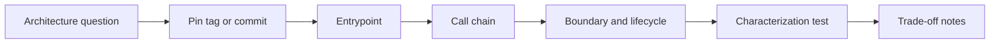

# Framework Source Tours

Source tour là bài thực hành đọc code framework theo một câu hỏi kiến trúc cụ thể. Mỗi tour phải pin tag hoặc commit, vẽ call graph, ghi lifecycle, viết characterization test và chỉ ra behavior không nên leak vào domain.

- [Laravel Source Tour](laravel.md)
- [Symfony Source Tour](symfony.md)
- [Protocol chung](../docs/09-expert-practice/27-framework-source-tour-protocol.md)

Không dùng link tới nhánh `main` trong learning artifact vì nội dung có thể thay đổi. Ghi exact commit và ngày review.
