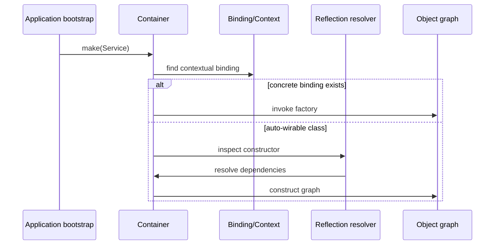

# Laravel Source Tour

## Câu hỏi cần trả lời

Container quản lý binding/lifecycle như thế nào, queued job đi qua middleware và failure path ra sao, event queued/after-commit khác synchronous event ở điểm nào?

## Tour 1 — Container resolution

Artifact: exact tag/commit, entrypoint file, call graph, transient/singleton/scoped experiment và test chứng minh lifecycle.

## Tour 2 — Queue delivery

Theo chuỗi dispatch → command serialization → queue payload → worker → middleware → handler → retry/failed job. Ghi rõ transaction timing, payload compatibility và duplicate delivery assumption.

## Tour 3 — Events

So sánh listener trực tiếp, queued listener và after-commit. Viết test cho việc transaction rollback không phát integration side effect.

## Câu hỏi review

- Behavior nào là contract ổn định, behavior nào là implementation detail?
- Domain có đang import facade/container không?
- Test có phụ thuộc internal class dễ thay đổi không?
- Upgrade framework cần characterization test nào chạy lại?
