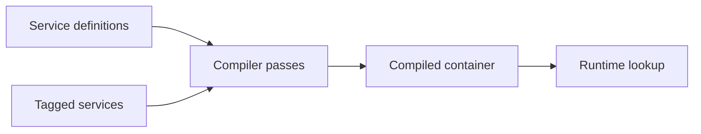

# Symfony Source Tour

## Câu hỏi cần trả lời

Compiled container, Messenger middleware stack, EventDispatcher priority và Doctrine Unit of Work phối hợp như thế nào với application boundary?

## Tour 1 — Compiled container

Pin exact tag/commit. Theo definition loading, compiler pass, generated container và runtime service retrieval. So sánh với reflection-based runtime resolution.

## Tour 2 — Messenger

Theo Envelope → middleware → sender/transport → receiver → handler locator → failure transport. Ghi rõ stamps nào là transport concern và command object nào thuộc application.

## Tour 3 — Doctrine Unit of Work

Theo EntityManager persist → identity map/change tracking → flush → SQL/transaction. Kiểm tra lazy loading và domain event timing để tránh phát event trước commit.

## Artifact

- Call graph Mermaid.
- Characterization test.
- Lifecycle table.
- Upgrade risk list.
- Boundary note: framework behavior nào không được leak vào domain.
