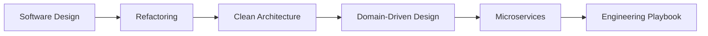
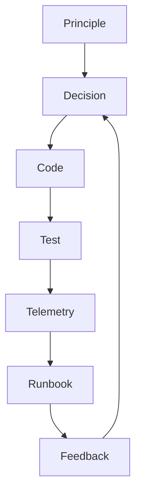

# Engineering Handbook

Engineering Handbook mở rộng Design Pattern sang toàn bộ vòng đời quyết định kỹ thuật: thiết kế, refactor, kiến trúc, mô hình domain, distributed system và vận hành production.

## Bản đồ nội dung

- [Software Design](software-design/README.md): abstraction, API, dependency và trade-off.
- [Refactoring](refactoring/README.md): thay đổi an toàn, characterization test, migration strategy.
- [Clean Architecture](clean-architecture/README.md): boundary, dependency rule, ports/adapters.
- [Domain-Driven Design](ddd/README.md): ubiquitous language, aggregate, bounded context.
- [Microservices](microservices/README.md): consistency, messaging, resilience, observability.
- [Engineering Playbook](engineering-playbook/README.md): review, incident, rollout, governance.

## Cách sử dụng như một Tech Lead

1. Bắt đầu từ vấn đề thật và business impact.
2. Đọc chapter nền tảng để thống nhất thuật ngữ.
3. Liệt kê option và consequence.
4. Viết ADR trước quyết định khó đảo ngược.
5. Thiết kế test, observability và rollback trước rollout.
6. Sau vận hành, cập nhật chapter hoặc ADR bằng evidence thực tế.

## Chuẩn đầu ra cho một quyết định tốt

- Context và constraint rõ.
- Invariant không bị phá.
- Dependency direction có chủ đích.
- Failure mode được mô tả.
- Có test strategy.
- Có metric và alert.
- Có rollout/rollback plan.
- Có ngày hoặc điều kiện review lại.

## Tuyến học đề xuất

- **Middle**: Software Design → Refactoring → Clean Architecture.
- **Senior**: DDD → Microservices → Production case studies.
- **Tech Lead**: Engineering Playbook → ADR → design review workshop.

## Lộ trình áp dụng Bản đồ Engineering Handbook

## Evidence hoàn thành

Hoàn thành khi người học kết nối được design, architecture và operation trong một review packet có ADR, diagram, test và runbook.

## Cách review chương

Review theo chuỗi quyết định: vấn đề → forces → boundary → evidence → feedback; thiếu mắt xích nào thì ghi rõ debt.

## Rubric chất lượng một chương Handbook

Một chương chỉ được xem là hoàn chỉnh khi trả lời được năm lớp câu hỏi:

1. **Correctness:** invariant hoặc contract nào cần giữ?
2. **Changeability:** loại thay đổi nào được cô lập, loại nào vẫn tốn kém?
3. **Operability:** failure được phát hiện, cô lập và phục hồi như thế nào?
4. **Evidence:** test, metric, trace hay incident nào chứng minh thiết kế hoạt động?
5. **Reversibility:** migration và rollback có thể thực hiện mà không big-bang hay không?

Các bài trong Handbook phải được đọc như chuỗi quyết định có evidence, không phải danh sách best practice. Nếu một abstraction không còn giảm rủi ro hoặc lead time, hãy xem xét thu hồi thay vì tiếp tục mở rộng.
