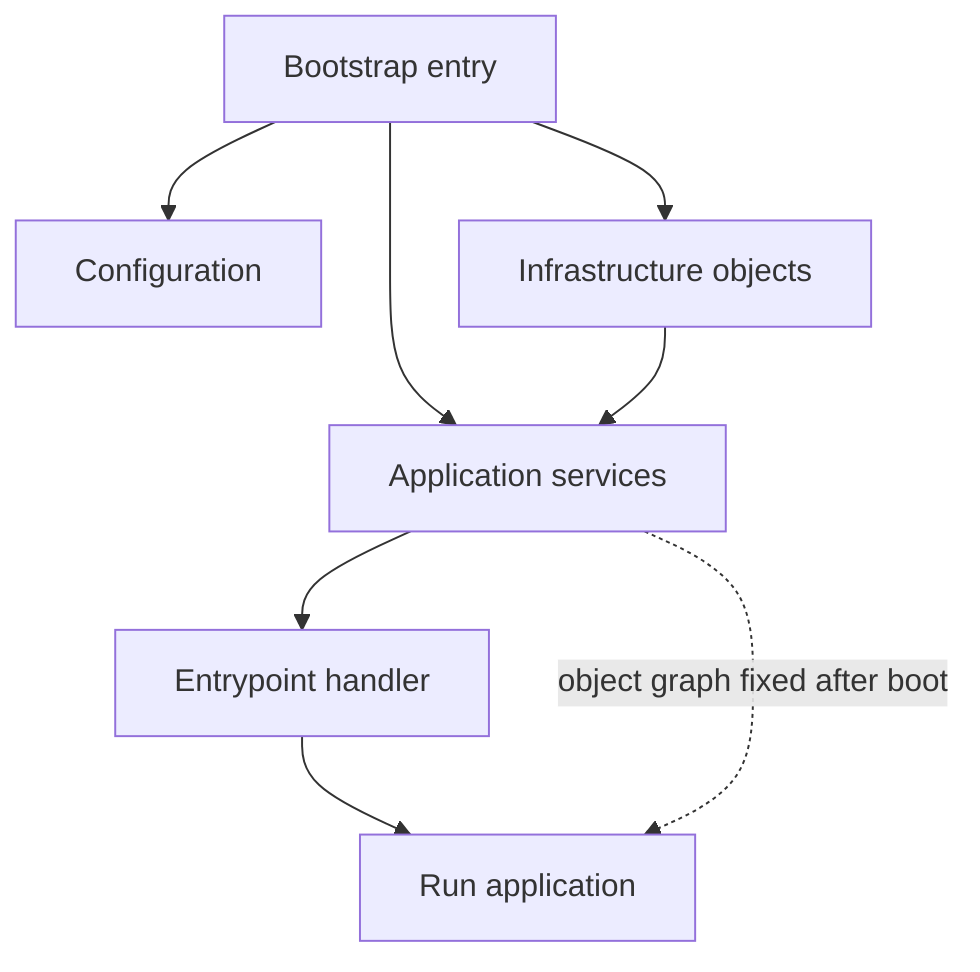

# Composition Root

## Vấn đề cần giải quyết

**Composition Root** giải quyết một quyết định cụ thể trong clean architecture: làm sao giữ rule và ownership rõ khi hệ thống thay đổi, thay vì để framework, dữ liệu hoặc quy trình vận hành quyết định ngược lại thiết kế.

Để đánh giá **Composition Root**, hãy tìm triệu chứng cụ thể trong nhóm clean architecture: dependency lan rộng, owner mơ hồ, test phải dựng sai boundary hoặc rollback không an toàn. Không có bằng chứng như vậy thì chưa nên thêm cấu trúc mới.

## Khái niệm trọng tâm

### 1. Object Graph

**Object Graph** là khái niệm cần dùng để phân tích Composition Root. Hãy xác định nó nằm ở class, dữ liệu hay quy trình nào; ai sở hữu quyết định; invariant nào phụ thuộc vào nó; và failure nào xảy ra khi boundary bị đặt sai. Một định nghĩa chỉ có giá trị khi liên hệ được với code hoặc quyết định vận hành cụ thể.

### 2. Lifecycle

**Lifecycle** là khái niệm cần dùng để phân tích Composition Root. Hãy xác định nó nằm ở class, dữ liệu hay quy trình nào; ai sở hữu quyết định; invariant nào phụ thuộc vào nó; và failure nào xảy ra khi boundary bị đặt sai. Một định nghĩa chỉ có giá trị khi liên hệ được với code hoặc quyết định vận hành cụ thể.

### 3. Configuration

**Configuration** là khái niệm cần dùng để phân tích Composition Root. Hãy xác định nó nằm ở class, dữ liệu hay quy trình nào; ai sở hữu quyết định; invariant nào phụ thuộc vào nó; và failure nào xảy ra khi boundary bị đặt sai. Một định nghĩa chỉ có giá trị khi liên hệ được với code hoặc quyết định vận hành cụ thể.

### 4. Framework Boundary

**Framework Boundary** là khái niệm cần dùng để phân tích Composition Root. Hãy xác định nó nằm ở class, dữ liệu hay quy trình nào; ai sở hữu quyết định; invariant nào phụ thuộc vào nó; và failure nào xảy ra khi boundary bị đặt sai. Một định nghĩa chỉ có giá trị khi liên hệ được với code hoặc quyết định vận hành cụ thể.

## Mental model

### Composition root

Composition root là nơi duy nhất lắp object graph. Nó được phép biết concrete class và configuration; business code chỉ nhận dependency qua constructor.

**Cách đọc sơ đồ Composition Root:** xác định điểm khởi đầu, quyết định trung tâm và outcome trong sơ đồ; sau đó ánh xạ từng participant sang artifact thật của nhóm clean architecture. Khi review, kiểm tra failure path và bằng chứng đặc thù của Composition Root, thay vì chỉ đánh giá hình thức các mũi tên.
## Ví dụ áp dụng

Để áp dụng **composition root**, hãy chọn một use case có liên quan trực tiếp rồi ghi rõ:

1. trạng thái hoặc quyết định nào của **composition root** cần nhất quán;
2. dependency hoặc boundary nào có thể thất bại;
3. ai sở hữu rule, dữ liệu và vận hành của chủ đề này;
4. test, artifact hoặc metric nào chứng minh cách áp dụng composition root là đúng.

Chỉ áp dụng **composition root** khi nó làm các điểm trên rõ và kiểm chứng được hơn so với thiết kế trực tiếp.

## Quy trình áp dụng

1. Viết một scenario cụ thể và outcome mong đợi, chưa dùng thuật ngữ Composition Root.
2. Ghi invariant, owner và failure mode liên quan đến **object graph**.
3. Vẽ dependency/data flow hiện tại; đánh dấu nơi detail đang rò vào policy.
4. So sánh baseline trực tiếp với một phương án có boundary rõ hơn.
5. Chọn thay đổi nhỏ nhất có thể chứng minh bằng test hoặc metric.
6. Ghi migration, rollback và điều kiện xóa abstraction nếu giả định không còn đúng.

## Sai lầm thường gặp

- Gọi một cấu trúc là composition root nhưng không thay đổi semantics hoặc ownership.
- Áp dụng theo framework recipe mà chưa xác định vấn đề riêng của composition root.
- Không ghi trade-off đặc thù: coupling, consistency, latency, migration hoặc cognitive load.
- Không kiểm tra failure/boundary có liên quan trực tiếp đến composition root.

## Câu hỏi review

- Composition Root đang bảo vệ invariant nào và owner nào chịu trách nhiệm?
- Contract có phản ánh **object graph** hay chỉ là tên kỹ thuật chung chung?
- Failure ở boundary được classify, retry hoặc translate ở đâu?
- Test/metric nào chứng minh thiết kế tốt hơn baseline?
- Khi nào có thể hợp nhất hoặc xóa cấu trúc này mà không mất semantics?

## Bài tập

Chọn một module thật có liên quan đến **Composition Root**. Viết design note gồm: scenario hiện tại, dependency/data-flow diagram, invariant, hai alternative, decision, test/metric và rollback. Sau đó thực hiện một refactor nhỏ hoặc spike để chứng minh assumption quan trọng nhất; không kết luận chỉ bằng sơ đồ.

