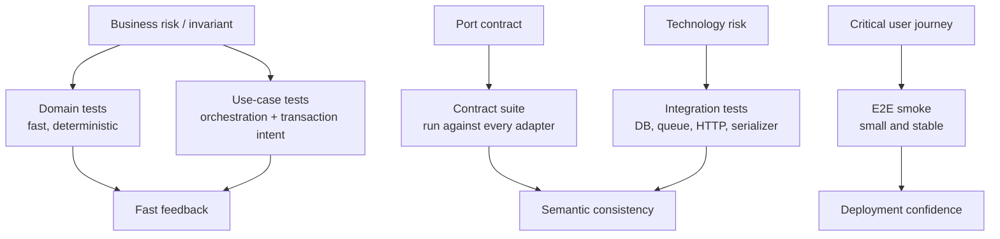

# Testing Strategy trong Clean Architecture

## Vấn đề cần giải quyết

Một hệ thống có thể có hàng nghìn test nhưng vẫn phản hồi chậm, dễ vỡ và bỏ sót lỗi quan trọng. Nguyên nhân thường không nằm ở số lượng test mà ở việc **đặt test sai boundary**:

- domain rule chỉ được kiểm tra qua HTTP và database;
- adapter bên ngoài được mock quá sâu nên mapping lỗi không bao giờ được kiểm chứng;
- use case test lẫn framework lifecycle;
- E2E suite gánh mọi trách nhiệm và trở thành bottleneck của CI;
- test khẳng định implementation detail thay vì behavior/invariant.

Testing Strategy trong Clean Architecture trả lời ba câu hỏi:

1. Rule nào phải được kiểm chứng ở lớp nhanh nhất?
2. Contract nào cần test chung cho mọi adapter?
3. Integration nào bắt buộc chạy với công nghệ thật?

## Khái niệm trọng tâm

### Domain test

Kiểm tra invariant và decision thuần nghiệp vụ, không khởi động framework hoặc database. Ví dụ: `Money` không cộng hai currency khác nhau; Order không thể chuyển trực tiếp từ `pending` sang `shipped`.

### Use-case test

Kiểm tra orchestration: load aggregate, gọi behavior, lưu state, phát event hoặc trả output. Dependency hạ tầng được thay bằng fake có semantics rõ, không phải mock mọi method nhỏ.

### Contract test

Một bộ test được chạy với **mọi implementation của cùng port**. Contract test bảo đảm `InMemoryCustomerRepository` và `SqlCustomerRepository` cùng giữ semantics về not-found, optimistic version, ordering hoặc pagination.

### Integration test

Kiểm tra mapping và lifecycle của công nghệ thật: SQL transaction, serializer, queue acknowledgement, HTTP timeout, framework middleware order. Integration test không lặp lại toàn bộ domain scenarios.

### End-to-end test

Chỉ giữ những journey có giá trị kinh doanh hoặc rủi ro tích hợp cao. E2E là bằng chứng cuối cùng rằng các boundary ghép lại đúng, không phải nơi mô tả mọi edge case.

## Mental model

### Portfolio test theo boundary và loại rủi ro

**Cách đọc:** bắt đầu từ loại rủi ro, không bắt đầu từ tool. Một invariant nên được chứng minh bằng domain test; một port có nhiều adapter cần contract suite; SQL isolation hoặc queue redelivery phải được kiểm tra bằng integration test. Chỉ journey quan trọng mới đi đến E2E.

## Ma trận lựa chọn test

| Rủi ro | Test chính | Có nên mock? | Bằng chứng cần có |
|---|---|---|---|
| Sai business rule | Domain unit test | Không cần | invariant và error rõ |
| Sai orchestration | Use-case test | Fake port | state/event/output đúng |
| Adapter lệch semantics | Contract test | Không mock adapter | mọi implementation pass cùng suite |
| SQL/queue/HTTP lifecycle | Integration test | Chỉ mock dependency xa hơn | transaction, retry, mapping đúng |
| Journey tích hợp quan trọng | E2E | Tối thiểu | outcome người dùng quan sát được |

## Ví dụ áp dụng

Với use case `PlaceOrder`:

- Domain test kiểm tra không đặt số lượng âm và không vượt stock đã reserve.
- Use-case test kiểm tra repository được lưu sau khi payment authorization thành công.
- Contract test áp dụng cho mọi `OrderRepository`.
- Integration test kiểm tra transaction rollback khi outbox insert thất bại.
- E2E chỉ giữ journey “đặt hàng thành công” và “payment bị từ chối”.

## Quy trình xây dựng strategy

1. Liệt kê invariant, external dependency và failure quan trọng.
2. Gán mỗi rủi ro cho lớp test nhỏ nhất có thể chứng minh nó.
3. Viết contract suite trước khi thêm adapter thứ hai.
4. Giữ fake theo semantics, không tạo mock chain theo implementation.
5. Đo thời gian CI, flakiness và defect escape theo nhóm test.
6. Xóa test trùng trách nhiệm hoặc chỉ khẳng định getter/setter.
7. Định kỳ review khi boundary hoặc deployment architecture thay đổi.

## Sai lầm thường gặp

- Dùng E2E để kiểm tra mọi nhánh domain.
- Mock repository nhưng fake không giữ semantics về version/order.
- Contract test chỉ chạy với fake, không chạy với adapter production.
- Integration test phụ thuộc dữ liệu dùng chung và không isolate transaction.
- Test private method hoặc số lần gọi nội bộ thay vì outcome.
- Chạy test chậm nhưng không theo dõi flakiness và duration trend.

## Câu hỏi review

- Invariant quan trọng nhất được chứng minh ở test nào?
- Adapter mới phải pass contract suite nào trước khi merge?
- Failure như timeout sau external success được mô phỏng ở lớp nào?
- Có scenario nào đang bị kiểm tra ba lần nhưng không thêm evidence mới?
- CI có chỉ ra test chậm/flaky và owner xử lý hay không?

## Bài tập có hướng dẫn

Chọn một use case có database và API ngoài.

1. Viết bảng rủi ro gồm invariant, mapping, lifecycle và journey.
2. Chia scenario vào domain/use-case/contract/integration/E2E.
3. Viết một contract suite chạy với fake và adapter thật.
4. Thêm failure injection: timeout sau API thành công hoặc transaction rollback.
5. Ghi thời gian chạy và giải thích vì sao mỗi test nằm ở boundary đó.

### Tiêu chí hoàn thành

- Không test nào chỉ tồn tại vì framework cho phép.
- Mỗi rủi ro có một test chủ đạo và evidence rõ.
- Contract suite chạy với ít nhất hai implementation.
- Failure path có thể tái hiện ổn định.

## Liên kết

- [Boundary Testing](12-boundary-testing.md)
- [Use-case Boundaries](09-use-case-boundaries.md)
- [Testing Patterns Cheatsheet](../../cheatsheets/testing-patterns.md)
- [Source và test map](../../src/README.md)
