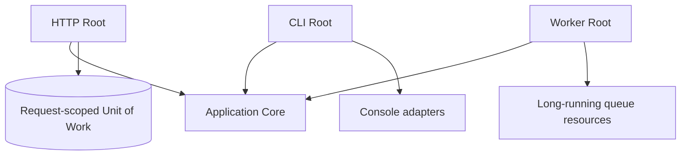
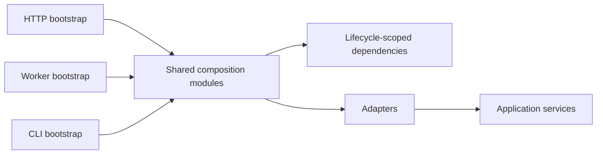

# Composition Root trong ứng dụng nhiều entry point

## Mục tiêu

Chương này tập trung vào composition root ở quy mô thực tế: HTTP, CLI, queue worker và scheduler dùng chung application core nhưng có lifecycle, middleware và resource khác nhau.

## Nguyên tắc

Composition root là nơi duy nhất được phép biết concrete implementation. Domain và use case chỉ biết contract. Mỗi entry point có thể có root riêng nhưng phải tái sử dụng module wiring có chủ đích, không dùng service locator toàn cục.

## Lifecycle cần thiết kế

- HTTP: request-scoped transaction, auth context, correlation ID.
- Worker: resource reset giữa message, retry middleware, graceful shutdown.
- CLI: explicit arguments, deterministic output, exit code.
- Scheduler: distributed lock, idempotency, missed-run recovery.

## Sai lầm thường gặp

- Container được truyền vào domain service.
- Singleton giữ request/tenant state.
- Worker tái sử dụng connection hoặc entity manager đã lỗi.
- Test dựng object graph khác production nên wiring bug không được phát hiện.

## Kiểm thử wiring

Viết smoke test cho từng entry point: resolve use case quan trọng, kiểm tra lifecycle và chạy một flow nhỏ với fake adapter. Architecture test cấm import framework/container trong `Domain` và `Application`.

## Bài tập

Thiết kế composition root cho API và queue worker xử lý đơn hàng. Chỉ ra dependency nào singleton, scoped hoặc transient; mô tả cách reset resource sau mỗi message.

## Mental model

### Multi-entry composition root

Ở hệ thống nhiều entrypoint, mỗi bootstrap lắp object graph phù hợp lifecycle nhưng tái sử dụng module composition chung. Tránh service locator và container access rải rác.

**Cách đọc sơ đồ Composition Root trong ứng dụng nhiều entry point:** xác định điểm khởi đầu, quyết định trung tâm và outcome trong sơ đồ; sau đó ánh xạ từng participant sang artifact thật của nhóm clean architecture. Khi review, kiểm tra failure path và bằng chứng đặc thù của Composition Root trong ứng dụng nhiều entry point, thay vì chỉ đánh giá hình thức các mũi tên.

## Nhiều composition root trong cùng hệ thống

HTTP, CLI, scheduler và queue worker có lifecycle khác nhau nên không nhất thiết dùng cùng graph object. Worker lâu sống phải tránh singleton giữ request state; CLI import có thể cần batch-scoped dependency; HTTP cần request-scoped correlation context. Hãy chia sẻ factory nhỏ cho wiring lặp lại nhưng giữ entrypoint-specific policy ở composition root tương ứng.
