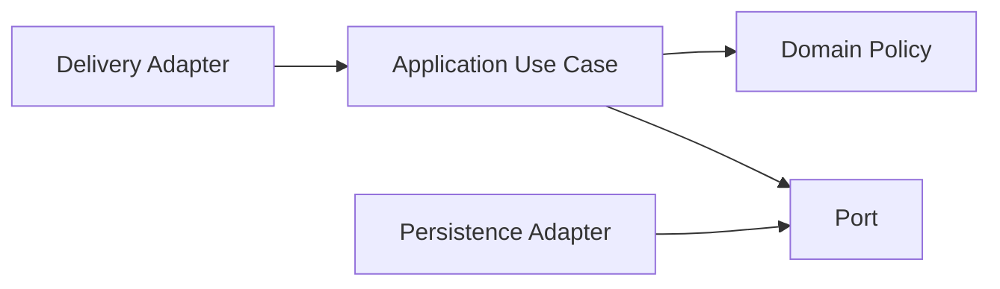
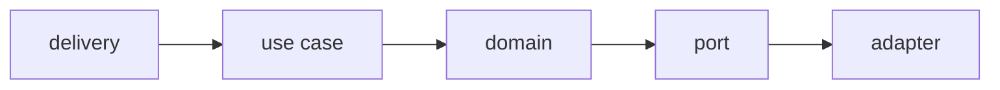

# Clean Architecture

## Mục tiêu của phần này

Phần **Clean Architecture** tập trung vào giữ business policy độc lập framework và cơ chế delivery.

## Cách học đề xuất

Học dependency rule trước ports/adapters và composition root. Với mỗi chương, hãy đọc ví dụ, trả lời câu hỏi review và áp dụng vào một module thật thay vì chỉ ghi nhớ định nghĩa.

## Danh mục

- [01 Dependency Rule](01-dependency-rule.md)
- [02 Entities](02-entities.md)
- [03 Use Cases](03-use-cases.md)
- [04 Ports Adapters](04-ports-adapters.md)
- [05 Composition Root](05-composition-root.md)
- [06 Presenters](06-presenters.md)
- [07 Boundaries](07-boundaries.md)
- [08 Testing Strategy](08-testing-strategy.md)

## Bài tổng kết

Tách use case PlaceOrder khỏi Laravel controller.

Deliverable của tuyến **Clean Architecture** phải gồm problem statement có constraints, sơ đồ thể hiện đúng ownership/boundary của chủ đề, ví dụ mã đủ để kiểm chứng, test strategy theo rủi ro, trade-off và kế hoạch đảo ngược hoặc đơn giản hóa khi giả định thay đổi.

## Bản đồ tư duy của nhóm

Clean Architecture không yêu cầu nhiều layer; nó yêu cầu dependency hướng vào policy ổn định. Bắt đầu bằng một use case có thể chạy không cần HTTP, database hoặc framework, sau đó đặt adapter ở ngoài boundary.

## Câu hỏi review

- Domain có import ORM/framework không?
- Use case có thể test bằng fake port không?
- Transaction, authorization và observability đang nằm đúng boundary chưa?

## Lộ trình áp dụng Clean Architecture

## Evidence hoàn thành

Hoàn thành khi use case chạy không phụ thuộc HTTP/ORM, port có contract test và composition root là nơi wiring duy nhất.

## Cách review chương

Review dependency direction, framework leakage, error mapping và boundary test.

## Cách kiểm chứng hướng phụ thuộc

Một kiến trúc sạch không được chứng minh bằng số lượng folder. Hãy dùng architecture test chặn import từ domain sang framework, test application service với fake port, và kiểm tra adapter mapping bằng contract suite. Khi thay database hoặc HTTP client, phần domain/application nên không đổi hoặc chỉ đổi ở composition root. Nếu migration buộc sửa entity domain để phù hợp ORM annotation, boundary đang bị rò rỉ.
