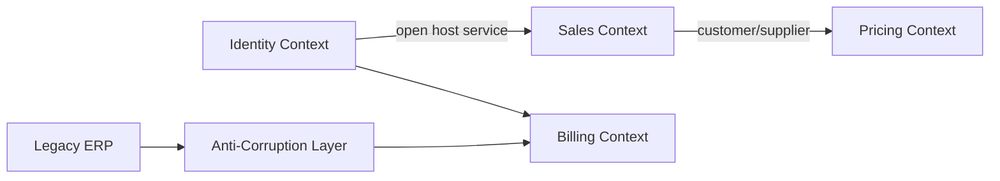
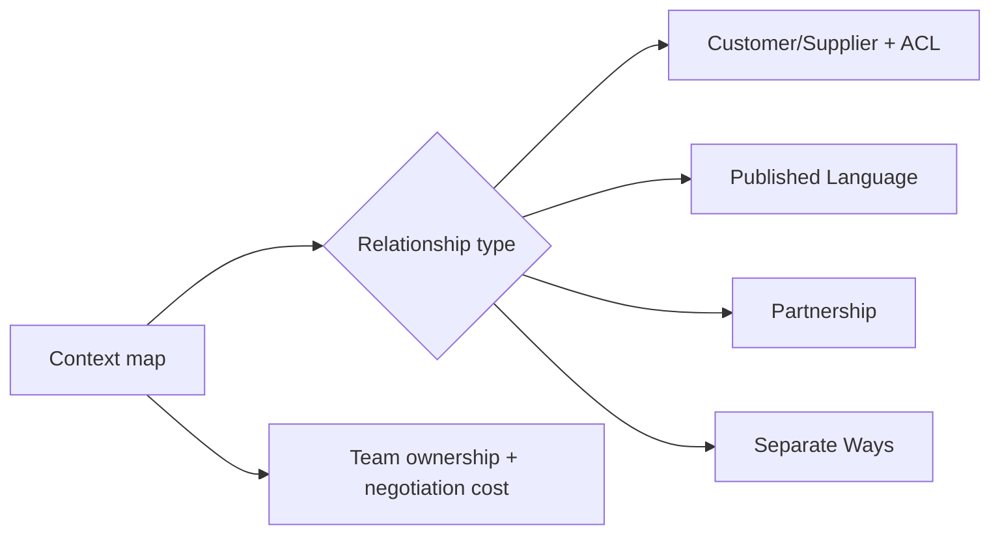

# Context Mapping nâng cao — Quan hệ và chính trị giữa Bounded Context

## Mục tiêu

Bài này đi sâu vào **mối quan hệ tổ chức và quyền lực** giữa các bounded context. Context map không chỉ là sơ đồ tích hợp; nó ghi rõ ai sở hữu model, ai phải thích nghi và thay đổi được thương lượng như thế nào.

## Các kiểu quan hệ cần phân biệt

- **Partnership**: hai team cùng lập kế hoạch và chịu rủi ro thay đổi.
- **Customer/Supplier**: downstream có khả năng thương lượng roadmap với upstream.
- **Conformist**: downstream chấp nhận model upstream vì không đủ quyền hoặc lợi ích để dịch.
- **Anti-Corruption Layer**: downstream bảo vệ model của mình bằng translation boundary.
- **Open Host Service**: upstream công bố protocol ổn định cho nhiều consumer.
- **Published Language**: schema/ngôn ngữ dùng chung được version hóa rõ ràng.
- **Separate Ways**: chi phí tích hợp lớn hơn lợi ích, hai context tách biệt.

## Cách lập context map

1. Xác định business capability và team ownership, không bắt đầu từ database.
2. Ghi dữ liệu hoặc quyết định đi qua boundary.
3. Gắn loại quan hệ và lý do tổ chức.
4. Ghi contract, cadence thay đổi và escalation path.
5. Đánh dấu rủi ro: shared database, semantic drift, upstream instability.

## Dấu hiệu map sai

- Một context được đặt tên theo layer kỹ thuật như `CommonService`.
- Sơ đồ chỉ có mũi tên nhưng không nói upstream/downstream.
- ACL chỉ là DTO mapper nhưng business language vẫn bị rò.
- Team ownership không khớp với boundary kiến trúc.

## Case study

Legacy ERP dùng mã khách hàng và trạng thái công nợ khác CRM. CRM không nên dùng trực tiếp model ERP; ACL dịch mã, normalize status và map lỗi. Contract test khóa vocabulary ở boundary, trong khi domain CRM vẫn dùng ngôn ngữ riêng.

## Bài tập

Vẽ context map cho e-commerce gồm Catalog, Pricing, Checkout, Payment, Inventory và Fulfillment. Chọn ít nhất ba loại quan hệ, giải thích quyền thay đổi contract và đề xuất một ACL cần thiết.

## Mental model

### Strategic context mapping

Ở mức chiến lược, context map ghi kiểu quan hệ, quyền lực giữa team và chi phí thay đổi contract; nó là công cụ tổ chức chứ không chỉ sơ đồ integration.

**Cách đọc sơ đồ Context Mapping nâng cao — Quan hệ và chính trị giữa Bounded Context:** xác định điểm khởi đầu, quyết định trung tâm và outcome trong sơ đồ; sau đó ánh xạ từng participant sang artifact thật của nhóm ddd. Khi review, kiểm tra failure path và bằng chứng đặc thù của Context Mapping nâng cao — Quan hệ và chính trị giữa Bounded Context, thay vì chỉ đánh giá hình thức các mũi tên.