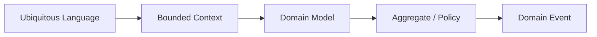
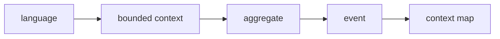

# Domain-Driven Design

## Mục tiêu của phần này

Phần **Domain-Driven Design** tập trung vào mô hình hóa nghiệp vụ phức tạp bằng ngôn ngữ và boundary rõ ràng.

## Cách học đề xuất

Học ubiquitous language, bounded context rồi aggregate/event. Với mỗi chương, hãy đọc ví dụ, trả lời câu hỏi review và áp dụng vào một module thật thay vì chỉ ghi nhớ định nghĩa.

## Danh mục

- [01 Ubiquitous Language](01-ubiquitous-language.md)
- [02 Bounded Context](02-bounded-context.md)
- [03 Entity Value Object](03-entity-value-object.md)
- [04 Aggregate](04-aggregate.md)
- [05 Domain Service](05-domain-service.md)
- [06 Domain Event](06-domain-event.md)
- [07 Repository](07-repository.md)
- [08 Context Mapping](08-context-mapping.md)

## Bài tổng kết

Mô hình hóa Order aggregate và context map với Inventory.

Deliverable của tuyến **Domain-Driven Design** phải gồm problem statement có constraints, sơ đồ thể hiện đúng ownership/boundary của chủ đề, ví dụ mã đủ để kiểm chứng, test strategy theo rủi ro, trade-off và kế hoạch đảo ngược hoặc đơn giản hóa khi giả định thay đổi.

## Bản đồ tư duy của nhóm

DDD bắt đầu từ ngôn ngữ và boundary, không bắt đầu từ entity/repository. Hãy xác định business capability, invariant và ownership trước khi chọn aggregate hay event.

## Dấu hiệu áp dụng sai

- Một aggregate tải toàn bộ object graph.
- Repository chỉ bọc từng lệnh ORM mà không biểu diễn collection semantics.
- Domain event được dùng như command bất đồng bộ.
- Bounded context chỉ là tên thư mục, không có ownership và contract.

## Lộ trình áp dụng Domain-Driven Design

## Evidence hoàn thành

Hoàn thành khi ubiquitous language, aggregate invariant, context map và transaction boundary được đội nghiệp vụ xác nhận.

## Cách review chương

Review model bằng scenario thật; hỏi source of truth, consistency boundary và event meaning.

## Từ ngôn ngữ đến ranh giới giao dịch

DDD bắt đầu bằng khác biệt trong ngôn ngữ và invariant, không bắt đầu bằng entity/repository template. Nếu “Customer” trong Sales và Billing có lifecycle khác nhau, hãy giữ model riêng và dịch qua contract. Aggregate chỉ bao state cần nhất quán ngay lập tức; workflow xuyên aggregate dùng event hoặc process manager. Context map phải chỉ owner và hướng translation, tránh shared model vô chủ.
