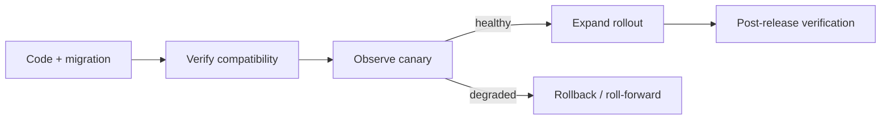
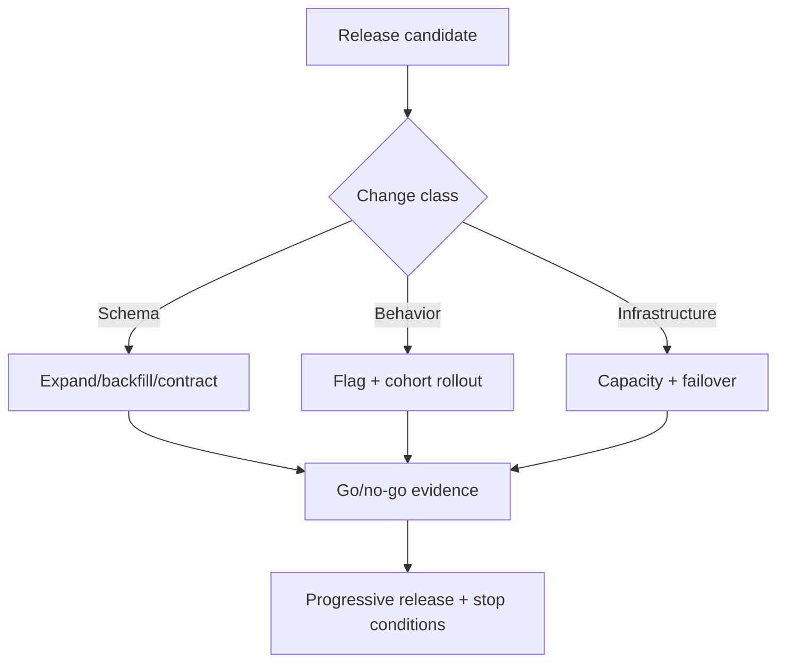

# Release Readiness ở quy mô production

## Mục tiêu

Chương này không lặp lại checklist phát hành cơ bản. Trọng tâm là cách chứng minh một release **có thể vận hành, quan sát và quay lui** khi thay đổi chạm vào dữ liệu, message, cache hoặc dependency bên ngoài.

## Mô hình bằng chứng

Một release chỉ sẵn sàng khi có đủ bốn nhóm bằng chứng:

1. **Behavior** — acceptance test và contract test khóa hành vi quan trọng.
2. **Compatibility** — schema, event và API vẫn tương thích trong thời gian rollout.
3. **Operations** — dashboard, alert, runbook và owner đã tồn tại trước khi deploy.
4. **Recovery** — rollback hoặc roll-forward đã được thử trên môi trường gần production.

## Release packet

Mỗi thay đổi rủi ro cao nên có một release packet ngắn:

- phạm vi và owner;
- invariant có thể bị phá;
- migration order;
- feature flag/canary plan;
- metric trước, trong và sau rollout;
- ngưỡng dừng;
- câu lệnh hoặc quy trình phục hồi;
- thời điểm xóa compatibility code.

## Các tình huống khó

### Database migration

Dùng expand–migrate–contract. Code cũ và mới phải cùng hoạt động trong cửa sổ chuyển đổi; không deploy code yêu cầu schema mới trước khi schema tương thích được đưa lên.

### Event schema

Consumer phải chịu được field mới và producer không được xóa field cũ trước khi xác nhận toàn bộ consumer đã nâng cấp. Theo dõi tỷ lệ deserialize failure như một release metric.

### External provider

Canary theo tenant hoặc phần trăm traffic, giữ adapter cũ để rollback, và phân biệt lỗi provider với lỗi business validation.

## Review checklist

- Có metric phản ánh trực tiếp invariant không?
- Rollback có làm mất hoặc nhân đôi dữ liệu không?
- Compatibility window kết thúc khi nào và ai chịu trách nhiệm cleanup?
- Alert có actionable hay chỉ báo noise?
- Quy trình recovery đã được diễn tập chưa?

## Bài tập

Thiết kế release packet cho việc đổi payment provider hoặc thay schema event. Vẽ thứ tự deploy, ngưỡng canary, rollback path và ba metric quyết định tiếp tục/dừng rollout.

## Mental model

### Advanced release readiness

Release phức tạp cần readiness theo loại thay đổi, stop condition và progressive delivery. Go/no-go dựa trên evidence, không dựa vào cảm giác.

**Cách đọc sơ đồ Release Readiness ở quy mô production:** xác định điểm khởi đầu, quyết định trung tâm và outcome trong sơ đồ; sau đó ánh xạ từng participant sang artifact thật của nhóm engineering playbook. Khi review, kiểm tra failure path và bằng chứng đặc thù của Release Readiness ở quy mô production, thay vì chỉ đánh giá hình thức các mũi tên.