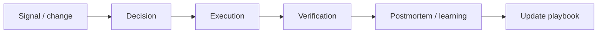
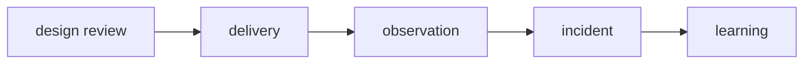

# Engineering Playbook

## Mục tiêu của phần này

Phần **Engineering Playbook** tập trung vào chuẩn hóa cách nhóm thiết kế, review, release và xử lý sự cố.

## Cách học đề xuất

Dùng các bài như runbook thực hành cho tech lead. Với mỗi chương, hãy đọc ví dụ, trả lời câu hỏi review và áp dụng vào một module thật thay vì chỉ ghi nhớ định nghĩa.

## Danh mục

- [01 Technical Design Review](01-technical-design-review.md)
- [02 Incident Response](02-incident-response.md)
- [03 Onboarding](03-onboarding.md)
- [04 Mentoring](04-mentoring.md)
- [05 Code Review](05-code-review.md)
- [06 Release Readiness](06-release-readiness.md)
- [07 Deprecation](07-deprecation.md)
- [08 Architecture Governance](08-architecture-governance.md)

## Bài tổng kết

Tổ chức design review và viết release readiness checklist.

Deliverable của tuyến **Engineering Playbook** phải gồm problem statement có constraints, sơ đồ thể hiện đúng ownership/boundary của chủ đề, ví dụ mã đủ để kiểm chứng, test strategy theo rủi ro, trade-off và kế hoạch đảo ngược hoặc đơn giản hóa khi giả định thay đổi.

## Cách dùng playbook

Playbook biến kiến thức thành hành vi lặp lại được: checklist trước release, runbook khi sự cố, ADR khi có quyết định dài hạn và retrospective sau thay đổi. Mỗi quy trình cần owner, trigger, evidence và điều kiện kết thúc.

## Lộ trình áp dụng Engineering Playbook

## Evidence hoàn thành

Hoàn thành khi team có repeatable process cho design review, release, incident, debt và deprecation với owner rõ.

## Cách review chương

Review process bằng artifact và lead time: checklist không có owner/evidence chỉ là nghi thức.

## Playbook phải dẫn đến hành động có thể kiểm chứng

Mỗi quy trình cần input, owner, decision point, evidence và exit condition. Incident playbook phải chỉ cách giảm blast radius trước khi tìm root cause; release playbook phải có go/no-go và rollback rehearsal; architecture review phải ghi assumption cần xem lại. Tài liệu không có người chịu trách nhiệm hoặc không liên kết dashboard/runbook sẽ nhanh chóng trở thành nội dung trang trí.

## Kiểm tra playbook sau mỗi lần sử dụng

Sau incident, release hoặc review, owner phải ghi lại bước nào không dùng được, dữ kiện nào thiếu và quyết định nào bị chậm. Playbook chỉ trưởng thành khi phản hồi thực tế được chuyển thành thay đổi cụ thể, có người chịu trách nhiệm và ngày kiểm chứng lại.
