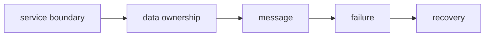

# Microservices — Boundary, consistency và operability

Microservices không phải mục tiêu mặc định. Phần này chỉ phù hợp khi hệ thống thực sự cần ownership độc lập, deployment độc lập hoặc scaling khác biệt và đội ngũ chấp nhận chi phí phân tán.

## Khái niệm trọng tâm

- **Service boundary:** được xác định bởi capability và ownership, không phải bảng database.
- **Data ownership:** một service là source of truth; service khác dùng API/event/read model.
- **Consistency:** strong consistency chỉ trong boundary nhỏ; qua service thường là eventual consistency.
- **Message delivery:** at-least-once là phổ biến, vì vậy consumer phải idempotent.
- **Operability:** deploy, alert, trace, rollback và incident ownership là một phần của thiết kế.

## Tuyến học

1. [Service Boundaries](01-service-boundaries.md)
2. [Data Ownership](02-data-ownership.md)
3. [Saga](03-saga.md)
4. [Outbox & Inbox](04-outbox-inbox.md)
5. [Idempotency](05-idempotency.md)
6. [Observability](06-observability.md)
7. [Resilience](07-resilience.md)
8. [Deployment](08-deployment.md)

## Bài tổng kết

Thiết kế flow Booking–Payment có hold TTL, payment authorization, confirmation và compensation. Deliverable:

- Context map và sequence diagram.
- Source of truth cho booking/payment.
- Idempotency key và duplicate policy.
- Failure matrix: timeout, partial success, poison message.
- SLO, alert và reconciliation job.
- Rollback/migration plan.

## Khi không nên tách microservice

Giữ modular monolith khi domain chưa ổn định, team nhỏ, transaction xuyên module thường xuyên hoặc chưa có năng lực observability/deployment độc lập.

## Lộ trình áp dụng Microservices

## Evidence hoàn thành

Hoàn thành khi service boundary đi cùng data ownership, delivery semantics, SLO, recovery và contract evolution.

## Cách review chương

Review failure across network: duplicate, timeout, out-of-order, partial commit và reconciliation.

## Ngưỡng tách service và chi phí ẩn

Chỉ tách khi boundary ownership, deployment cadence hoặc scaling profile đủ khác biệt. Một service mới kéo theo authentication, observability, schema evolution, retry, incident ownership và data migration. Trước khi tách, thử module boundary cùng architecture test trong monolith. Nếu team chưa vận hành tốt outbox, idempotency và distributed tracing, microservice thường làm failure khó chẩn đoán hơn.
