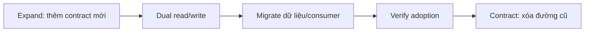
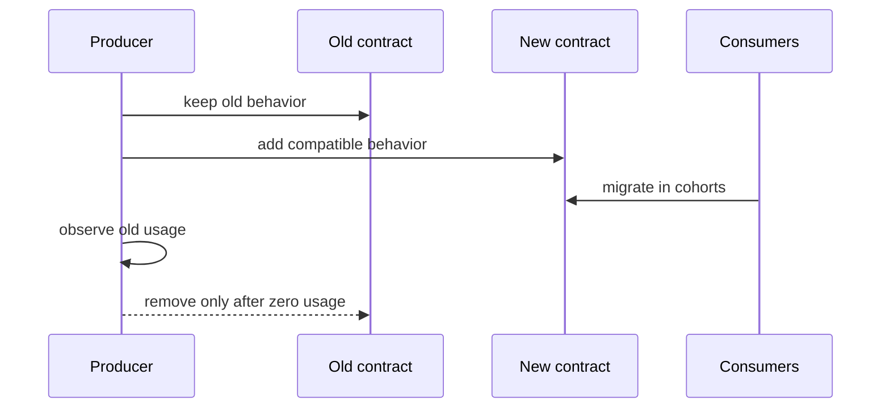

# Parallel Change cho database, API và event schema

## Mục tiêu

Bài này áp dụng Parallel Change ở production, nơi producer và consumer không thể nâng cấp đồng thời. Trọng tâm là giữ tương thích trong suốt quá trình **expand → migrate → contract**.

## Database migration

1. Thêm column/table mới theo cách backward-compatible.
2. Deploy code dual-write hoặc backfill có checkpoint.
3. So sánh dữ liệu cũ/mới bằng reconciliation query.
4. Chuyển read path bằng feature flag.
5. Chờ compatibility window rồi xóa schema cũ.

## API migration

Thêm endpoint hoặc field mới, đo consumer adoption, giữ translation layer trong thời gian chuyển đổi. Không đổi semantics của field cũ dưới cùng tên.

## Event migration

Version event khi meaning thay đổi. Producer có thể phát dual event tạm thời; consumer phải idempotent để tránh side effect kép. Schema registry/contract test giúp phát hiện breaking change trước deploy.

## Guardrail

- Mỗi bước deploy/rollback độc lập.
- Có metric cho dual-write mismatch.
- Cleanup có deadline và owner.
- Không duy trì hai model vô thời hạn.

## Bài tập

Lập kế hoạch đổi `amount` integer sang Money object gồm amount + currency trên database, API và event. Nêu từng release, test, metric mismatch và rollback.

## Mental model

### Cross-team parallel change

Ở hệ thống nhiều team, parallel change cần compatibility window, usage telemetry và lịch migrate consumer. Contract chỉ được thu hẹp sau evidence.

**Cách đọc sơ đồ Parallel Change cho database, API và event schema:** xác định điểm khởi đầu, quyết định trung tâm và outcome trong sơ đồ; sau đó ánh xạ từng participant sang artifact thật của nhóm refactoring. Khi review, kiểm tra failure path và bằng chứng đặc thù của Parallel Change cho database, API và event schema, thay vì chỉ đánh giá hình thức các mũi tên.

## Điều phối expand–migrate–contract

Expand phải tương thích ngược: thêm field nullable, endpoint mới hoặc event version mới. Migrate cần telemetry cho mức sử dụng cũ/mới và cơ chế dual-write hoặc backfill có idempotency. Contract chỉ thực hiện khi consumer cũ về 0 và rollback window đã đóng. Mỗi bước là một release độc lập; tránh gộp schema change và code cutover vào cùng deploy.
