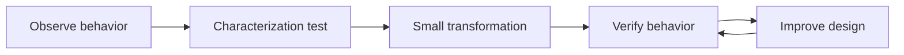
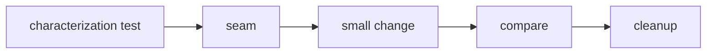

# Refactoring

## Mục tiêu của phần này

Phần **Refactoring** tập trung vào thay đổi cấu trúc an toàn mà không đổi hành vi quan sát được.

## Cách học đề xuất

Đi từ characterization test đến migration database và strangler. Với mỗi chương, hãy đọc ví dụ, trả lời câu hỏi review và áp dụng vào một module thật thay vì chỉ ghi nhớ định nghĩa.

## Danh mục

- [01 Characterization Tests](01-characterization-tests.md)
- [02 Branch By Abstraction](02-branch-by-abstraction.md)
- [03 Strangler Fig](03-strangler-fig.md)
- [04 Parallel Change](04-parallel-change.md)
- [05 Extract Class](05-extract-class.md)
- [06 Replace Conditionals](06-replace-conditionals.md)
- [07 Legacy Boundaries](07-legacy-boundaries.md)
- [08 Safe Database Refactoring](08-safe-database-refactoring.md)

## Bài tổng kết

Refactor exporter legacy theo branch by abstraction.

Deliverable của tuyến **Refactoring** phải gồm problem statement có constraints, sơ đồ thể hiện đúng ownership/boundary của chủ đề, ví dụ mã đủ để kiểm chứng, test strategy theo rủi ro, trade-off và kế hoạch đảo ngược hoặc đơn giản hóa khi giả định thay đổi.

## Quy trình an toàn

Refactoring phải giữ behavior quan sát được. Tạo characterization test, thay đổi theo lát nhỏ, đo lại complexity và giữ đường rollback. Pattern chỉ xuất hiện khi nó giải quyết một lực thay đổi đã quan sát được.

## Lộ trình áp dụng Refactoring

## Evidence hoàn thành

Hoàn thành khi một thay đổi legacy được bảo vệ bằng characterization test, seam, rollout nhỏ và cleanup condition.

## Cách review chương

Review diff theo behavior-preserving steps, rollback point và evidence so sánh trước/sau.

## Refactoring có kiểm soát rủi ro

Trước khi đổi cấu trúc, khóa behavior bằng characterization test và chọn seam nhỏ. Với code quan trọng, chạy implementation cũ/mới song song trên cùng input rồi so result, error và side effect. Rollout theo cohort giúp giới hạn blast radius. Refactor hoàn thành khi old path, feature flag và compatibility shim được xóa, không phải khi abstraction mới được merge.

## Chỉ số theo dõi sau refactor

Theo dõi defect, lead time, số file phải sửa cho một change và thời gian chạy test liên quan. Nếu cấu trúc mới không cải thiện các tín hiệu đã chọn hoặc làm onboarding khó hơn, hãy đơn giản hóa thay vì tiếp tục bảo vệ abstraction bằng lý do thẩm mỹ.
