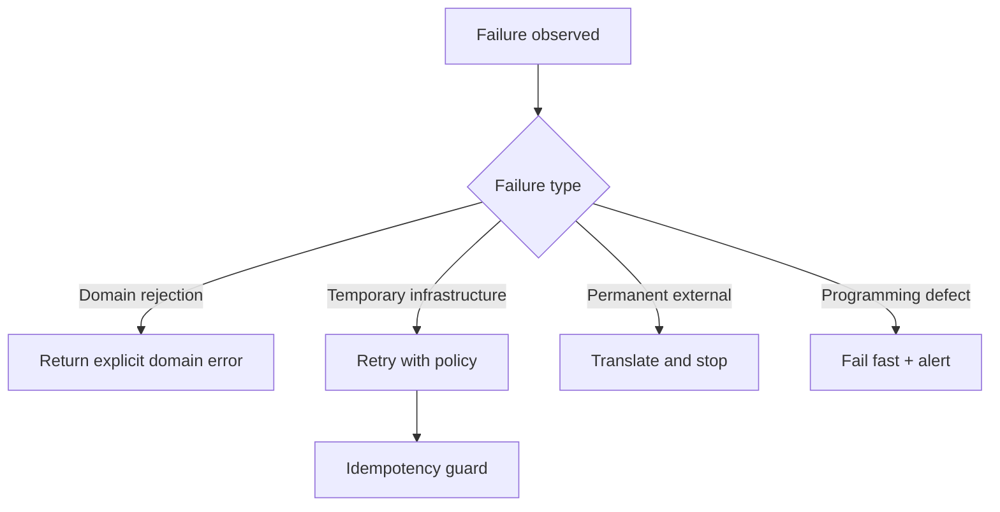

# Error Modeling

## Vấn đề cần giải quyết

**Error Modeling** giải quyết một quyết định cụ thể trong software design: làm sao giữ rule và ownership rõ khi hệ thống thay đổi, thay vì để framework, dữ liệu hoặc quy trình vận hành quyết định ngược lại thiết kế.

Để đánh giá **Error Modeling**, hãy tìm triệu chứng cụ thể trong nhóm software design: dependency lan rộng, owner mơ hồ, test phải dựng sai boundary hoặc rollback không an toàn. Không có bằng chứng như vậy thì chưa nên thêm cấu trúc mới.

## Khái niệm trọng tâm

### 1. Domain Error

**Domain Error** là khái niệm cần dùng để phân tích Error Modeling. Hãy xác định nó nằm ở class, dữ liệu hay quy trình nào; ai sở hữu quyết định; invariant nào phụ thuộc vào nó; và failure nào xảy ra khi boundary bị đặt sai. Một định nghĩa chỉ có giá trị khi liên hệ được với code hoặc quyết định vận hành cụ thể.

### 2. Technical Failure

**Technical Failure** là khái niệm cần dùng để phân tích Error Modeling. Hãy xác định nó nằm ở class, dữ liệu hay quy trình nào; ai sở hữu quyết định; invariant nào phụ thuộc vào nó; và failure nào xảy ra khi boundary bị đặt sai. Một định nghĩa chỉ có giá trị khi liên hệ được với code hoặc quyết định vận hành cụ thể.

### 3. Retryability

**Retryability** là khái niệm cần dùng để phân tích Error Modeling. Hãy xác định nó nằm ở class, dữ liệu hay quy trình nào; ai sở hữu quyết định; invariant nào phụ thuộc vào nó; và failure nào xảy ra khi boundary bị đặt sai. Một định nghĩa chỉ có giá trị khi liên hệ được với code hoặc quyết định vận hành cụ thể.

### 4. Error Translation

**Error Translation** là khái niệm cần dùng để phân tích Error Modeling. Hãy xác định nó nằm ở class, dữ liệu hay quy trình nào; ai sở hữu quyết định; invariant nào phụ thuộc vào nó; và failure nào xảy ra khi boundary bị đặt sai. Một định nghĩa chỉ có giá trị khi liên hệ được với code hoặc quyết định vận hành cụ thể.

## Mental model

### Error taxonomy

Không phải mọi failure đều là exception giống nhau. Phân loại domain rejection, lỗi tạm thời, lỗi vĩnh viễn và bug giúp caller quyết định retry, compensate hoặc dừng đúng cách.

**Cách đọc sơ đồ Error Modeling:** xác định điểm khởi đầu, quyết định trung tâm và outcome trong sơ đồ; sau đó ánh xạ từng participant sang artifact thật của nhóm software design. Khi review, kiểm tra failure path và bằng chứng đặc thù của Error Modeling, thay vì chỉ đánh giá hình thức các mũi tên.
## Ví dụ áp dụng

Để áp dụng **error modeling**, hãy chọn một use case có liên quan trực tiếp rồi ghi rõ:

1. trạng thái hoặc quyết định nào của **error modeling** cần nhất quán;
2. dependency hoặc boundary nào có thể thất bại;
3. ai sở hữu rule, dữ liệu và vận hành của chủ đề này;
4. test, artifact hoặc metric nào chứng minh cách áp dụng error modeling là đúng.

Chỉ áp dụng **error modeling** khi nó làm các điểm trên rõ và kiểm chứng được hơn so với thiết kế trực tiếp.

## Quy trình áp dụng

1. Viết một scenario cụ thể và outcome mong đợi, chưa dùng thuật ngữ Error Modeling.
2. Ghi invariant, owner và failure mode liên quan đến **domain error**.
3. Vẽ dependency/data flow hiện tại; đánh dấu nơi detail đang rò vào policy.
4. So sánh baseline trực tiếp với một phương án có boundary rõ hơn.
5. Chọn thay đổi nhỏ nhất có thể chứng minh bằng test hoặc metric.
6. Ghi migration, rollback và điều kiện xóa abstraction nếu giả định không còn đúng.

## Sai lầm thường gặp

- Gọi một cấu trúc là error modeling nhưng không thay đổi semantics hoặc ownership.
- Áp dụng theo framework recipe mà chưa xác định vấn đề riêng của error modeling.
- Không ghi trade-off đặc thù: coupling, consistency, latency, migration hoặc cognitive load.
- Không kiểm tra failure/boundary có liên quan trực tiếp đến error modeling.

## Câu hỏi review

- Error Modeling đang bảo vệ invariant nào và owner nào chịu trách nhiệm?
- Contract có phản ánh **domain error** hay chỉ là tên kỹ thuật chung chung?
- Failure ở boundary được classify, retry hoặc translate ở đâu?
- Test/metric nào chứng minh thiết kế tốt hơn baseline?
- Khi nào có thể hợp nhất hoặc xóa cấu trúc này mà không mất semantics?

## Bài tập

Chọn một module thật có liên quan đến **Error Modeling**. Viết design note gồm: scenario hiện tại, dependency/data-flow diagram, invariant, hai alternative, decision, test/metric và rollback. Sau đó thực hiện một refactor nhỏ hoặc spike để chứng minh assumption quan trọng nhất; không kết luận chỉ bằng sơ đồ.

