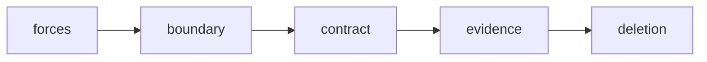

# Software Design

## Mục tiêu của phần này

Phần **Software Design** tập trung vào cách tạo module dễ hiểu, dễ thay đổi và có chi phí abstraction hợp lý.

## Cách học đề xuất

Bắt đầu từ design-for-change, sau đó học api, error, concurrency và performance. Với mỗi chương, hãy đọc ví dụ, trả lời câu hỏi review và áp dụng vào một module thật thay vì chỉ ghi nhớ định nghĩa.

## Danh mục

- [01 Design For Change](01-design-for-change.md)
- [02 Abstraction Cost](02-abstraction-cost.md)
- [03 Modularity](03-modularity.md)
- [04 Api Design](04-api-design.md)
- [05 Error Modeling](05-error-modeling.md)
- [06 Immutability](06-immutability.md)
- [07 Concurrency Design](07-concurrency-design.md)
- [08 Performance Design](08-performance-design.md)

## Bài tổng kết

Thiết kế một checkout service có error model và latency budget.

Deliverable của tuyến **Software Design** phải gồm problem statement có constraints, sơ đồ thể hiện đúng ownership/boundary của chủ đề, ví dụ mã đủ để kiểm chứng, test strategy theo rủi ro, trade-off và kế hoạch đảo ngược hoặc đơn giản hóa khi giả định thay đổi.

## Trọng tâm của Software Design

Thiết kế là quản lý dependency, state và chi phí thay đổi dưới các constraint cụ thể. Mỗi quyết định nên nêu rõ context, forces, option, trade-off và evidence thay vì dựa vào “best practice” chung chung.

## Bài tập định hướng

Chọn một use case trong dự án, liệt kê ba thay đổi có xác suất cao, vẽ dependency graph hiện tại và đề xuất thiết kế tối thiểu giúp cô lập đúng một trục thay đổi.

## Lộ trình áp dụng Software Design

## Evidence hoàn thành

Hoàn thành khi có thể nhận diện change axis, chi phí abstraction và thiết kế để xóa; artifact là API/contract cùng test compatibility.

## Cách review chương

Review tên, coupling, state ownership và cost of change; yêu cầu một baseline trực tiếp để so sánh.

## Đánh giá thiết kế bằng evidence thay vì thẩm mỹ

Một thiết kế tốt làm giảm chi phí của thay đổi có xác suất cao và giữ failure trong boundary có owner. Review nên hỏi: test nào chứng minh invariant, metric nào cho thấy abstraction có ích, và rollback có thể thực hiện không. “Clean”, “flexible” hay “scalable” không đủ nếu không có scenario cụ thể. Đôi khi một hàm trực tiếp với test rõ ràng tốt hơn hierarchy nhiều lớp.
