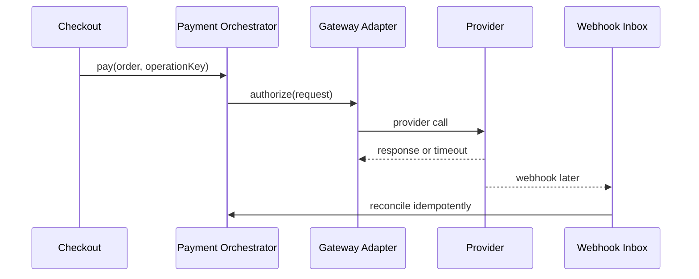

# Live Design Scenarios

Mỗi scenario dùng trong 30–45 phút. Ứng viên cần hỏi requirement, ghi invariant, vẽ flow, chọn baseline, sau đó mới cân nhắc pattern.

## Rubric chung

| Tiêu chí | Điểm |
|---|---:|
| Problem framing và invariant | 20 |
| Boundary, ownership, data | 20 |
| Failure, concurrency, idempotency | 20 |
| Trade-off và alternative | 15 |
| Test, observability, runbook | 15 |
| Migration và rollback | 10 |

## 1. Payment đa cổng

Thiết kế checkout hỗ trợ nhiều provider, retry an toàn và webhook đến muộn. Kỳ vọng: Strategy/Factory hoặc registry ở selection boundary; Adapter cho provider; idempotency record; payment state machine; outbox; reconciliation.

**Câu hỏi đào sâu:** timeout sau provider success; duplicate webhook; refund; provider migration; ledger versus mutable balance.

## 2. Notification đa kênh

Thiết kế router Email/SMS/Chatwork/Slack với preference, rate limit, retry và fallback. Kỳ vọng: channel contract, provider adapter, policy selection, template version, outbox và delivery audit.

## 3. Inventory reservation

Giữ hàng 15 phút khi checkout có concurrency cao. Kỳ vọng: available-to-promise invariant, optimistic/conditional write, reservation TTL, expiry worker và reconciliation.

## 4. Booking calendar

Đặt phòng theo timezone, chống overlap, hỗ trợ hold và waitlist. Kỳ vọng: interval semantics, state machine, capacity/version guard và DST test.

## 5. CSV import lớn

Import hàng triệu dòng, resume sau lỗi, báo lỗi theo dòng. Kỳ vọng: streaming, checkpoint, validation pipeline, idempotent upsert và dead-letter file.

## 6. Order saga

Payment, stock và shipment thuộc các service khác nhau. Kỳ vọng: process manager, persisted state, timeout, compensation và manual intervention.

## 7. CRM identity merge

Gộp khách hàng trùng nhưng phải reversible và giữ consent/provenance. Kỳ vọng: merge policy, audit ledger, conflict review và privacy constraints.

## 8. Legacy replacement

Thay module giá cũ không downtime. Kỳ vọng: characterization tests, seam, dual-run, shadow compare, cohort rollout, rollback và deletion plan.

## Rubric live design enterprise

| Trục đánh giá | Tín hiệu mạnh | Tín hiệu yếu |
|---|---|---|
| Domain understanding | nêu invariant và source of truth | nhảy ngay vào class diagram |
| Failure design | timeout, duplicate, stale write, compensation | chỉ mô tả happy path |
| Pattern fit | so sánh baseline và alternative | gọi tên pattern như mục tiêu |
| Operability | metric, alert, runbook, reconciliation | chỉ nói log |
| Evolution | migration, compatibility, rollback | big-bang rewrite |

Ứng viên nên kết thúc bằng một decision record ngắn: quyết định, lý do, rủi ro, verification và revisit condition.

## Cách sử dụng trong buổi phỏng vấn

Mỗi scenario nên dành tối thiểu 25 phút: 5 phút làm rõ invariant và failure, 10 phút vẽ boundary/flow, 5 phút bàn trade-off và 5 phút nêu test, telemetry cùng rollback. Interviewer không chấm số lượng pattern; điểm cao thuộc về ứng viên biết chọn baseline đơn giản, nhận diện ambiguous outcome và liên kết thiết kế với vận hành.
