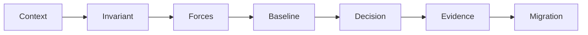
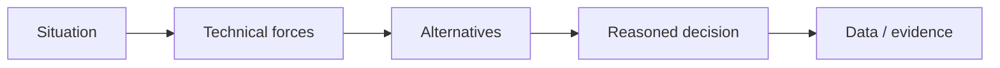

# Interview Playbook

## Công thức trả lời 7 bước

1. **Context:** hệ thống, actor và outcome.
2. **Invariant:** điều không được phép sai.
3. **Forces:** change axis, scale, team ownership, latency, consistency.
4. **Baseline:** thiết kế trực tiếp đơn giản nhất.
5. **Decision:** pattern/boundary được chọn và vì sao.
6. **Failure & evidence:** timeout, duplicate, test, metric, incident.
7. **Migration:** rollout, rollback và điều kiện xóa abstraction.

## Cách xử lý khi không nhớ tên pattern

Mô tả intent và collaboration trước. Một câu trả lời đúng vấn đề nhưng quên tên tốt hơn việc gọi sai pattern. Sau đó có thể nói “cấu trúc này gần Strategy/Adapter vì…”.

## Red flags

- Nhảy vào pattern trước requirement.
- Nói “best practice” nhưng không có trade-off.
- Không phân biệt local call với network call.
- Không đề cập test, failure hoặc migration.
- Coi Repository/CQRS/Microservice là mặc định.

## Mẹo ghi điểm

- Vẽ source of truth và transaction boundary.
- Nói rõ delivery guarantee và idempotency.
- Đưa option không dùng pattern.
- Ghi metric/alert chứng minh thiết kế hoạt động.
- Chỉ ra revisit condition nếu assumption thay đổi.

## Mock interview 60 phút

| Phút | Hoạt động |
|---:|---|
| 0–10 | Clarify requirement, invariant |
| 10–20 | Baseline và data model |
| 20–35 | Pattern/boundary và diagram |
| 35–45 | Failure, scale, security |
| 45–55 | Test, observability, migration |
| 55–60 | Summary và trade-off |

## Mô hình trả lời STAR-D

Một câu trả lời mạnh không dừng ở định nghĩa. Hãy nêu bối cảnh, lực thay đổi, phương án đã cân nhắc, lý do chọn và evidence sau triển khai.

## Cách xử lý câu hỏi chưa biết

1. Làm rõ scope và constraint.
2. Nêu baseline trực tiếp.
3. Phân tích failure/transaction/concurrency.
4. Đề xuất pattern như một lựa chọn, không phải đáp án mặc định.
5. Nêu cách test và cách rollback.

## Red flags khi trả lời theo STAR-D

- Liệt kê pattern không liên quan.
- Khẳng định Repository/DDD/Microservice luôn tốt.
- Không nói về failure hoặc data ownership.
- Không phân biệt command, event và job.
- Không đưa ra evidence hoặc điều kiện revisit.

## Cách điều chỉnh câu trả lời theo thời lượng

Trong 60 giây, nêu context, lựa chọn và trade-off chính. Với 5 phút, thêm baseline, failure và test. Trong live design 30 phút, vẽ boundary, source of truth, transaction, async flow, telemetry và migration. Khi chưa biết dữ kiện, hãy hỏi về consistency, scale, ownership và failure tolerance; đừng giả định microservice hoặc queue chỉ để thể hiện thuật ngữ.

## Bài luyện evidence-based

Khi trả lời một câu design, hãy nêu một metric hoặc test có thể bác bỏ lựa chọn của mình. Ví dụ: nếu chọn cache, nói freshness budget và stale-read test; nếu chọn Outbox, nói backlog age và reconciliation. Cách này cho thấy ứng viên hiểu quyết định có thể kiểm chứng, không chỉ nhớ định nghĩa pattern.
